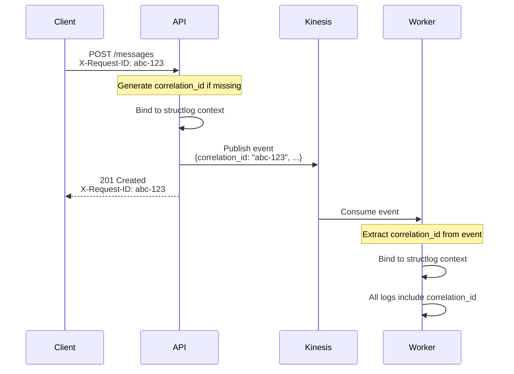

# Enterprise Logging Standards

## Structured Logging with structlog

All services MUST use `structlog` for structured, JSON-formatted logging.

## CloudWatch Integration

Logs are automatically sent to CloudWatch Logs via ECS `awslogs` driver. The JSON format enables powerful querying.

### Log Format
```json
{
  "event": "Message processed",
  "timestamp": "2026-02-05T19:45:32.456789Z",
  "level": "info",
  "logger": "worker.processor",
  "service": "omnichannel-worker",
  "correlation_id": "a1b2c3d4-e5f6-7890-abcd-ef1234567890",
  "message_id": "msg-123",
  "channels": ["facebook", "linkedin"],
  "duration_ms": 245.67
}
```

### CloudWatch Logs Insights Queries
```sql
-- Trace request across services
fields @timestamp, service, event, message_id
| filter correlation_id = "your-correlation-id"
| sort @timestamp asc

-- Error rate by service
fields service, level
| filter level = "error"
| stats count() by service, bin(1h)

-- Slow operations (>500ms)
fields @timestamp, service, event, duration_ms
| filter duration_ms > 500
| sort duration_ms desc

-- Failed message deliveries
fields @timestamp, message_id, channel, error
| filter event = "Channel marked as failed"
| sort @timestamp desc
```

### Metric Filters & Alarms (CDK Infrastructure)

CloudWatch metric filters and alarms are automatically created by `MonitoringStack` for each service:

| Filter | Pattern | Alarm Threshold | Action |
|--------|---------|-----------------|--------|
| Error Count | `"level": "error"` | ≥10 errors/5min | SNS Alert |
| Critical | `"level": "critical"` | ≥1/min | SNS Alert (immediate) |
| Latency | `$.duration_ms` | p95 > 1000ms | SNS Alert |

```python
# Metric namespace: SecureApi/Logs
# Metrics per service: ApiErrorCount, WorkerErrorCount, SchedulerErrorCount, etc.
```

### Log Retention

All ECS service logs are retained for 1 month (configured in `ComputeStack`):
- `/ecs/secure-api/api`
- `/ecs/secure-api/worker`
- `/ecs/secure-api/scheduler`

### Configuration
```python
import structlog

structlog.configure(
    processors=[
        structlog.stdlib.filter_by_level,
        structlog.stdlib.add_logger_name,
        structlog.stdlib.add_log_level,
        structlog.processors.TimeStamper(fmt="iso"),
        structlog.processors.JSONRenderer(),
    ],
    wrapper_class=structlog.stdlib.BoundLogger,
    context_class=dict,
    logger_factory=structlog.stdlib.LoggerFactory(),
)
```

### Logger Initialization
```python
import structlog

logger = structlog.get_logger()
```

### Logging Patterns

#### Always Include Context
```python
# ✅ Good - includes relevant context
logger.info(
    "Message processed",
    message_id=message_id,
    channels=channels,
    duration_ms=duration,
)

# ❌ Bad - no context
logger.info("Message processed")
```

#### Use Appropriate Log Levels
| Level | Use Case |
|-------|----------|
| `debug` | Detailed diagnostic info (disabled in prod) |
| `info` | Normal operations, business events |
| `warning` | Unexpected but recoverable situations |
| `error` | Errors that need attention |
| `critical` | System failures requiring immediate action |

#### Log at Boundaries
```python
async def process_message(self, message_id: str) -> None:
    logger.info("Processing started", message_id=message_id)
    
    try:
        result = await self._do_work(message_id)
        logger.info(
            "Processing completed",
            message_id=message_id,
            result=result,
        )
    except Exception as e:
        logger.error(
            "Processing failed",
            message_id=message_id,
            error=str(e),
            exc_info=True,
        )
        raise
```

### Security in Logging

#### Never Log Sensitive Data
```python
# ❌ NEVER log these
logger.info("User login", password=password)
logger.info("API call", api_key=api_key)
logger.info("Payment", credit_card=card_number)

# ✅ Log sanitized versions
logger.info("User login", user_id=user_id)
logger.info("API call", api_key_prefix=api_key[:8] + "...")
logger.info("Payment", card_last_four=card_number[-4:])
```

#### Truncate Long Values
```python
# For idempotency keys, hashes, etc.
logger.debug(
    "Idempotency check",
    idempotency_key=key[:16] + "...",
)
```

### Correlation IDs

Correlation IDs enable distributed tracing across services:



Implementation:
```python
from contextvars import ContextVar

correlation_id: ContextVar[str] = ContextVar("correlation_id", default="")

# In middleware
@app.middleware("http")
async def add_correlation_id(request: Request, call_next):
    request_id = request.headers.get("X-Request-ID", str(uuid4()))
    correlation_id.set(request_id)
    
    with structlog.contextvars.bound_contextvars(
        correlation_id=request_id,
    ):
        response = await call_next(request)
        response.headers["X-Request-ID"] = request_id
        return response
```

### Performance Logging

Log timing for critical operations:
```python
import time

start = time.perf_counter()
result = await expensive_operation()
duration_ms = (time.perf_counter() - start) * 1000

logger.info(
    "Operation completed",
    operation="expensive_operation",
    duration_ms=round(duration_ms, 2),
)
```

### Error Logging

Always include exception info:
```python
try:
    await risky_operation()
except SpecificError as e:
    logger.warning(
        "Expected error occurred",
        error_type=type(e).__name__,
        error=str(e),
    )
except Exception as e:
    logger.error(
        "Unexpected error",
        error_type=type(e).__name__,
        error=str(e),
        exc_info=True,  # Includes stack trace
    )
    raise
```
