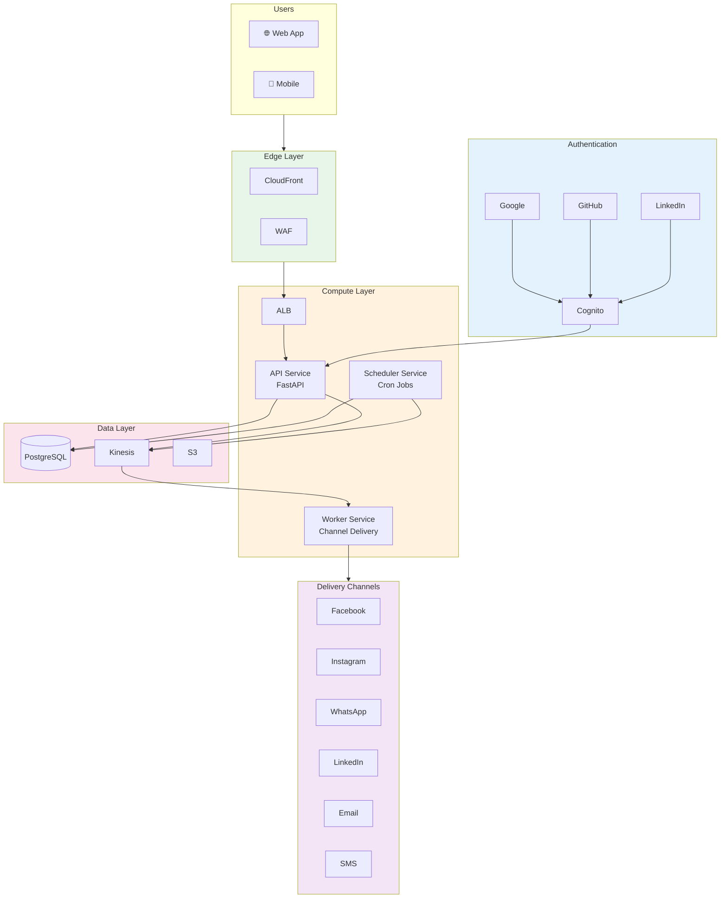

# Omnichannel Publisher Platform

## Project Goal

Build a secure, scalable platform for publishing announcements across multiple social media channels. The primary use case is the **AWS Certification Announcer** - a community tool where members can submit their AWS certification achievements, which are then automatically published to community social media accounts (Facebook, Instagram, WhatsApp, LinkedIn).

## Architecture Overview



## Key Features

- **Multi-channel Publishing**: Facebook, Instagram, WhatsApp, LinkedIn, Email, SMS
- **Social Authentication**: Google, GitHub, LinkedIn, or email/password
- **Scheduled Messages**: Schedule announcements for future delivery
- **Role-based Access**: Admin and Community Manager roles
- **Zero Trust Security**: WAF, encryption, GuardDuty, Security Hub
- **Secure Supply Chain**: Signed containers, SBOM, vulnerability scanning

## Tech Stack

| Layer | Technology |
|-------|------------|
| Frontend | React/Next.js (planned) |
| API | FastAPI (Python) |
| Database | PostgreSQL (RDS) |
| Queue | Kinesis Data Streams |
| Auth | Cognito + Social Providers |
| Infrastructure | AWS CDK (Python) |
| Containers | ECS Fargate |
| CI/CD | GitHub Actions |

## Services

### API Service
Handles HTTP requests, authentication, and message scheduling. Implements hexagonal architecture with clean separation of concerns.

### Worker Service
Consumes messages from Kinesis and delivers them to the appropriate channels (Facebook, Instagram, WhatsApp, LinkedIn, Email, SMS).

### Scheduler Service
Polls the database for scheduled messages and publishes them to Kinesis when due.

## Documentation

- [Architecture](architecture.md) - Detailed system architecture and patterns
- [Security](security.md) - Zero Trust and Secure Supply Chain practices
- [Service Discovery](service-discovery.md) - Cloud Map and inter-service communication
- [AI Agents](ai-agents.md) - Using Bedrock Agents for intelligent posting

## Use Cases

- [AWS Certification Announcer](use-cases/aws-certification-announcer.md) - Primary use case

## Getting Started

### Prerequisites

- [devbox](https://www.jetpack.io/devbox/) - Development environment
- [Docker](https://www.docker.com/) - Container runtime
- [just](https://github.com/casey/just) - Task runner

### Local Development

```bash
# Start local services (PostgreSQL, LocalStack)
just up

# Run database migrations
just migrate

# Start API in development mode
just dev-api

# Run tests
just test
```

### Deployment

```bash
# Deploy infrastructure
cd infra
uv run cdk deploy --all
```

## Project Structure

```
.
├── api/                    # API service (FastAPI)
│   ├── src/
│   │   ├── domain/         # Business entities
│   │   ├── application/    # Use cases and ports
│   │   ├── infrastructure/ # Adapters (DB, Kinesis)
│   │   └── presentation/   # HTTP layer
│   └── tests/
├── worker/                 # Worker service (Kinesis consumer)
│   └── src/
│       └── channels/       # Channel gateways
├── scheduler/              # Scheduler service (cron)
├── infra/                  # CDK infrastructure
│   └── stacks/
├── docs/                   # Documentation
└── .github/                # CI/CD workflows
```

## License

MIT
