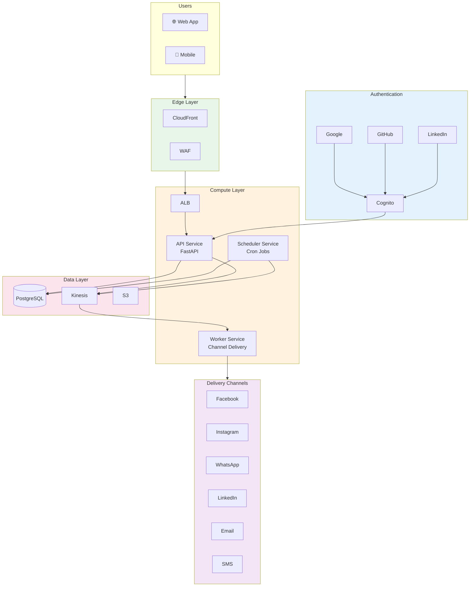

# Omnichannel Publisher Platform

## Project Goal

Build a secure, scalable platform for publishing announcements across multiple social media channels. The primary use case is the **AWS Certification Announcer** - a community tool where members can submit their AWS certification achievements, which are then automatically published to community social media accounts (Facebook, Instagram, WhatsApp, LinkedIn).

## Architecture Overview



## Key Features

- **Multi-channel Publishing**: Facebook, Instagram, WhatsApp, LinkedIn, Email, SMS
- **Social Authentication**: Google, GitHub, LinkedIn, or email/password
- **Scheduled Messages**: Schedule announcements for future delivery
- **Role-based Access**: Admin and Community Manager roles
- **Zero Trust Security**: WAF, encryption, GuardDuty, Security Hub
- **API Security Middleware**: CSRF protection, CSP headers, rate limiting, request validation
- **Secure Supply Chain**: Signed containers, SBOM, vulnerability scanning
- **Enterprise Observability**: Structured logging, distributed tracing, CloudWatch alarms

## Tech Stack

| Layer | Containers | Serverless |
|-------|------------|------------|
| Frontend | React (Amplify) | React (Amplify) |
| API | FastAPI on ECS | FastAPI on Lambda |
| Database | PostgreSQL (RDS) | DynamoDB |
| Queue | Kinesis Data Streams | Kinesis Data Streams |
| Auth | Cognito + Social | Cognito + Social |
| Infrastructure | AWS CDK (Python) | AWS CDK (Python) |
| Compute | ECS Fargate | Lambda |
| CI/CD | GitHub Actions | GitHub Actions |

## Services

### API Service
Handles HTTP requests, authentication, and message scheduling. Implements hexagonal architecture with clean separation of concerns.

### Worker Service
Consumes messages from Kinesis and delivers them to the appropriate channels (Facebook, Instagram, WhatsApp, LinkedIn, Email, SMS).

### Scheduler Service
Polls the database for scheduled messages and publishes them to Kinesis when due.

## Dual-Mode Deployment

The platform supports two deployment modes that can be switched at any time via a single CI/CD parameter:

| | Containers (`infra/`) | Serverless (`infra-fs/`) |
|---|---|---|
| Compute | ECS Fargate | Lambda |
| Database | PostgreSQL (RDS) | DynamoDB (Single-Table) |
| API Gateway | ALB + CloudFront | API Gateway + CloudFront |
| Scheduler | ECS Service (APScheduler) | EventBridge + Lambda |
| Cost (low traffic) | ~$180-200/mo | ~$5-15/mo |

Both modes share the same domain and application layers thanks to hexagonal architecture — only the infrastructure adapters change. The deploy workflow selects the mode via `infra_type` input (`containers` or `serverless`), routing to the corresponding CDK project. Stack names are fully independent, so both can coexist in the same AWS account during migration.

See [Dual-Mode Deployment Guide](dual-mode-deployment.md) for the full migration strategy.

## Documentation

- [Hexagonal Architecture](hexagonal-architecture.md) - Ports & Adapters reference with system diagram
- [Architecture (Containers)](architecture-containers.md) - ECS Fargate deployment with PostgreSQL
- [Architecture (Serverless)](architecture-serverless.md) - Lambda + DynamoDB deployment
- [Dual-Mode Deployment](dual-mode-deployment.md) - Switching between containers and serverless
- [Security](security.md) - Zero Trust and Secure Supply Chain practices
- [Penetration Testing](penetration-testing.md) - Manual security testing guide and checklist
- [Service Discovery](service-discovery.md) - Cloud Map and inter-service communication
- [AI Agents](ai-agents.md) - Using Bedrock Agents for intelligent posting

## Use Cases

- [AWS Certification Announcer](use-cases/aws-certification-announcer.md) - Primary use case
- [Operational Notifications](use-cases/operational-notifications.md) - Dog-fooding CI/CD and monitoring alerts through the platform

## Getting Started

### Prerequisites

- [devbox](https://www.jetpack.io/devbox/) - Development environment
- [Docker](https://www.docker.com/) - Container runtime
- [just](https://github.com/casey/just) - Task runner

### Local Development

```bash
# Start local services (PostgreSQL, LocalStack)
just up

# Run database migrations
just migrate

# Start API in development mode
just dev-api

# Run tests
just test
```

### Deployment

```bash
# Deploy infrastructure
cd infra
uv run cdk deploy --all
```

## Project Structure

```
.
├── api/                    # API service (FastAPI + ECS)
│   ├── src/
│   │   ├── domain/         # Business entities, value objects
│   │   ├── application/    # Use cases, ports, DTOs
│   │   ├── infrastructure/ # Adapters (DB, Kinesis, Secrets)
│   │   └── presentation/   # HTTP routes, middleware
│   ├── tests/              # Unit tests
│   └── alembic/            # Database migrations
│
├── api-lambda/             # API Lambda handler (serverless)
│
├── worker/                 # Worker service (Kinesis consumer + ECS)
│   ├── src/
│   │   ├── domain/         # Ports for channels, publishers
│   │   ├── application/    # Delivery service
│   │   ├── infrastructure/ # Publisher adapters (Direct, AI Agent)
│   │   └── channels/       # Channel gateways (FB, IG, LI, Email, SMS)
│   └── tests/              # Unit tests
│
├── worker-lambda/          # Worker Lambda handler (serverless)
│
├── scheduler/              # Scheduler service (cron + ECS)
│   └── src/                # APScheduler, due message scanner
│
├── scheduler-lambda/       # Scheduler Lambda handler (serverless)
│
├── web/                    # Frontend (React + Vite + TypeScript)
│   └── src/
│       ├── components/     # React components
│       ├── pages/          # Page components
│       ├── api/            # API client
│       └── types/          # TypeScript types
│
├── infra/                  # CDK infrastructure (containers)
│   └── stacks/             # Network, Security, Auth, Data, Compute, Edge, Monitoring
│
├── infra-fs/               # CDK infrastructure (serverless)
│   └── stacks/             # Data, Auth, API, Worker, Scheduler, Security, Frontend
│
├── docs/                   # Documentation
│   ├── architecture-containers.md
│   ├── architecture-serverless.md
│   ├── security.md
│   └── use-cases/
│
├── scripts/                # Utility scripts
│   └── git-hooks/          # Pre-push hooks (lint, test)
│
├── .github/                # CI/CD
│   └── workflows/          # GitHub Actions (security-scan)
│
├── devbox.json             # Development environment
├── docker-compose.yml      # Local services (PostgreSQL, LocalStack)
├── justfile                # Task runner commands
└── ruff.toml               # Linter configuration
```

## License

AGPL-3.0 — See [LICENSE](../LICENSE) for details.
