# AI Agents for Social Media Posting

## Overview

The Omnichannel Publisher uses **Strands Agents SDK** to intelligently orchestrate social media posting. [Strands Agents](https://strandsagents.com) is an open-source SDK from AWS for building production-ready AI agents with a model-first approach.

Instead of simple API calls, an AI agent can:

- Optimize content for each platform
- Handle errors and retry intelligently
- Adapt tone and format per channel
- Make decisions about posting strategy

## Architecture

```mermaid
flowchart TB
    subgraph Input["User Request"]
        REQ["Post certification<br/>announcement"]
    end

    subgraph Agent["Strands Agent (Claude)"]
        LOOP["Agent Loop<br/>• Reasoning<br/>• Tool Selection<br/>• Execution"]
    end

    subgraph Tools["@tool Functions"]
        FB_TOOL["post_to_facebook()"]
        IG_TOOL["post_to_instagram()"]
        LI_TOOL["post_to_linkedin()"]
        WA_TOOL["send_whatsapp()"]
    end

    subgraph Gateways["Channel Gateways"]
        FB["Facebook<br/>Gateway"]
        IG["Instagram<br/>Gateway"]
        LI["LinkedIn<br/>Gateway"]
        WA["WhatsApp<br/>Gateway"]
    end

    subgraph APIs["External APIs"]
        META["Meta Graph API"]
        LINKEDIN_API["LinkedIn API"]
    end

    REQ --> LOOP
    LOOP --> Tools
    FB_TOOL --> FB
    IG_TOOL --> IG
    LI_TOOL --> LI
    WA_TOOL --> WA
    FB --> META
    IG --> META
    WA --> META
    LI --> LINKEDIN_API

    style Agent fill:#e3f2fd
    style Tools fill:#fff3e0
    style Gateways fill:#e8f5e9
```



## Strands Agents SDK

Key features of Strands Agents:

- **Model-first design** - The LLM is the core of agent intelligence
- **Simple tool definition** - Use `@tool` decorator for Python functions
- **Built-in observability** - Traces, metrics, and debugging
- **AWS native** - Seamless integration with Amazon Bedrock
- **Multi-agent patterns** - Swarm, Graph, and Workflow patterns
- **MCP integration** - Native Model Context Protocol support

## Implementation

### Tool Definition

Tools are defined using the `@tool` decorator:

```python
from strands import Agent, tool

@tool
async def post_to_facebook(content: str, media_url: str | None = None) -> dict:
    """
    Post content to the Facebook Page.
    
    Args:
        content: The post content/caption to publish
        media_url: Optional URL to an image
    
    Returns:
        Dictionary with success status and post_id
    """
    result = await facebook_gateway.send(content=content, media_url=media_url)
    return {"success": result.success, "post_id": result.external_id}
```

### Agent Creation

```python
from strands import Agent
from strands.models import BedrockModel

# Configure the model
model = BedrockModel(
    model_id="anthropic.claude-sonnet-4-5-20250929-v1:0",
    region_name="us-east-1",
)

# Create the agent with tools
agent = Agent(
    model=model,
    system_prompt=SYSTEM_PROMPT,
    tools=[post_to_facebook, post_to_instagram, post_to_linkedin, send_whatsapp],
)

# Run the agent
result = agent("Post my AWS certification to all channels")
```

### Agent Loop


The agent automatically:
1. Analyzes the request
2. Decides which tools to call
3. Executes tools and observes results
4. Continues reasoning until task is complete

### Content Adaptation

The agent automatically adapts content for each platform:

| Platform | Adaptation |
|----------|------------|
| Facebook | Longer posts, emojis, hashtags at end |
| Instagram | Visual focus, heavy emojis, hashtags |
| LinkedIn | Professional tone, formal language |
| WhatsApp | Short, celebratory, personal |

## Example

**Input:**
```
Post my AWS Solutions Architect certification to all channels
Member: John Doe
Certification: AWS Solutions Architect Professional
```

**Agent Actions:**

1. **Facebook Post:**
   ```
   🎉 Congratulations to John Doe! 🎉
   
   John has just earned the AWS Solutions Architect Professional 
   certification - one of the most challenging AWS certifications!
   
   Welcome to the elite club of AWS certified architects! 🚀
   
   #AWSCertified #SolutionsArchitect #CloudCommunity #AWSCommunity
   ```

2. **LinkedIn Post:**
   ```
   We're pleased to announce that John Doe has achieved the 
   AWS Solutions Architect Professional certification.
   
   This certification demonstrates advanced expertise in designing 
   distributed systems on AWS. Congratulations, John!
   
   #AWSCertified #CloudArchitecture #ProfessionalDevelopment
   ```

3. **Instagram Post:**
   ```
   🏆 NEW AWS CERTIFIED PRO! 🏆
   
   Congrats John Doe on your Solutions Architect Professional cert! 
   
   🚀☁️💪
   
   #AWSCertified #CloudLife #TechCommunity
   ```

4. **WhatsApp:**
   ```
   🎉 John Doe just got AWS SA Pro certified! Congrats! 🚀
   ```

## Configuration

Enable the AI agent in your environment:

```bash
# .env
USE_AI_AGENT=true

# Available Claude models (via cross-region inference):
# Claude Sonnet 4.5 - Best balance of speed and capability (recommended)
BEDROCK_MODEL_ID=anthropic.claude-sonnet-4-5-20250929-v1:0

# Claude Haiku 4.5 - Fastest and most cost-effective
# BEDROCK_MODEL_ID=anthropic.claude-haiku-4-5-20251001-v1:0

# Claude Opus 4.5 - Most capable for complex reasoning
# BEDROCK_MODEL_ID=anthropic.claude-opus-4-5-20251101-v1:0
```

### Model Comparison

| Model | Speed | Cost | Best For |
|-------|-------|------|----------|
| Claude Haiku 4.5 | ⚡⚡⚡ | $ | High-volume, simple posts |
| Claude Sonnet 4.5 | ⚡⚡ | $$ | Balanced performance (default) |
| Claude Opus 4.5 | ⚡ | $$$ | Complex content optimization |

## Dependencies

Install the required packages:

```bash
pip install strands-agents strands-agents-tools
```

## IAM Permissions

The worker service needs Bedrock permissions:

```json
{
  "Effect": "Allow",
  "Action": [
    "bedrock:InvokeModel",
    "bedrock:InvokeModelWithResponseStream"
  ],
  "Resource": [
    "arn:aws:bedrock:*::foundation-model/anthropic.claude-*"
  ]
}
```

## Observability

Strands provides built-in observability through traces and metrics:

```python
result = agent("Post to all channels")

# Access metrics
print(result.metrics.get_summary())
# {
#   "total_cycles": 4,
#   "total_duration": 5.2,
#   "tool_usage": {
#     "post_to_facebook": {"success_rate": 1.0, "call_count": 1},
#     "post_to_linkedin": {"success_rate": 1.0, "call_count": 1},
#   }
# }
```

## Benefits


## Comparison: Direct API vs AI Agent

| Aspect | Direct API | AI Agent |
|--------|-----------|----------|
| Content | Same for all platforms | Optimized per platform |
| Errors | Simple retry | Intelligent recovery |
| Flexibility | Code changes needed | Prompt changes |
| Cost | API calls only | API + Bedrock |
| Complexity | Lower | Higher |

## When to Use AI Agents

✅ **Use AI Agent when:**
- Content needs platform-specific optimization
- You want intelligent error handling
- Posting strategy may vary by content type
- You need natural language summaries

❌ **Use Direct API when:**
- Simple, identical posts across platforms
- Cost is a primary concern
- Latency is critical
- Content is pre-formatted

## Other Agents

- [Security Testing Agent](security-testing-agent.md) — AI-powered penetration testing assistant using the same Strands SDK, scoped to running, debugging, and fixing security tests.

## References

- [Strands Agents Documentation](https://strandsagents.com)
- [Strands Agents GitHub](https://github.com/strands-agents/sdk-python)
- [AWS Blog: Introducing Strands Agents](https://aws.amazon.com/blogs/opensource/introducing-strands-agents-an-open-source-ai-agents-sdk/)
- [Amazon Bedrock Documentation](https://docs.aws.amazon.com/bedrock/)
