# Architecture

## AWS Infrastructure Overview

The Omnichannel Publisher is deployed on AWS using a secure, layered defense architecture with DevSecOps practices.

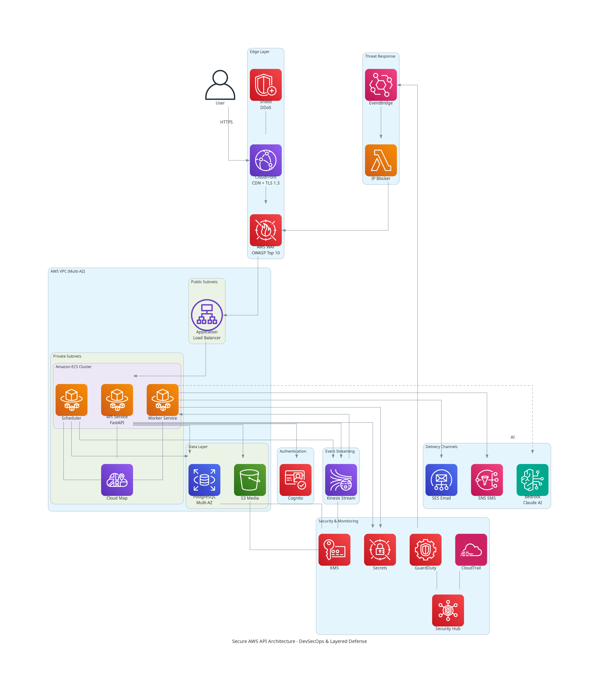

### Architecture Components

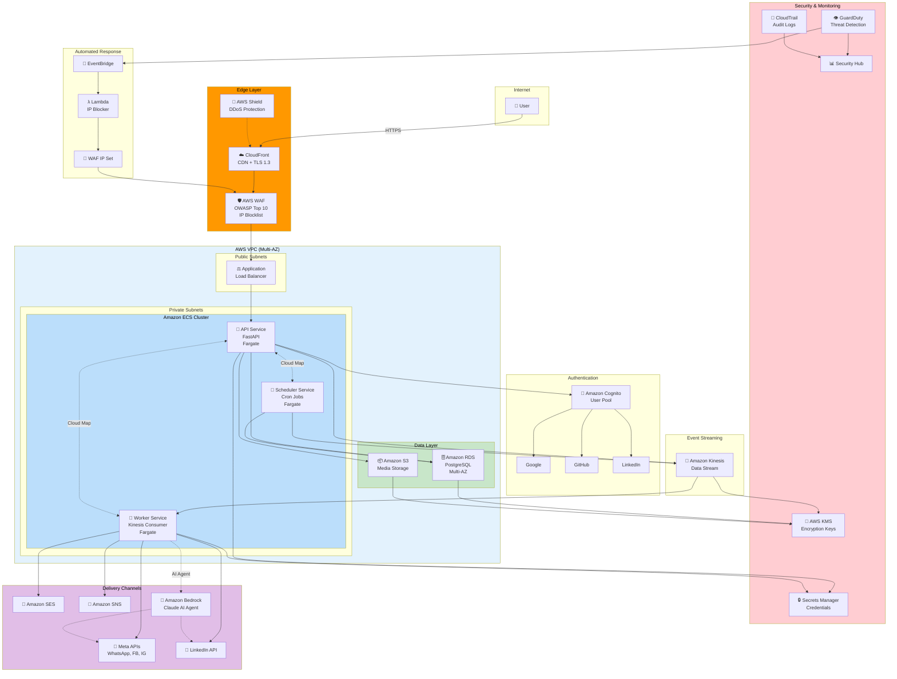
```mermaid
flowchart TB
    subgraph Internet["Internet"]
        User["👤 User"]
    end

    subgraph Edge["Edge Layer"]
        CF["☁️ CloudFront<br/>CDN + TLS 1.3"]
        WAF["🛡️ AWS WAF<br/>OWASP Top 10<br/>IP Blocklist"]
        Shield["🔰 AWS Shield<br/>DDoS Protection"]
    end

    subgraph VPC["AWS VPC (Multi-AZ)"]
        subgraph Public["Public Subnets"]
            ALB["⚖️ Application<br/>Load Balancer"]
        end

        subgraph Private["Private Subnets"]
            subgraph ECS["Amazon ECS Cluster"]
                API["🔷 API Service<br/>FastAPI<br/>Fargate"]
                Worker["🔷 Worker Service<br/>Kinesis Consumer<br/>Fargate"]
                Scheduler["🔷 Scheduler Service<br/>Cron Jobs<br/>Fargate"]
            end
        end

        subgraph Data["Data Layer"]
            RDS["🗄️ Amazon RDS<br/>PostgreSQL<br/>Multi-AZ"]
            S3["📦 Amazon S3<br/>Media Storage"]
        end
    end

    subgraph Messaging["Event Streaming"]
        Kinesis["📨 Amazon Kinesis<br/>Data Stream"]
    end

    subgraph Auth["Authentication"]
        Cognito["🔐 Amazon Cognito<br/>User Pool"]
        Google["Google"]
        GitHub["GitHub"]
        LinkedIn["LinkedIn"]
    end

    subgraph Security["Security & Monitoring"]
        KMS["🔑 AWS KMS<br/>Encryption Keys"]
        Secrets["🔒 Secrets Manager<br/>Credentials"]
        GuardDuty["👁️ GuardDuty<br/>Threat Detection"]
        SecurityHub["📊 Security Hub"]
        CloudTrail["📝 CloudTrail<br/>Audit Logs"]
    end

    subgraph Channels["Delivery Channels"]
        Meta["📱 Meta APIs<br/>WhatsApp, FB, IG"]
        LI["💼 LinkedIn API"]
        SES["📧 Amazon SES"]
        SNS["📲 Amazon SNS"]
        Bedrock["🤖 Amazon Bedrock<br/>Claude AI Agent"]
    end

    subgraph AutoResponse["Automated Response"]
        EventBridge["📡 EventBridge"]
        Lambda["λ Lambda<br/>IP Blocker"]
        IPSet["🚫 WAF IP Set"]
    end

    %% User flow
    User -->|HTTPS| CF
    CF --> WAF
    WAF --> ALB
    Shield -.-> CF
    ALB --> API

    %% Auth flow
    API --> Cognito
    Cognito --> Google
    Cognito --> GitHub
    Cognito --> LinkedIn

    %% Internal flow
    API --> RDS
    API --> Kinesis
    API --> S3
    Kinesis --> Worker
    Scheduler --> RDS
    Scheduler --> Kinesis

    %% Worker delivery
    Worker --> Meta
    Worker --> LI
    Worker --> SES
    Worker --> SNS
    Worker -.->|AI Agent| Bedrock
    Bedrock -.-> Meta
    Bedrock -.-> LI

    %% Service Discovery
    API <-.->|Cloud Map| Worker
    API <-.->|Cloud Map| Scheduler

    %% Security
    RDS --> KMS
    S3 --> KMS
    Kinesis --> KMS
    API --> Secrets
    Worker --> Secrets

    %% Threat response
    GuardDuty --> EventBridge
    EventBridge --> Lambda
    Lambda --> IPSet
    IPSet --> WAF

    %% Monitoring
    GuardDuty --> SecurityHub
    CloudTrail --> SecurityHub

    style Edge fill:#ff9800,color:#000
    style VPC fill:#e3f2fd,color:#000
    style ECS fill:#bbdefb,color:#000
    style Data fill:#c8e6c9,color:#000
    style Security fill:#ffcdd2,color:#000
    style Channels fill:#e1bee7,color:#000
```

## Security Layers

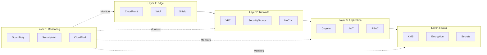
```mermaid
flowchart LR
    subgraph L1["Layer 1: Edge"]
        CloudFront
        WAF
        Shield
    end

    subgraph L2["Layer 2: Network"]
        VPC
        SecurityGroups
        NACLs
    end

    subgraph L3["Layer 3: Application"]
        Cognito
        JWT
        RBAC
    end

    subgraph L4["Layer 4: Data"]
        KMS
        Encryption
        Secrets
    end

    subgraph L5["Layer 5: Monitoring"]
        GuardDuty
        SecurityHub
        CloudTrail
    end

    L1 --> L2 --> L3 --> L4
    L5 -.->|Monitors| L1
    L5 -.->|Monitors| L2
    L5 -.->|Monitors| L3
    L5 -.->|Monitors| L4
```

## Service Architecture

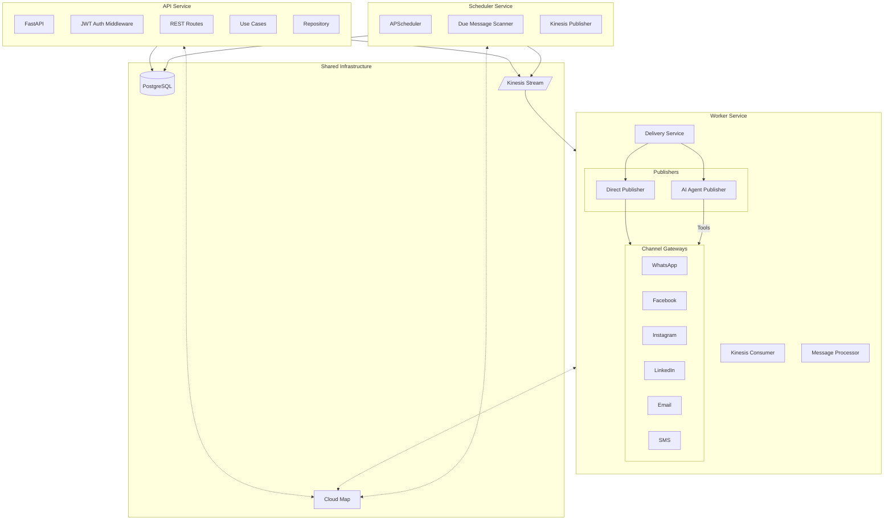
```mermaid
flowchart TB
    subgraph API["API Service"]
        direction TB
        FastAPI["FastAPI"]
        AuthMW["JWT Auth Middleware"]
        Routes["REST Routes"]
        UseCases["Use Cases"]
        Repo["Repository"]
    end

    subgraph Worker["Worker Service"]
        direction TB
        Consumer["Kinesis Consumer"]
        Processor["Message Processor"]
        DeliveryService["Delivery Service"]
        subgraph Publishers["Publishers"]
            Direct["Direct Publisher"]
            Agent["AI Agent Publisher"]
        end
        subgraph Gateways["Channel Gateways"]
            WA["WhatsApp"]
            FB["Facebook"]
            IG["Instagram"]
            LI["LinkedIn"]
            Email["Email"]
            SMS["SMS"]
        end
    end

    subgraph Scheduler["Scheduler Service"]
        direction TB
        APScheduler["APScheduler"]
        Scanner["Due Message Scanner"]
        Publisher["Kinesis Publisher"]
    end

    subgraph Shared["Shared Infrastructure"]
        RDS[(PostgreSQL)]
        Kinesis[/Kinesis Stream/]
        CloudMap["Cloud Map"]
    end

    API --> RDS
    API --> Kinesis
    Kinesis --> Worker
    Scheduler --> RDS
    Scheduler --> Kinesis
    
    DeliveryService --> Direct
    DeliveryService --> Agent
    Direct --> Gateways
    Agent -->|Tools| Gateways

    API <-.-> CloudMap
    Worker <-.-> CloudMap
    Scheduler <-.-> CloudMap
```

## API Security Middleware Stack

The API service implements a comprehensive middleware stack for defense-in-depth security:

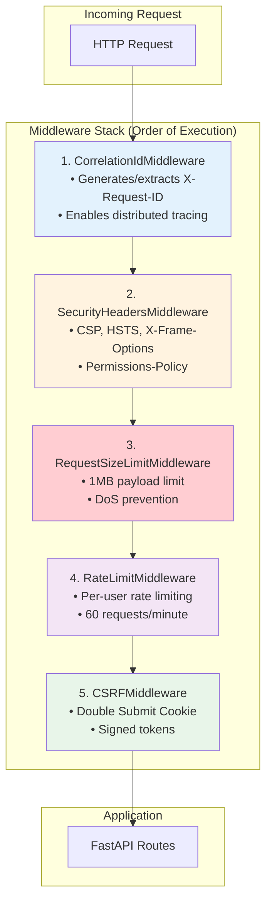
```mermaid
flowchart TB
    subgraph Request["Incoming Request"]
        REQ["HTTP Request"]
    end

    subgraph Middleware["Middleware Stack (Order of Execution)"]
        direction TB
        CORR["1. CorrelationIdMiddleware<br/>• Generates/extracts X-Request-ID<br/>• Enables distributed tracing"]
        SEC["2. SecurityHeadersMiddleware<br/>• CSP, HSTS, X-Frame-Options<br/>• Permissions-Policy"]
        SIZE["3. RequestSizeLimitMiddleware<br/>• 1MB payload limit<br/>• DoS prevention"]
        RATE["4. RateLimitMiddleware<br/>• Per-user rate limiting<br/>• 60 requests/minute"]
        CSRF["5. CSRFMiddleware<br/>• Double Submit Cookie<br/>• Signed tokens"]
    end

    subgraph App["Application"]
        ROUTES["FastAPI Routes"]
    end

    REQ --> CORR --> SEC --> SIZE --> RATE --> CSRF --> ROUTES

    style CORR fill:#e3f2fd
    style SEC fill:#fff3e0
    style SIZE fill:#ffcdd2
    style RATE fill:#f3e5f5
    style CSRF fill:#e8f5e9
```

### Middleware Details

| Middleware | Purpose | Configuration |
|------------|---------|---------------|
| CorrelationIdMiddleware | Distributed tracing | Auto-generates UUID if missing |
| SecurityHeadersMiddleware | Browser security | CSP, HSTS (1 year), X-Frame-Options: DENY |
| RequestSizeLimitMiddleware | DoS prevention | 1MB max payload |
| RateLimitMiddleware | Abuse prevention | 60 req/min per user |
| CSRFMiddleware | CSRF protection | Double Submit Cookie, HMAC-signed tokens |

### Security Headers Applied

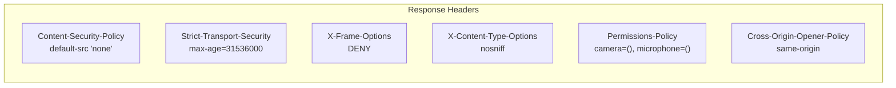
```mermaid
flowchart LR
    subgraph Headers["Response Headers"]
        CSP["Content-Security-Policy<br/>default-src 'none'"]
        HSTS["Strict-Transport-Security<br/>max-age=31536000"]
        XFO["X-Frame-Options<br/>DENY"]
        XCTO["X-Content-Type-Options<br/>nosniff"]
        PP["Permissions-Policy<br/>camera=(), microphone=()"]
        COOP["Cross-Origin-Opener-Policy<br/>same-origin"]
    end
```

### CSRF Protection Flow

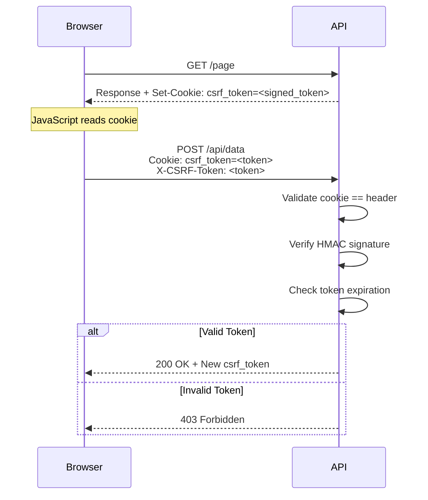
```mermaid
sequenceDiagram
    participant Browser
    participant API

    Browser->>API: GET /page
    API-->>Browser: Response + Set-Cookie: csrf_token=<signed_token>
    
    Note over Browser: JavaScript reads cookie
    
    Browser->>API: POST /api/data<br/>Cookie: csrf_token=<token><br/>X-CSRF-Token: <token>
    
    API->>API: Validate cookie == header
    API->>API: Verify HMAC signature
    API->>API: Check token expiration
    
    alt Valid Token
        API-->>Browser: 200 OK + New csrf_token
    else Invalid Token
        API-->>Browser: 403 Forbidden
    end
```

## Data Flow

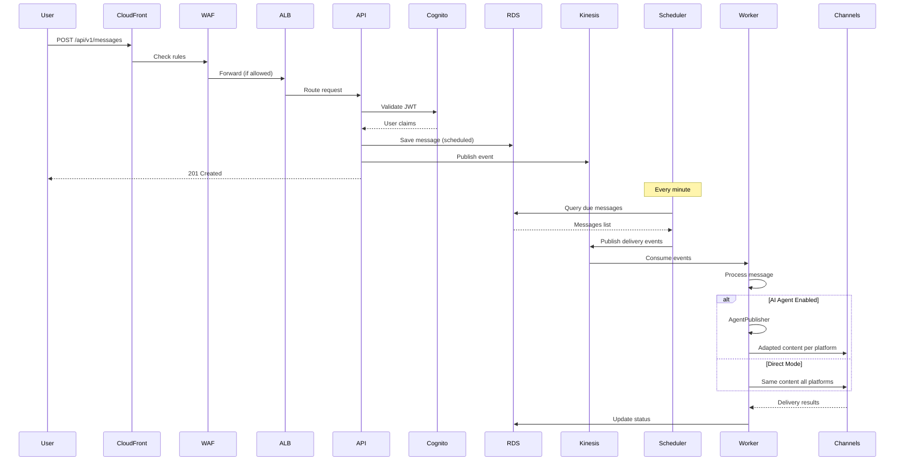
```mermaid
sequenceDiagram
    participant User
    participant CloudFront
    participant WAF
    participant ALB
    participant API
    participant Cognito
    participant RDS
    participant Kinesis
    participant Scheduler
    participant Worker
    participant Channels

    User->>CloudFront: POST /api/v1/messages
    CloudFront->>WAF: Check rules
    WAF->>ALB: Forward (if allowed)
    ALB->>API: Route request
    
    API->>Cognito: Validate JWT
    Cognito-->>API: User claims
    
    API->>RDS: Save message (scheduled)
    API->>Kinesis: Publish event
    API-->>User: 201 Created

    Note over Scheduler: Every minute
    Scheduler->>RDS: Query due messages
    RDS-->>Scheduler: Messages list
    Scheduler->>Kinesis: Publish delivery events

    Kinesis->>Worker: Consume events
    Worker->>Worker: Process message
    
    alt AI Agent Enabled
        Worker->>Worker: AgentPublisher
        Worker->>Channels: Adapted content per platform
    else Direct Mode
        Worker->>Channels: Same content all platforms
    end
    
    Channels-->>Worker: Delivery results
    Worker->>RDS: Update status
```

## CDK Stack Dependencies

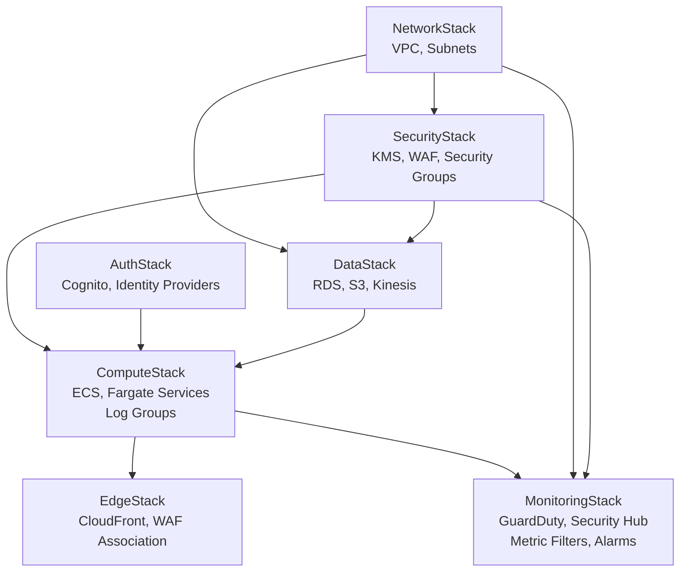
```mermaid
flowchart TB
    Network["NetworkStack<br/>VPC, Subnets"]
    Security["SecurityStack<br/>KMS, WAF, Security Groups"]
    Auth["AuthStack<br/>Cognito, Identity Providers"]
    Data["DataStack<br/>RDS, S3, Kinesis"]
    Compute["ComputeStack<br/>ECS, Fargate Services<br/>Log Groups"]
    Edge["EdgeStack<br/>CloudFront, WAF Association"]
    Monitoring["MonitoringStack<br/>GuardDuty, Security Hub<br/>Metric Filters, Alarms"]

    Network --> Security
    Network --> Data
    Security --> Data
    Security --> Compute
    Auth --> Compute
    Data --> Compute
    Compute --> Edge
    Compute --> Monitoring
    Network --> Monitoring
    Security --> Monitoring
```

---

## Observability & Monitoring

### Enterprise Logging Architecture

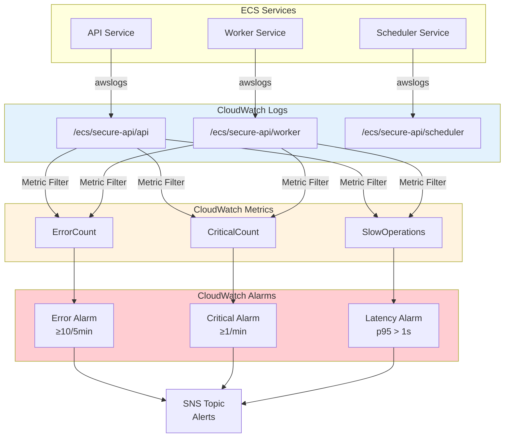
```mermaid
flowchart TB
    subgraph Services["ECS Services"]
        API["API Service"]
        Worker["Worker Service"]
        Scheduler["Scheduler Service"]
    end

    subgraph Logging["CloudWatch Logs"]
        API_LOG["/ecs/secure-api/api"]
        WORKER_LOG["/ecs/secure-api/worker"]
        SCHEDULER_LOG["/ecs/secure-api/scheduler"]
    end

    subgraph Metrics["CloudWatch Metrics"]
        ERROR["ErrorCount"]
        CRITICAL["CriticalCount"]
        LATENCY["SlowOperations"]
    end

    subgraph Alarms["CloudWatch Alarms"]
        ERROR_ALARM["Error Alarm<br/>≥10/5min"]
        CRITICAL_ALARM["Critical Alarm<br/>≥1/min"]
        LATENCY_ALARM["Latency Alarm<br/>p95 > 1s"]
    end

    SNS["SNS Topic<br/>Alerts"]

    API -->|awslogs| API_LOG
    Worker -->|awslogs| WORKER_LOG
    Scheduler -->|awslogs| SCHEDULER_LOG

    API_LOG -->|Metric Filter| ERROR
    API_LOG -->|Metric Filter| CRITICAL
    API_LOG -->|Metric Filter| LATENCY

    WORKER_LOG -->|Metric Filter| ERROR
    WORKER_LOG -->|Metric Filter| CRITICAL
    WORKER_LOG -->|Metric Filter| LATENCY

    ERROR --> ERROR_ALARM
    CRITICAL --> CRITICAL_ALARM
    LATENCY --> LATENCY_ALARM

    ERROR_ALARM --> SNS
    CRITICAL_ALARM --> SNS
    LATENCY_ALARM --> SNS

    style Logging fill:#e3f2fd
    style Metrics fill:#fff3e0
    style Alarms fill:#ffcdd2
```

### Distributed Tracing with Correlation IDs

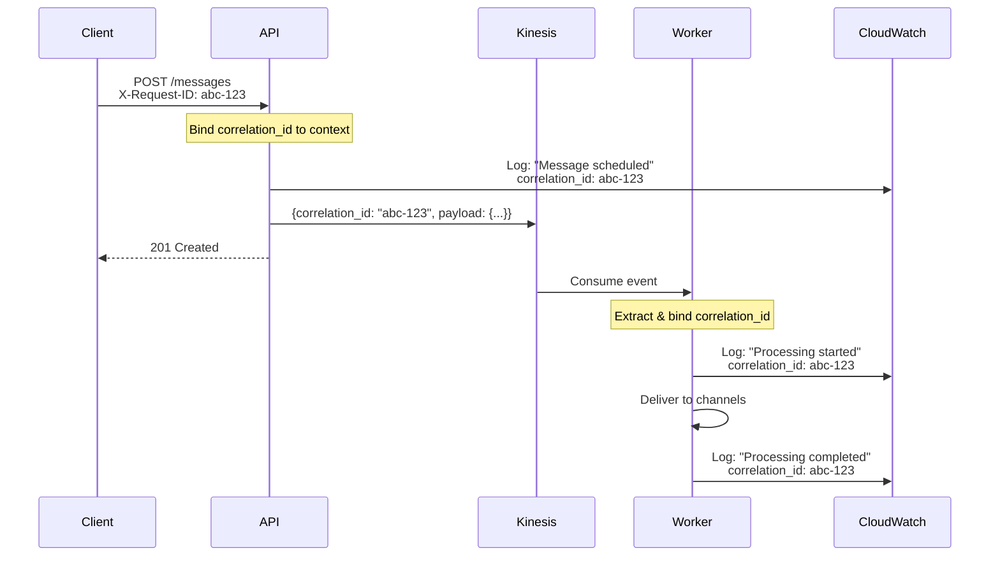
```mermaid
sequenceDiagram
    participant Client
    participant API
    participant Kinesis
    participant Worker
    participant CloudWatch

    Client->>API: POST /messages<br/>X-Request-ID: abc-123
    Note over API: Bind correlation_id to context
    API->>CloudWatch: Log: "Message scheduled"<br/>correlation_id: abc-123
    API->>Kinesis: {correlation_id: "abc-123", payload: {...}}
    API-->>Client: 201 Created

    Kinesis->>Worker: Consume event
    Note over Worker: Extract & bind correlation_id
    Worker->>CloudWatch: Log: "Processing started"<br/>correlation_id: abc-123
    Worker->>Worker: Deliver to channels
    Worker->>CloudWatch: Log: "Processing completed"<br/>correlation_id: abc-123
```

### Log Format (JSON Structured)

```json
{
  "event": "Message processed",
  "timestamp": "2026-02-05T19:45:32.456789Z",
  "level": "info",
  "logger": "worker.processor",
  "service": "omnichannel-worker",
  "correlation_id": "a1b2c3d4-e5f6-7890-abcd-ef1234567890",
  "message_id": "msg-123",
  "channels": ["facebook", "linkedin"],
  "duration_ms": 245.67
}
```

### CloudWatch Logs Insights Queries

```sql
-- Trace request across services by correlation ID
fields @timestamp, service, event, message_id
| filter correlation_id = "your-correlation-id"
| sort @timestamp asc

-- Error rate by service (hourly)
fields service, level
| filter level = "error"
| stats count() by service, bin(1h)

-- Slow operations (>500ms)
fields @timestamp, service, event, duration_ms
| filter duration_ms > 500
| sort duration_ms desc
```

---

## Hexagonal Architecture (Ports & Adapters)

### Overview

The Omnichannel Publisher follows Hexagonal Architecture (also known as Ports & Adapters), which isolates the core business logic from external concerns like databases, APIs, and message queues.

## Hexagonal Architecture Diagram

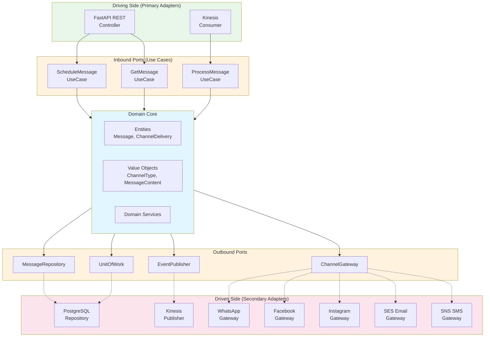
```mermaid
graph TB
    subgraph Driving["Driving Side (Primary Adapters)"]
        REST["FastAPI REST<br/>Controller"]
        KINESIS_IN["Kinesis<br/>Consumer"]
    end

    subgraph Ports_In["Inbound Ports (Use Cases)"]
        SCHEDULE["ScheduleMessage<br/>UseCase"]
        GET["GetMessage<br/>UseCase"]
        PROCESS["ProcessMessage<br/>UseCase"]
    end

    subgraph Core["Domain Core"]
        ENTITIES["Entities<br/>Message, ChannelDelivery"]
        VO["Value Objects<br/>ChannelType, MessageContent"]
        SERVICES["Domain Services"]
    end

    subgraph Ports_Out["Outbound Ports"]
        REPO["MessageRepository"]
        EVENTS["EventPublisher"]
        GATEWAY["ChannelGateway"]
        UOW["UnitOfWork"]
    end

    subgraph Driven["Driven Side (Secondary Adapters)"]
        POSTGRES["PostgreSQL<br/>Repository"]
        KINESIS_OUT["Kinesis<br/>Publisher"]
        WHATSAPP["WhatsApp<br/>Gateway"]
        FACEBOOK["Facebook<br/>Gateway"]
        INSTAGRAM["Instagram<br/>Gateway"]
        EMAIL["SES Email<br/>Gateway"]
        SMS["SNS SMS<br/>Gateway"]
    end

    REST --> SCHEDULE
    REST --> GET
    KINESIS_IN --> PROCESS

    SCHEDULE --> Core
    GET --> Core
    PROCESS --> Core

    Core --> REPO
    Core --> EVENTS
    Core --> GATEWAY
    Core --> UOW

    REPO -.-> POSTGRES
    EVENTS -.-> KINESIS_OUT
    GATEWAY -.-> WHATSAPP
    GATEWAY -.-> FACEBOOK
    GATEWAY -.-> INSTAGRAM
    GATEWAY -.-> EMAIL
    GATEWAY -.-> SMS
    UOW -.-> POSTGRES

    style Core fill:#e1f5fe
    style Ports_In fill:#fff3e0
    style Ports_Out fill:#fff3e0
    style Driving fill:#e8f5e9
    style Driven fill:#fce4ec
```

## Layer Responsibilities

### Domain Core (Center)
The heart of the application containing pure business logic with zero external dependencies.

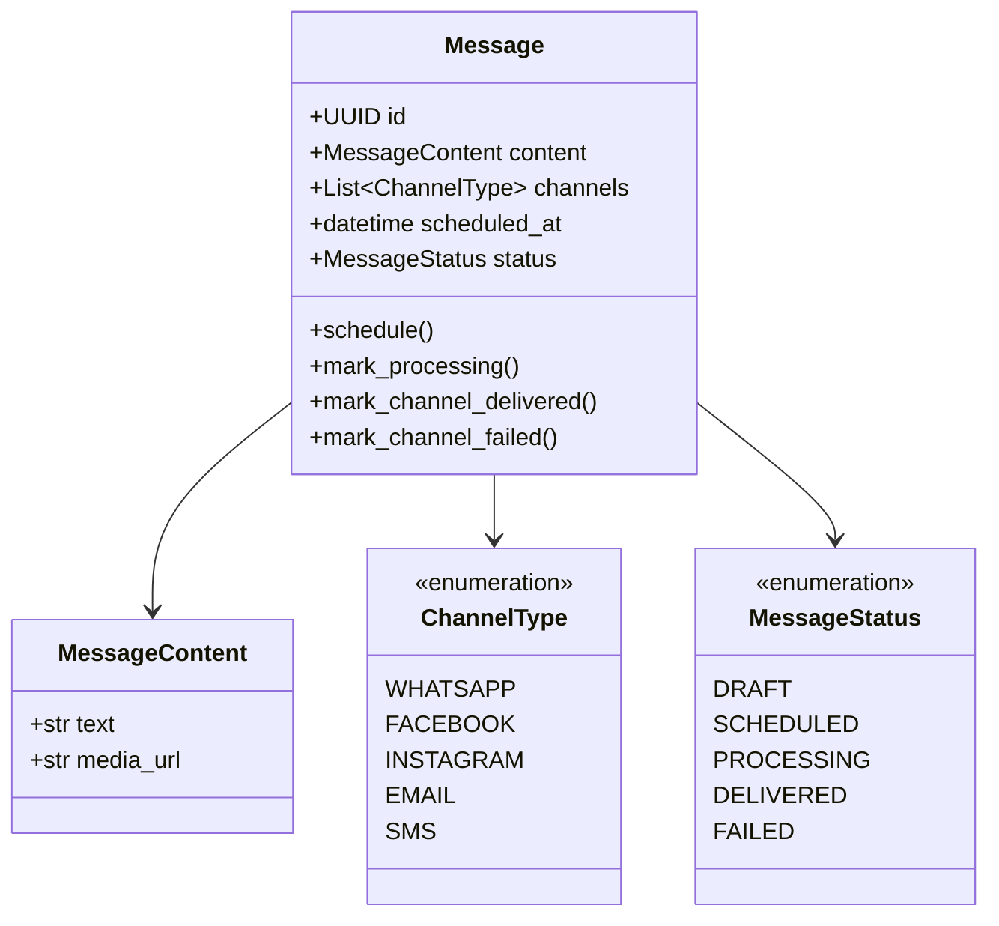
```mermaid
classDiagram
    class Message {
        +UUID id
        +MessageContent content
        +List~ChannelType~ channels
        +datetime scheduled_at
        +MessageStatus status
        +schedule()
        +mark_processing()
        +mark_channel_delivered()
        +mark_channel_failed()
    }

    class MessageContent {
        +str text
        +str media_url
    }

    class ChannelType {
        <<enumeration>>
        WHATSAPP
        FACEBOOK
        INSTAGRAM
        EMAIL
        SMS
    }

    class MessageStatus {
        <<enumeration>>
        DRAFT
        SCHEDULED
        PROCESSING
        DELIVERED
        FAILED
    }

    Message --> MessageContent
    Message --> ChannelType
    Message --> MessageStatus
```

### Inbound Ports (Use Cases)
Abstract interfaces defining what the application can do.

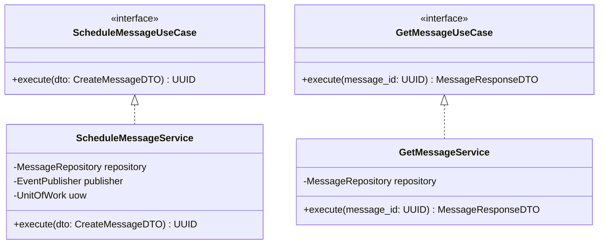
```mermaid
classDiagram
    class ScheduleMessageUseCase {
        <<interface>>
        +execute(dto: CreateMessageDTO) UUID
    }

    class GetMessageUseCase {
        <<interface>>
        +execute(message_id: UUID) MessageResponseDTO
    }

    class ScheduleMessageService {
        -MessageRepository repository
        -EventPublisher publisher
        -UnitOfWork uow
        +execute(dto: CreateMessageDTO) UUID
    }

    class GetMessageService {
        -MessageRepository repository
        +execute(message_id: UUID) MessageResponseDTO
    }

    ScheduleMessageUseCase <|.. ScheduleMessageService
    GetMessageUseCase <|.. GetMessageService
```

### Outbound Ports
Abstract interfaces for external dependencies.

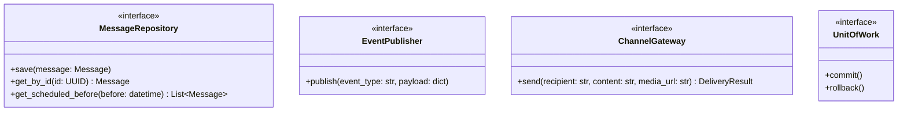
```mermaid
classDiagram
    class MessageRepository {
        <<interface>>
        +save(message: Message)
        +get_by_id(id: UUID) Message
        +get_scheduled_before(before: datetime) List~Message~
    }

    class EventPublisher {
        <<interface>>
        +publish(event_type: str, payload: dict)
    }

    class ChannelGateway {
        <<interface>>
        +send(recipient: str, content: str, media_url: str) DeliveryResult
    }

    class UnitOfWork {
        <<interface>>
        +commit()
        +rollback()
    }
```

### Adapters
Concrete implementations of ports.

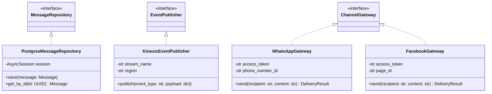
```mermaid
classDiagram
    class MessageRepository {
        <<interface>>
    }

    class PostgresMessageRepository {
        -AsyncSession session
        +save(message: Message)
        +get_by_id(id: UUID) Message
    }

    class EventPublisher {
        <<interface>>
    }

    class KinesisEventPublisher {
        -str stream_name
        -str region
        +publish(event_type: str, payload: dict)
    }

    class ChannelGateway {
        <<interface>>
    }

    class WhatsAppGateway {
        -str access_token
        -str phone_number_id
        +send(recipient: str, content: str) DeliveryResult
    }

    class FacebookGateway {
        -str access_token
        -str page_id
        +send(recipient: str, content: str) DeliveryResult
    }

    MessageRepository <|.. PostgresMessageRepository
    EventPublisher <|.. KinesisEventPublisher
    ChannelGateway <|.. WhatsAppGateway
    ChannelGateway <|.. FacebookGateway
```

## Folder Structure

```
api/src/
├── domain/                          # Domain Core
│   ├── entities/
│   │   └── message.py               # Message aggregate root
│   └── value_objects/
│       ├── channel_type.py          # ChannelType enum
│       └── content.py               # MessageContent value object
│
├── application/                     # Application Layer
│   ├── ports/
│   │   ├── inbound/                 # Use case interfaces
│   │   │   ├── schedule_message.py
│   │   │   └── get_message.py
│   │   └── outbound/                # Repository/service interfaces
│   │       ├── message_repository.py
│   │       ├── event_publisher.py
│   │       └── unit_of_work.py
│   ├── services/                    # Use case implementations
│   │   ├── schedule_message_service.py
│   │   └── get_message_service.py
│   └── dtos/                        # Data transfer objects
│       └── message_dto.py
│
├── infrastructure/                  # Infrastructure Layer
│   ├── adapters/
│   │   ├── persistence/             # Database adapters
│   │   │   ├── postgres_message_repository.py
│   │   │   └── sqlalchemy_unit_of_work.py
│   │   └── messaging/               # Message queue adapters
│   │       └── kinesis_event_publisher.py
│   └── persistence/
│       ├── database.py              # Database connection
│       └── models.py                # SQLAlchemy models
│
└── presentation/                    # Presentation Layer
    └── api/
        ├── dependencies.py          # Dependency injection
        └── v1/
            ├── health.py
            └── messages.py          # REST endpoints
```

## Request Flow

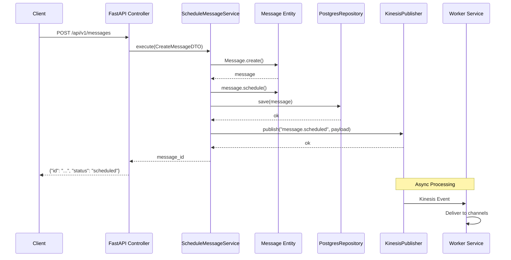
```mermaid
sequenceDiagram
    participant Client
    participant FastAPI as FastAPI Controller
    participant UseCase as ScheduleMessageService
    participant Domain as Message Entity
    participant Repo as PostgresRepository
    participant Publisher as KinesisPublisher
    participant Worker as Worker Service

    Client->>FastAPI: POST /api/v1/messages
    FastAPI->>UseCase: execute(CreateMessageDTO)
    UseCase->>Domain: Message.create()
    Domain-->>UseCase: message
    UseCase->>Domain: message.schedule()
    UseCase->>Repo: save(message)
    Repo-->>UseCase: ok
    UseCase->>Publisher: publish("message.scheduled", payload)
    Publisher-->>UseCase: ok
    UseCase-->>FastAPI: message_id
    FastAPI-->>Client: {"id": "...", "status": "scheduled"}

    Note over Publisher,Worker: Async Processing
    Publisher->>Worker: Kinesis Event
    Worker->>Worker: Deliver to channels
```

## Benefits of Hexagonal Architecture

| Benefit | Description |
|---------|-------------|
| **Testability** | Domain and use cases can be tested without infrastructure |
| **Flexibility** | Swap adapters without changing business logic |
| **Maintainability** | Clear boundaries make code easier to understand |
| **Independence** | Domain doesn't depend on frameworks or databases |
| **Parallel Development** | Teams can work on different adapters independently |

## Dependency Rule

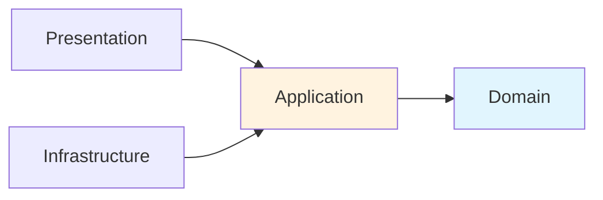
```mermaid
graph LR
    A[Presentation] --> B[Application]
    B --> C[Domain]
    D[Infrastructure] --> B

    style C fill:#e1f5fe
    style B fill:#fff3e0
```

Dependencies always point inward:
- **Presentation** depends on **Application**
- **Application** depends on **Domain**
- **Infrastructure** depends on **Application** (implements ports)
- **Domain** depends on nothing

## Testing Strategy

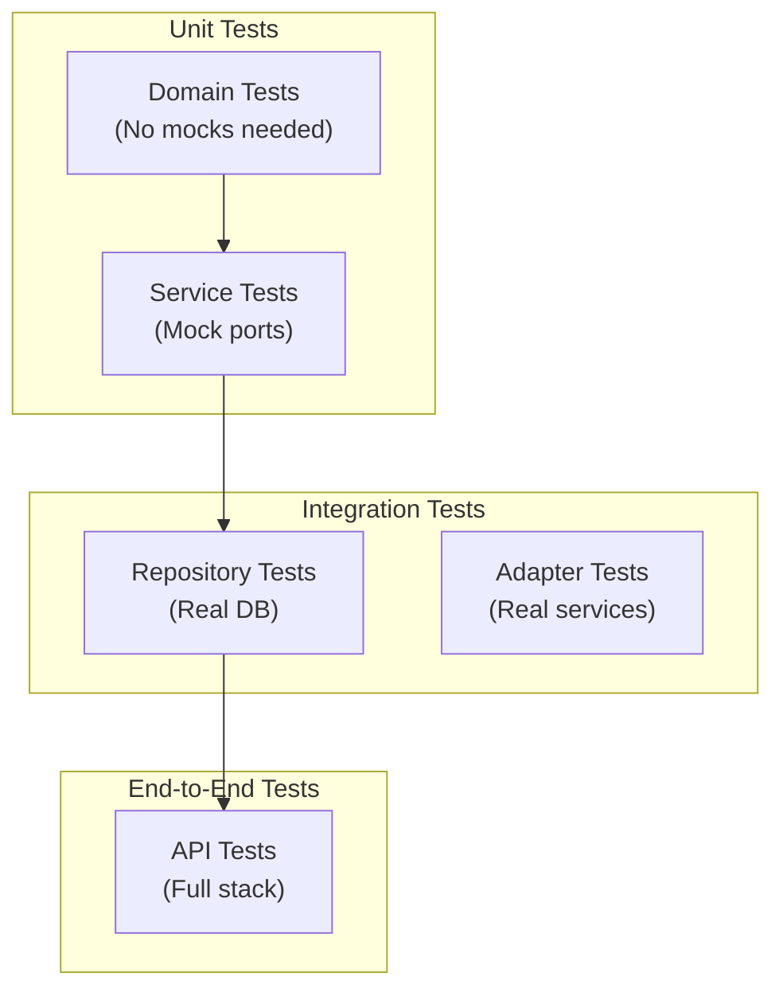
```mermaid
graph TB
    subgraph Unit["Unit Tests"]
        DOMAIN_TEST["Domain Tests<br/>(No mocks needed)"]
        SERVICE_TEST["Service Tests<br/>(Mock ports)"]
    end

    subgraph Integration["Integration Tests"]
        REPO_TEST["Repository Tests<br/>(Real DB)"]
        ADAPTER_TEST["Adapter Tests<br/>(Real services)"]
    end

    subgraph E2E["End-to-End Tests"]
        API_TEST["API Tests<br/>(Full stack)"]
    end

    DOMAIN_TEST --> SERVICE_TEST
    SERVICE_TEST --> REPO_TEST
    REPO_TEST --> API_TEST
```

| Layer | Test Type | Dependencies |
|-------|-----------|--------------|
| Domain | Unit | None |
| Services | Unit | Mocked ports |
| Adapters | Integration | Real DB/services |
| API | E2E | Full application |

## Worker Service Architecture

The Worker service also follows hexagonal architecture, with support for both direct API publishing and AI-powered intelligent publishing.

### Worker Hexagonal Diagram

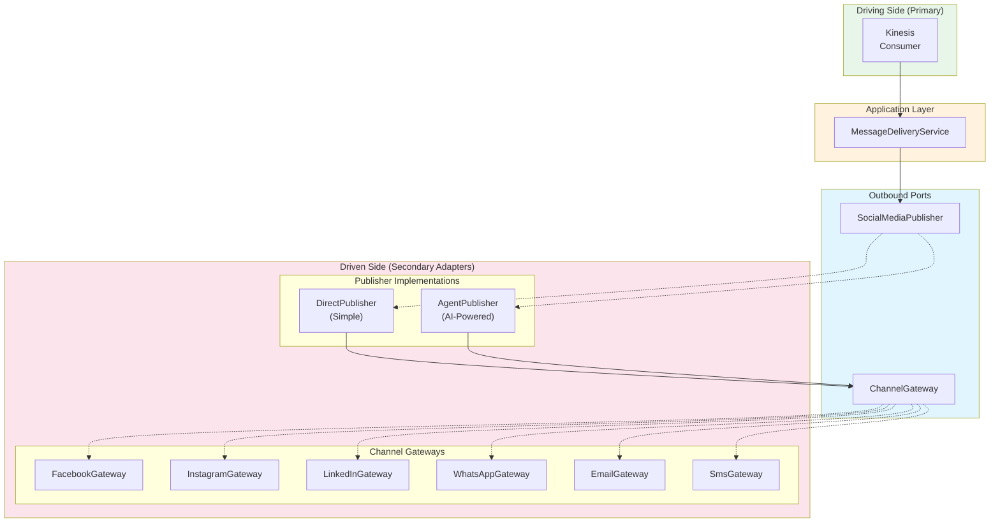
```mermaid
graph TB
    subgraph Driving["Driving Side (Primary)"]
        KINESIS_IN["Kinesis<br/>Consumer"]
    end

    subgraph Application["Application Layer"]
        DELIVERY["MessageDeliveryService"]
    end

    subgraph Ports_Out["Outbound Ports"]
        PUBLISHER["SocialMediaPublisher"]
        GATEWAY["ChannelGateway"]
    end

    subgraph Driven["Driven Side (Secondary Adapters)"]
        subgraph Publishers["Publisher Implementations"]
            DIRECT["DirectPublisher<br/>(Simple)"]
            AGENT["AgentPublisher<br/>(AI-Powered)"]
        end
        
        subgraph Channels["Channel Gateways"]
            FB["FacebookGateway"]
            IG["InstagramGateway"]
            LI["LinkedInGateway"]
            WA["WhatsAppGateway"]
            EMAIL["EmailGateway"]
            SMS["SmsGateway"]
        end
    end

    KINESIS_IN --> DELIVERY
    DELIVERY --> PUBLISHER
    
    PUBLISHER -.-> DIRECT
    PUBLISHER -.-> AGENT
    
    DIRECT --> GATEWAY
    AGENT --> GATEWAY
    
    GATEWAY -.-> FB
    GATEWAY -.-> IG
    GATEWAY -.-> LI
    GATEWAY -.-> WA
    GATEWAY -.-> EMAIL
    GATEWAY -.-> SMS

    style Application fill:#fff3e0
    style Ports_Out fill:#e1f5fe
    style Driving fill:#e8f5e9
    style Driven fill:#fce4ec
```

### Worker Ports

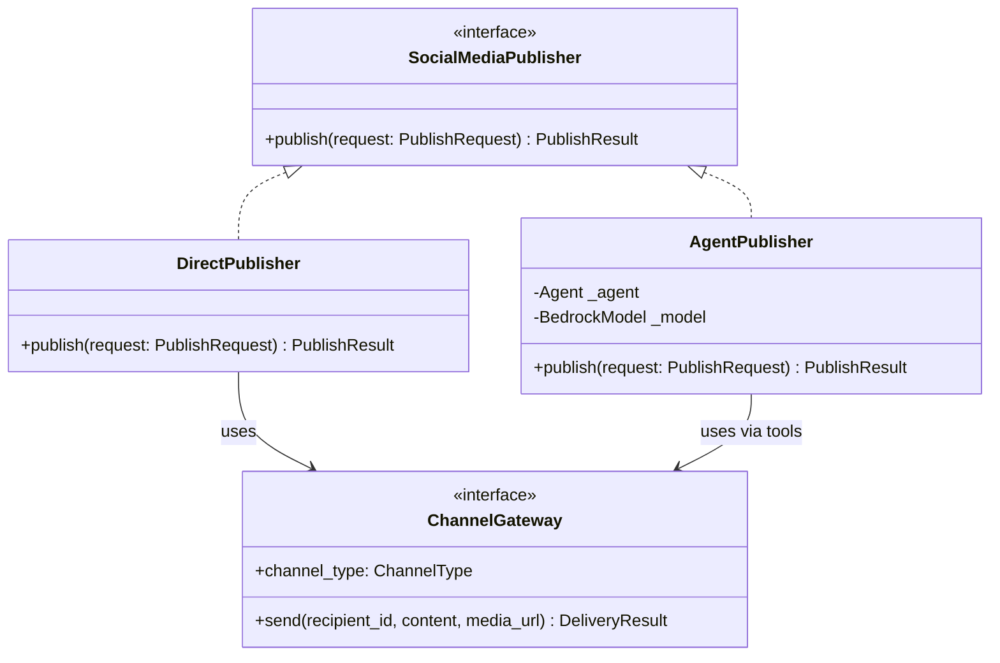
```mermaid
classDiagram
    class SocialMediaPublisher {
        <<interface>>
        +publish(request: PublishRequest) PublishResult
    }

    class ChannelGateway {
        <<interface>>
        +channel_type: ChannelType
        +send(recipient_id, content, media_url) DeliveryResult
    }

    class DirectPublisher {
        +publish(request: PublishRequest) PublishResult
    }

    class AgentPublisher {
        -Agent _agent
        -BedrockModel _model
        +publish(request: PublishRequest) PublishResult
    }

    SocialMediaPublisher <|.. DirectPublisher
    SocialMediaPublisher <|.. AgentPublisher
    DirectPublisher --> ChannelGateway : uses
    AgentPublisher --> ChannelGateway : uses via tools
```

### AI Agent Integration

The `AgentPublisher` uses the Strands Agents SDK with Amazon Bedrock to intelligently adapt content for each platform:

```mermaid
sequenceDiagram
    participant Processor as MessageProcessor
    participant Service as MessageDeliveryService
    participant Agent as AgentPublisher
    participant Bedrock as Claude (Bedrock)
    participant Tools as Channel Tools
    participant Gateway as ChannelGateway

    Processor->>Service: deliver(content, channels)
    Service->>Agent: publish(PublishRequest)
    Agent->>Bedrock: Analyze content + channels
    
    loop For each channel
        Bedrock->>Bedrock: Adapt content for platform
        Bedrock->>Tools: post_to_facebook(adapted_content)
        Tools->>Gateway: send(content, media_url)
        Gateway-->>Tools: DeliveryResult
        Tools-->>Bedrock: Result
    end
    
    Bedrock-->>Agent: Final response + metrics
    Agent-->>Service: PublishResult
    Service-->>Processor: PublishResult
```

### Worker Folder Structure

```
worker/src/
├── domain/                          # Domain Layer
│   └── ports/                       # Outbound port interfaces
│       ├── channel_gateway.py       # ChannelGateway, DeliveryResult, ChannelType
│       └── social_media_publisher.py # SocialMediaPublisher, PublishRequest/Result
│
├── application/                     # Application Layer
│   └── services/
│       └── message_delivery_service.py  # Orchestrates delivery
│
├── infrastructure/                  # Infrastructure Layer
│   └── adapters/
│       ├── direct_publisher.py      # Simple direct API calls
│       ├── agent_publisher.py       # AI-powered with Strands SDK
│       └── channel_gateway_factory.py # Creates gateway instances
│
├── channels/                        # Channel Gateway Implementations
│   ├── base.py                      # Re-exports from domain ports
│   ├── facebook.py                  # Facebook Graph API
│   ├── instagram.py                 # Instagram Graph API
│   ├── linkedin.py                  # LinkedIn API
│   ├── whatsapp.py                  # WhatsApp Business API
│   ├── email.py                     # AWS SES
│   └── sms.py                       # AWS SNS
│
├── consumer.py                      # Kinesis consumer (driving adapter)
├── processor.py                     # Message processor
├── config.py                        # Settings
└── main.py                          # Entry point
```

### Publisher Selection

The worker selects between `DirectPublisher` and `AgentPublisher` based on configuration:

| Setting | Publisher | Behavior |
|---------|-----------|----------|
| `USE_AI_AGENT=false` | DirectPublisher | Posts same content to all channels |
| `USE_AI_AGENT=true` | AgentPublisher | AI adapts content per platform |

### AI Agent Benefits

| Feature | Direct | AI Agent |
|---------|--------|----------|
| Speed | Fast | Slower (LLM calls) |
| Content Adaptation | None | Per-platform optimization |
| Character Limits | Manual | Automatic |
| Hashtags | Static | Context-aware |
| Tone | Same everywhere | Platform-appropriate |
| Cost | API calls only | + Bedrock tokens |

## References

- [Hexagonal Architecture by Alistair Cockburn](https://alistair.cockburn.us/hexagonal-architecture/)
- [Ports and Adapters Pattern](https://herbertograca.com/2017/09/14/ports-adapters-architecture/)
- [Clean Architecture by Robert C. Martin](https://blog.cleancoder.com/uncle-bob/2012/08/13/the-clean-architecture.html)
- [Strands Agents SDK](https://strandsagents.com/latest/)

---

## Hexagonal Architecture Compliance Audit

### Audit Summary (February 2026)

A comprehensive audit was performed to ensure all services follow hexagonal architecture principles.

### Violations Found and Fixed

```mermaid
flowchart LR
    subgraph Before["Before (Violations)"]
        P1["MessageProcessor<br/>❌ Raw SQL queries"]
        C1["KinesisConsumer<br/>❌ Direct infra import"]
    end

    subgraph After["After (Compliant)"]
        P2["MessageProcessor<br/>✅ Uses MessageRepository port"]
        C2["KinesisConsumer<br/>✅ Injected IdempotencyPort"]
    end

    P1 -->|Refactored| P2
    C1 -->|Refactored| C2
```

### Changes Made

| Component | Issue | Fix |
|-----------|-------|-----|
| `worker/src/processor.py` | Raw SQL queries in class | Created `MessageRepository` port, moved SQL to `SqlAlchemyMessageRepository` adapter |
| `worker/src/consumer.py` | Direct import of `get_idempotency_service()` | Created `IdempotencyPort`, inject via constructor |
| `worker/src/infrastructure/idempotency.py` | Class not implementing port | Renamed to `InMemoryIdempotencyService`, implements `IdempotencyPort` |
| `worker/src/main.py` | No composition root | Added proper dependency wiring |

### New Ports Added

```mermaid
classDiagram
    class MessageRepository {
        <<interface>>
        +get_by_id(message_id: UUID) MessageData
        +update_status(message_id: UUID, status: str)
        +mark_channel_delivered(message_id: UUID, channel: str, external_id: str)
        +mark_channel_failed(message_id: UUID, channel: str, error: str)
    }

    class IdempotencyPort {
        <<interface>>
        +generate_key(message_id: str, channels: list) str
        +check_and_lock(key: str) IdempotencyRecord
        +mark_completed(key: str, result: dict)
        +mark_failed(key: str, error: str)
    }

    class SqlAlchemyMessageRepository {
        -AsyncSession _session
    }

    class InMemoryIdempotencyService {
        -dict _cache
        -int _ttl_seconds
    }

    MessageRepository <|.. SqlAlchemyMessageRepository
    IdempotencyPort <|.. InMemoryIdempotencyService
```

### Composition Root Pattern

The `main.py` now serves as the composition root, wiring all dependencies:

```python
# worker/src/main.py - Composition Root
async def main():
    # Create infrastructure adapters
    message_repository = SqlAlchemyMessageRepository(session)
    publisher = create_publisher()  # DirectPublisher or AgentPublisher
    idempotency = get_idempotency_service()

    # Wire up application layer
    processor = MessageProcessor(
        message_repository=message_repository,
        publisher=publisher,
    )
    
    # Wire up driving adapter
    consumer = KinesisConsumer(
        processor=processor,
        idempotency=idempotency,
    )
```

### Compliance Checklist

| Principle | API Service | Worker Service |
|-----------|-------------|----------------|
| Domain has no external dependencies | ✅ | ✅ |
| Use cases depend only on ports | ✅ | ✅ |
| Infrastructure implements ports | ✅ | ✅ |
| Dependencies injected via constructor | ✅ | ✅ |
| No raw SQL in application layer | ✅ | ✅ |
| Composition root wires dependencies | ✅ | ✅ |
