# Architecture

## AWS Infrastructure Overview

The Omnichannel Publisher is deployed on AWS using a secure, layered defense architecture with DevSecOps practices.


### Architecture Components

```mermaid
flowchart TB
    subgraph Internet["Internet"]
        User["👤 User"]
    end

    subgraph Edge["Edge Layer"]
        CF["☁️ CloudFront<br/>CDN + TLS 1.3"]
        WAF["🛡️ AWS WAF<br/>OWASP Top 10<br/>IP Blocklist"]
        Shield["🔰 AWS Shield<br/>DDoS Protection"]
    end

    subgraph VPC["AWS VPC (Multi-AZ)"]
        subgraph Public["Public Subnets"]
            ALB["⚖️ Application<br/>Load Balancer"]
        end

        subgraph Private["Private Subnets"]
            subgraph ECS["Amazon ECS Cluster"]
                API["🔷 API Service<br/>FastAPI<br/>Fargate"]
                Worker["🔷 Worker Service<br/>Kinesis Consumer<br/>Fargate"]
                Scheduler["🔷 Scheduler Service<br/>Cron Jobs<br/>Fargate"]
            end
        end

        subgraph Data["Data Layer"]
            RDS["🗄️ Amazon RDS<br/>PostgreSQL<br/>Multi-AZ"]
            S3["📦 Amazon S3<br/>Media Storage"]
        end
    end

    subgraph Messaging["Event Streaming"]
        Kinesis["📨 Amazon Kinesis<br/>Data Stream"]
    end

    subgraph Auth["Authentication"]
        Cognito["🔐 Amazon Cognito<br/>User Pool"]
        Google["Google"]
        GitHub["GitHub"]
        LinkedIn["LinkedIn"]
    end

    subgraph Security["Security & Monitoring"]
        KMS["🔑 AWS KMS<br/>Encryption Keys"]
        Secrets["🔒 Secrets Manager<br/>Credentials"]
        GuardDuty["👁️ GuardDuty<br/>Threat Detection"]
        SecurityHub["📊 Security Hub"]
        CloudTrail["📝 CloudTrail<br/>Audit Logs"]
    end

    subgraph Channels["Delivery Channels"]
        Meta["📱 Meta APIs<br/>WhatsApp, FB, IG"]
        LI["💼 LinkedIn API"]
        SES["📧 Amazon SES"]
        SNS["📲 Amazon SNS"]
        Bedrock["🤖 Amazon Bedrock<br/>Claude AI Agent"]
    end

    subgraph AutoResponse["Automated Response"]
        EventBridge["📡 EventBridge"]
        Lambda["λ Lambda<br/>IP Blocker"]
        IPSet["🚫 WAF IP Set"]
    end

    %% User flow
    User -->|HTTPS| CF
    CF --> WAF
    WAF --> ALB
    Shield -.-> CF
    ALB --> API

    %% Auth flow
    API --> Cognito
    Cognito --> Google
    Cognito --> GitHub
    Cognito --> LinkedIn

    %% Internal flow
    API --> RDS
    API --> Kinesis
    API --> S3
    Kinesis --> Worker
    Scheduler --> RDS
    Scheduler --> Kinesis

    %% Worker delivery
    Worker --> Meta
    Worker --> LI
    Worker --> SES
    Worker --> SNS
    Worker -.->|AI Agent| Bedrock
    Bedrock -.-> Meta
    Bedrock -.-> LI

    %% Service Discovery
    API <-.->|Cloud Map| Worker
    API <-.->|Cloud Map| Scheduler

    %% Security
    RDS --> KMS
    S3 --> KMS
    Kinesis --> KMS
    API --> Secrets
    Worker --> Secrets

    %% Threat response
    GuardDuty --> EventBridge
    EventBridge --> Lambda
    Lambda --> IPSet
    IPSet --> WAF

    %% Monitoring
    GuardDuty --> SecurityHub
    CloudTrail --> SecurityHub

    style Edge fill:#ff9800,color:#000
    style VPC fill:#e3f2fd,color:#000
    style ECS fill:#bbdefb,color:#000
    style Data fill:#c8e6c9,color:#000
    style Security fill:#ffcdd2,color:#000
    style Channels fill:#e1bee7,color:#000
```



## Security Layers


## Service Architecture


## API Security Middleware Stack

The API service implements a comprehensive middleware stack for defense-in-depth security:

```mermaid
flowchart TB
    subgraph Request["Incoming Request"]
        REQ["HTTP Request"]
    end

    subgraph Middleware["Middleware Stack (Order of Execution)"]
        direction TB
        CORR["1. CorrelationIdMiddleware<br/>• Generates/extracts X-Request-ID<br/>• Enables distributed tracing"]
        SEC["2. SecurityHeadersMiddleware<br/>• CSP, HSTS, X-Frame-Options<br/>• Permissions-Policy"]
        SIZE["3. RequestSizeLimitMiddleware<br/>• 1MB payload limit<br/>• DoS prevention"]
        RATE["4. RateLimitMiddleware<br/>• Per-user rate limiting<br/>• 60 requests/minute"]
        CSRF["5. CSRFMiddleware<br/>• Double Submit Cookie<br/>• Signed tokens"]
    end

    subgraph App["Application"]
        ROUTES["FastAPI Routes"]
    end

    REQ --> CORR --> SEC --> SIZE --> RATE --> CSRF --> ROUTES

    style CORR fill:#e3f2fd
    style SEC fill:#fff3e0
    style SIZE fill:#ffcdd2
    style RATE fill:#f3e5f5
    style CSRF fill:#e8f5e9
```



### Middleware Details

| Middleware | Purpose | Configuration |
|------------|---------|---------------|
| CorrelationIdMiddleware | Distributed tracing | Auto-generates UUID if missing |
| SecurityHeadersMiddleware | Browser security | CSP, HSTS (1 year), X-Frame-Options: DENY |
| RequestSizeLimitMiddleware | DoS prevention | 1MB max payload |
| RateLimitMiddleware | Abuse prevention | 60 req/min per user |
| CSRFMiddleware | CSRF protection | Double Submit Cookie, HMAC-signed tokens |

### Security Headers Applied


### CSRF Protection Flow


## Data Flow


## CDK Stack Dependencies


---

## Observability & Monitoring

### Enterprise Logging Architecture


### Distributed Tracing with Correlation IDs


### Log Format (JSON Structured)

```json
{
  "event": "Message processed",
  "timestamp": "2026-02-05T19:45:32.456789Z",
  "level": "info",
  "logger": "worker.processor",
  "service": "omnichannel-worker",
  "correlation_id": "a1b2c3d4-e5f6-7890-abcd-ef1234567890",
  "message_id": "msg-123",
  "channels": ["facebook", "linkedin"],
  "duration_ms": 245.67
}
```

### CloudWatch Logs Insights Queries

```sql
-- Trace request across services by correlation ID
fields @timestamp, service, event, message_id
| filter correlation_id = "your-correlation-id"
| sort @timestamp asc

-- Error rate by service (hourly)
fields service, level
| filter level = "error"
| stats count() by service, bin(1h)

-- Slow operations (>500ms)
fields @timestamp, service, event, duration_ms
| filter duration_ms > 500
| sort duration_ms desc
```

---

## Hexagonal Architecture (Ports & Adapters)

### Overview

The Omnichannel Publisher follows Hexagonal Architecture (also known as Ports & Adapters), which isolates the core business logic from external concerns like databases, APIs, and message queues.

## Hexagonal Architecture Diagram


## Layer Responsibilities

### Domain Core (Center)
The heart of the application containing pure business logic with zero external dependencies.


### Inbound Ports (Use Cases)
Abstract interfaces defining what the application can do.


### Outbound Ports
Abstract interfaces for external dependencies.


### Adapters
Concrete implementations of ports.


## Folder Structure

```
api/src/
├── domain/                          # Domain Core
│   ├── entities/
│   │   └── message.py               # Message aggregate root
│   └── value_objects/
│       ├── channel_type.py          # ChannelType enum
│       └── content.py               # MessageContent value object
│
├── application/                     # Application Layer
│   ├── ports/
│   │   ├── inbound/                 # Use case interfaces
│   │   │   ├── schedule_message.py
│   │   │   └── get_message.py
│   │   └── outbound/                # Repository/service interfaces
│   │       ├── message_repository.py
│   │       ├── event_publisher.py
│   │       └── unit_of_work.py
│   ├── services/                    # Use case implementations
│   │   ├── schedule_message_service.py
│   │   └── get_message_service.py
│   └── dtos/                        # Data transfer objects
│       └── message_dto.py
│
├── infrastructure/                  # Infrastructure Layer
│   ├── adapters/
│   │   ├── persistence/             # Database adapters
│   │   │   ├── postgres_message_repository.py
│   │   │   └── sqlalchemy_unit_of_work.py
│   │   └── messaging/               # Message queue adapters
│   │       └── kinesis_event_publisher.py
│   └── persistence/
│       ├── database.py              # Database connection
│       └── models.py                # SQLAlchemy models
│
└── presentation/                    # Presentation Layer
    └── api/
        ├── dependencies.py          # Dependency injection
        └── v1/
            ├── health.py
            └── messages.py          # REST endpoints
```

## Request Flow


## Benefits of Hexagonal Architecture

| Benefit | Description |
|---------|-------------|
| **Testability** | Domain and use cases can be tested without infrastructure |
| **Flexibility** | Swap adapters without changing business logic |
| **Maintainability** | Clear boundaries make code easier to understand |
| **Independence** | Domain doesn't depend on frameworks or databases |
| **Parallel Development** | Teams can work on different adapters independently |

## Dependency Rule


Dependencies always point inward:
- **Presentation** depends on **Application**
- **Application** depends on **Domain**
- **Infrastructure** depends on **Application** (implements ports)
- **Domain** depends on nothing

## Testing Strategy


| Layer | Test Type | Dependencies |
|-------|-----------|--------------|
| Domain | Unit | None |
| Services | Unit | Mocked ports |
| Adapters | Integration | Real DB/services |
| API | E2E | Full application |

## Worker Service Architecture

The Worker service also follows hexagonal architecture, with support for both direct API publishing and AI-powered intelligent publishing.

### Worker Hexagonal Diagram


### Worker Ports


### AI Agent Integration

The `AgentPublisher` uses the Strands Agents SDK with Amazon Bedrock to intelligently adapt content for each platform:

```mermaid
sequenceDiagram
    participant Processor as MessageProcessor
    participant Service as MessageDeliveryService
    participant Agent as AgentPublisher
    participant Bedrock as Claude (Bedrock)
    participant Tools as Channel Tools
    participant Gateway as ChannelGateway

    Processor->>Service: deliver(content, channels)
    Service->>Agent: publish(PublishRequest)
    Agent->>Bedrock: Analyze content + channels
    
    loop For each channel
        Bedrock->>Bedrock: Adapt content for platform
        Bedrock->>Tools: post_to_facebook(adapted_content)
        Tools->>Gateway: send(content, media_url)
        Gateway-->>Tools: DeliveryResult
        Tools-->>Bedrock: Result
    end
    
    Bedrock-->>Agent: Final response + metrics
    Agent-->>Service: PublishResult
    Service-->>Processor: PublishResult
```

### Worker Folder Structure

```
worker/src/
├── domain/                          # Domain Layer
│   └── ports/                       # Outbound port interfaces
│       ├── channel_gateway.py       # ChannelGateway, DeliveryResult, ChannelType
│       └── social_media_publisher.py # SocialMediaPublisher, PublishRequest/Result
│
├── application/                     # Application Layer
│   └── services/
│       └── message_delivery_service.py  # Orchestrates delivery
│
├── infrastructure/                  # Infrastructure Layer
│   └── adapters/
│       ├── direct_publisher.py      # Simple direct API calls
│       ├── agent_publisher.py       # AI-powered with Strands SDK
│       └── channel_gateway_factory.py # Creates gateway instances
│
├── channels/                        # Channel Gateway Implementations
│   ├── base.py                      # Re-exports from domain ports
│   ├── facebook.py                  # Facebook Graph API
│   ├── instagram.py                 # Instagram Graph API
│   ├── linkedin.py                  # LinkedIn API
│   ├── whatsapp.py                  # WhatsApp Business API
│   ├── email.py                     # AWS SES
│   └── sms.py                       # AWS SNS
│
├── consumer.py                      # Kinesis consumer (driving adapter)
├── processor.py                     # Message processor
├── config.py                        # Settings
└── main.py                          # Entry point
```

### Publisher Selection

The worker selects between `DirectPublisher` and `AgentPublisher` based on configuration:

| Setting | Publisher | Behavior |
|---------|-----------|----------|
| `USE_AI_AGENT=false` | DirectPublisher | Posts same content to all channels |
| `USE_AI_AGENT=true` | AgentPublisher | AI adapts content per platform |

### AI Agent Benefits

| Feature | Direct | AI Agent |
|---------|--------|----------|
| Speed | Fast | Slower (LLM calls) |
| Content Adaptation | None | Per-platform optimization |
| Character Limits | Manual | Automatic |
| Hashtags | Static | Context-aware |
| Tone | Same everywhere | Platform-appropriate |
| Cost | API calls only | + Bedrock tokens |

## References

- [Hexagonal Architecture by Alistair Cockburn](https://alistair.cockburn.us/hexagonal-architecture/)
- [Ports and Adapters Pattern](https://herbertograca.com/2017/09/14/ports-adapters-architecture/)
- [Clean Architecture by Robert C. Martin](https://blog.cleancoder.com/uncle-bob/2012/08/13/the-clean-architecture.html)
- [Strands Agents SDK](https://strandsagents.com/latest/)

---

## Hexagonal Architecture Compliance Audit

### Audit Summary (February 2026)

A comprehensive audit was performed to ensure all services follow hexagonal architecture principles.

### Violations Found and Fixed

```mermaid
flowchart LR
    subgraph Before["Before (Violations)"]
        P1["MessageProcessor<br/>❌ Raw SQL queries"]
        C1["KinesisConsumer<br/>❌ Direct infra import"]
    end

    subgraph After["After (Compliant)"]
        P2["MessageProcessor<br/>✅ Uses MessageRepository port"]
        C2["KinesisConsumer<br/>✅ Injected IdempotencyPort"]
    end

    P1 -->|Refactored| P2
    C1 -->|Refactored| C2
```

### Changes Made

| Component | Issue | Fix |
|-----------|-------|-----|
| `worker/src/processor.py` | Raw SQL queries in class | Created `MessageRepository` port, moved SQL to `SqlAlchemyMessageRepository` adapter |
| `worker/src/consumer.py` | Direct import of `get_idempotency_service()` | Created `IdempotencyPort`, inject via constructor |
| `worker/src/infrastructure/idempotency.py` | Class not implementing port | Renamed to `InMemoryIdempotencyService`, implements `IdempotencyPort` |
| `worker/src/main.py` | No composition root | Added proper dependency wiring |

### New Ports Added

```mermaid
classDiagram
    class MessageRepository {
        <<interface>>
        +get_by_id(message_id: UUID) MessageData
        +update_status(message_id: UUID, status: str)
        +mark_channel_delivered(message_id: UUID, channel: str, external_id: str)
        +mark_channel_failed(message_id: UUID, channel: str, error: str)
    }

    class IdempotencyPort {
        <<interface>>
        +generate_key(message_id: str, channels: list) str
        +check_and_lock(key: str) IdempotencyRecord
        +mark_completed(key: str, result: dict)
        +mark_failed(key: str, error: str)
    }

    class SqlAlchemyMessageRepository {
        -AsyncSession _session
    }

    class InMemoryIdempotencyService {
        -dict _cache
        -int _ttl_seconds
    }

    MessageRepository <|.. SqlAlchemyMessageRepository
    IdempotencyPort <|.. InMemoryIdempotencyService
```

### Composition Root Pattern

The `main.py` now serves as the composition root, wiring all dependencies:

```python
# worker/src/main.py - Composition Root
async def main():
    # Create infrastructure adapters
    message_repository = SqlAlchemyMessageRepository(session)
    publisher = create_publisher()  # DirectPublisher or AgentPublisher
    idempotency = get_idempotency_service()

    # Wire up application layer
    processor = MessageProcessor(
        message_repository=message_repository,
        publisher=publisher,
    )
    
    # Wire up driving adapter
    consumer = KinesisConsumer(
        processor=processor,
        idempotency=idempotency,
    )
```

### Compliance Checklist

| Principle | API Service | Worker Service |
|-----------|-------------|----------------|
| Domain has no external dependencies | ✅ | ✅ |
| Use cases depend only on ports | ✅ | ✅ |
| Infrastructure implements ports | ✅ | ✅ |
| Dependencies injected via constructor | ✅ | ✅ |
| No raw SQL in application layer | ✅ | ✅ |
| Composition root wires dependencies | ✅ | ✅ |
