# Serverless Architecture

This document describes the fully serverless architecture for the Omnichannel Publisher platform using AWS Lambda, DynamoDB, and API Gateway.


## Overview

The serverless architecture provides a cost-effective alternative to the container-based deployment, ideal for development, low-traffic, and variable workloads.

```mermaid
flowchart TB
    subgraph Internet["Internet"]
        User["👤 User"]
    end

    subgraph Edge["Edge Layer"]
        CF["☁️ CloudFront<br/>CDN + TLS 1.3"]
        WAF["🛡️ AWS WAF<br/>OWASP Rules<br/>Rate Limiting"]
    end

    subgraph Frontend["Frontend"]
        Amplify["📱 AWS Amplify<br/>React SPA"]
    end

    subgraph API["API Layer"]
        APIGW["🚪 API Gateway<br/>REST API"]
        Authorizer["🔐 Cognito<br/>Authorizer"]
        APILambda["λ API Lambda<br/>FastAPI/Mangum"]
    end

    subgraph Processing["Async Processing"]
        Kinesis["📨 Kinesis<br/>Data Stream"]
        WorkerLambda["λ Worker Lambda<br/>Message Delivery"]
    end

    subgraph Scheduling["Scheduling"]
        EventBridge["⏰ EventBridge<br/>Scheduler"]
        SchedulerLambda["λ Scheduler Lambda<br/>Due Messages"]
    end

    subgraph Data["Data Layer"]
        DynamoDB[("🗄️ DynamoDB<br/>Single-Table")]
        S3["📦 S3<br/>Media Storage"]
        Secrets["🔒 Secrets Manager"]
    end

    subgraph Auth["Authentication"]
        Cognito["🔐 Cognito<br/>User Pool"]
        Google["Google"]
        GitHub["GitHub"]
        LinkedIn["LinkedIn"]
    end

    subgraph Channels["Delivery Channels"]
        Meta["📱 Meta APIs"]
        LI["💼 LinkedIn"]
        SES["📧 SES"]
        SNS["📲 SNS"]
        Bedrock["🤖 Bedrock<br/>AI Agent"]
    end

    subgraph Security["Security"]
        GuardDuty["👁️ GuardDuty"]
        SecurityHub["📊 Security Hub"]
    end

    User --> CF
    CF --> WAF
    WAF --> Amplify
    WAF --> APIGW

    APIGW --> Authorizer
    Authorizer --> Cognito
    APIGW --> APILambda

    Cognito --> Google
    Cognito --> GitHub
    Cognito --> LinkedIn

    APILambda --> DynamoDB
    APILambda --> Kinesis
    APILambda --> S3

    Kinesis --> WorkerLambda
    EventBridge --> SchedulerLambda

    SchedulerLambda --> DynamoDB
    SchedulerLambda --> Kinesis

    WorkerLambda --> DynamoDB
    WorkerLambda --> Secrets
    WorkerLambda --> Channels
    WorkerLambda -.-> Bedrock
    Bedrock -.-> Meta
    Bedrock -.-> LI

    style Edge fill:#ff9800,color:#000
    style API fill:#e3f2fd,color:#000
    style Processing fill:#fff3e0,color:#000
    style Data fill:#c8e6c9,color:#000
    style Security fill:#ffcdd2,color:#000
```



## Cost Comparison

| Traffic Level | Containers (ECS) | Serverless | Savings |
|---------------|------------------|------------|---------|
| Dev/Low (<1K req/day) | ~$180-200/mo | ~$5-15/mo | 90%+ |
| Medium (10K req/day) | ~$200-250/mo | ~$20-40/mo | 80%+ |
| High (100K req/day) | ~$250-350/mo | ~$50-80/mo | 70%+ |

Serverless is ideal for:
- Development and staging environments
- Variable or unpredictable traffic
- Cost-sensitive deployments
- Rapid prototyping

## CDK Stack Architecture


## Data Layer

### DynamoDB Single-Table Design

The serverless architecture uses a single DynamoDB table with a flexible schema to store all entities.

```mermaid
erDiagram
    MAIN_TABLE {
        string PK "Partition Key"
        string SK "Sort Key"
        string GSI1PK "User queries"
        string GSI1SK "User queries"
        string GSI2PK "Status queries"
        string GSI2SK "Scheduled time"
        number ttl "Time to live"
    }
```

#### Access Patterns

| Access Pattern | PK | SK | Index |
|----------------|----|----|-------|
| Get message by ID | `MSG#<id>` | `METADATA` | Table |
| Get message channels | `MSG#<id>` | `CHANNEL#<type>` | Table |
| List user messages | `USER#<id>` | `MSG#<id>` | GSI1 |
| Get scheduled messages | `STATUS#scheduled` | `<scheduled_at>` | GSI2 |
| Get certification by ID | `CERT#<id>` | `METADATA` | Table |
| List user certifications | `USER#<id>` | `CERT#<id>` | GSI1 |

#### Item Examples

```json
// Message metadata
{
  "PK": "MSG#550e8400-e29b-41d4-a716-446655440000",
  "SK": "METADATA",
  "GSI1PK": "USER#user-123",
  "GSI1SK": "MSG#550e8400-e29b-41d4-a716-446655440000",
  "GSI2PK": "STATUS#scheduled",
  "GSI2SK": "2026-02-05T15:00:00Z",
  "content": "Congratulations on your AWS certification!",
  "channels": ["facebook", "linkedin"],
  "status": "scheduled",
  "created_at": "2026-02-05T10:00:00Z"
}

// Channel delivery status
{
  "PK": "MSG#550e8400-e29b-41d4-a716-446655440000",
  "SK": "CHANNEL#facebook",
  "status": "pending",
  "external_id": null,
  "error": null
}
```

### Kinesis Data Stream

- Stream name: `omnichannel-messages`
- Shard count: 1 (scales with traffic)
- Retention: 24 hours
- Encryption: AWS managed

### S3 Media Bucket

- Server-side encryption (SSE-S3)
- Block all public access
- Versioning enabled
- CORS configured for uploads

## API Layer

### API Gateway Configuration


### API Lambda Function

| Property | Value |
|----------|-------|
| Runtime | Python 3.12 |
| Architecture | ARM64 (Graviton2) |
| Memory | 512 MB |
| Timeout | 30 seconds |
| Tracing | X-Ray enabled |
| Log retention | 1 month |

The API Lambda uses [Mangum](https://mangum.io/) to adapt FastAPI for Lambda:

```python
from mangum import Mangum
from fastapi import FastAPI

app = FastAPI()

# ... routes ...

handler = Mangum(app, lifespan="off")
```

## Worker Layer

### Kinesis Event Source


### Worker Lambda Configuration

| Property | Value |
|----------|-------|
| Runtime | Python 3.12 |
| Architecture | ARM64 |
| Memory | 1024 MB |
| Timeout | 5 minutes |
| Concurrency | 10 (reserved) |
| Batch size | 10 records |
| Batch window | 5 seconds |
| Retry attempts | 3 |

### AI Agent Integration

The worker supports AI-powered content adaptation using Amazon Bedrock:


Environment variables:
- `USE_AI_AGENT`: `true` to enable AI adaptation
- `BEDROCK_MODEL_ID`: `anthropic.claude-haiku-4-5-20251001-v1:0`

## Scheduler Layer

### EventBridge Schedule


### Scheduler Lambda Configuration

| Property | Value |
|----------|-------|
| Runtime | Python 3.12 |
| Architecture | ARM64 |
| Memory | 256 MB |
| Timeout | 1 minute |
| Trigger | EventBridge (1 min) |

### Query Pattern

```python
# Query GSI2 for scheduled messages due now
response = table.query(
    IndexName="GSI2",
    KeyConditionExpression="GSI2PK = :status AND GSI2SK <= :now",
    ExpressionAttributeValues={
        ":status": "STATUS#scheduled",
        ":now": datetime.utcnow().isoformat()
    }
)
```

## Security Layer

### WAF Rules

| Rule | Priority | Action |
|------|----------|--------|
| AWS Common Rule Set | 1 | Block |
| Known Bad Inputs | 2 | Block |
| Rate Limit (2000/5min) | 3 | Block |

### GuardDuty Features

- S3 Data Events monitoring
- Lambda Network Logs monitoring
- 15-minute finding frequency

### Security Hub

- AWS Foundational Security Best Practices enabled
- Automated compliance checks

## Observability

### CloudWatch Metrics


### X-Ray Tracing

All Lambda functions have X-Ray tracing enabled for distributed tracing across:
- API Gateway → API Lambda
- Kinesis → Worker Lambda
- EventBridge → Scheduler Lambda

## Deployment

### Prerequisites

```bash
# Install dependencies
cd infra-fs
uv sync
```

### Deploy All Stacks

```bash
uv run cdk deploy --all
```

### Deploy Individual Stacks

```bash
# Data layer first
uv run cdk deploy OmnichannelDataStack

# Then dependent stacks
uv run cdk deploy OmnichannelAuthStack
uv run cdk deploy OmnichannelApiStack
uv run cdk deploy OmnichannelWorkerStack
uv run cdk deploy OmnichannelSchedulerStack
uv run cdk deploy OmnichannelMonitoringStack
uv run cdk deploy OmnichannelSecurityStack
uv run cdk deploy OmnichannelFrontendStack
```

### CI/CD Selection

Set `INFRA_TYPE` in GitHub Actions:

```yaml
env:
  INFRA_TYPE: serverless  # or 'containers' for ECS
```

## Comparison: Containers vs Serverless

| Aspect | Containers (ECS) | Serverless |
|--------|------------------|------------|
| Cold start | None | ~100-500ms |
| Scaling | Manual/Auto (minutes) | Instant |
| Cost model | Always-on | Pay-per-use |
| Max timeout | Unlimited | 15 minutes |
| Database | PostgreSQL (RDS) | DynamoDB |
| Complexity | Higher | Lower |
| Debugging | Easier | Harder |
| Best for | Steady traffic | Variable traffic |

## Migration Path

### Containers → Serverless

1. Export data from PostgreSQL to DynamoDB format
2. Deploy serverless stacks
3. Update DNS/CloudFront to point to new API Gateway
4. Decommission ECS services

### Serverless → Containers

1. Export data from DynamoDB to PostgreSQL
2. Deploy container stacks
3. Update DNS/CloudFront to point to ALB
4. Delete Lambda functions and API Gateway

## References

- [Container Architecture](architecture.md) - ECS Fargate deployment
- [Security Documentation](security.md) - Security practices
- [DynamoDB Single-Table Design](https://www.alexdebrie.com/posts/dynamodb-single-table/)
- [Lambda Power Tuning](https://github.com/alexcasalboni/aws-lambda-power-tuning)
