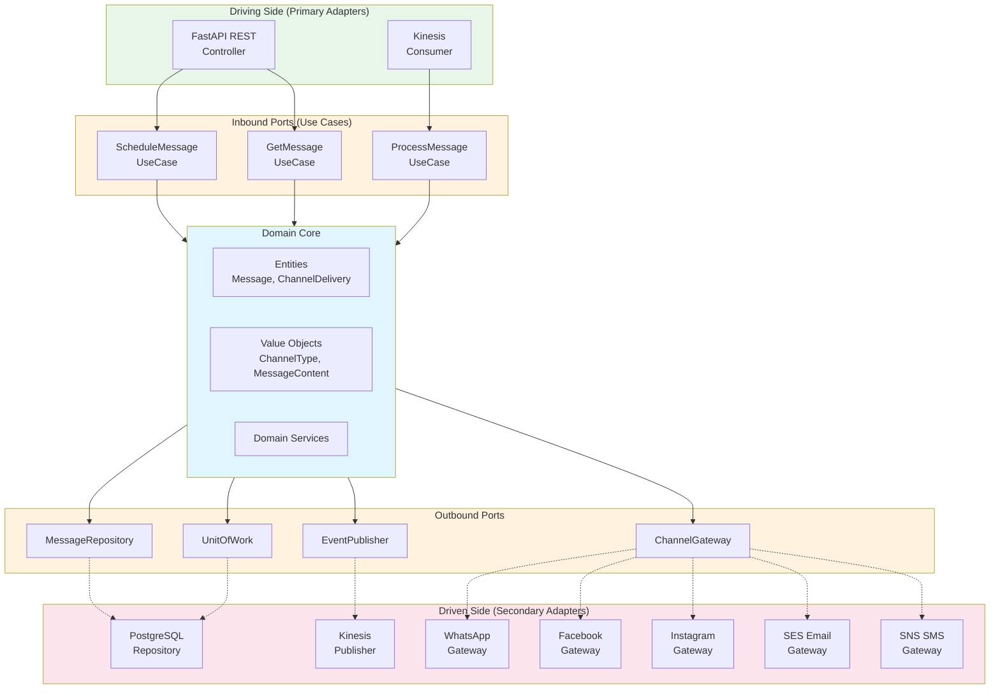
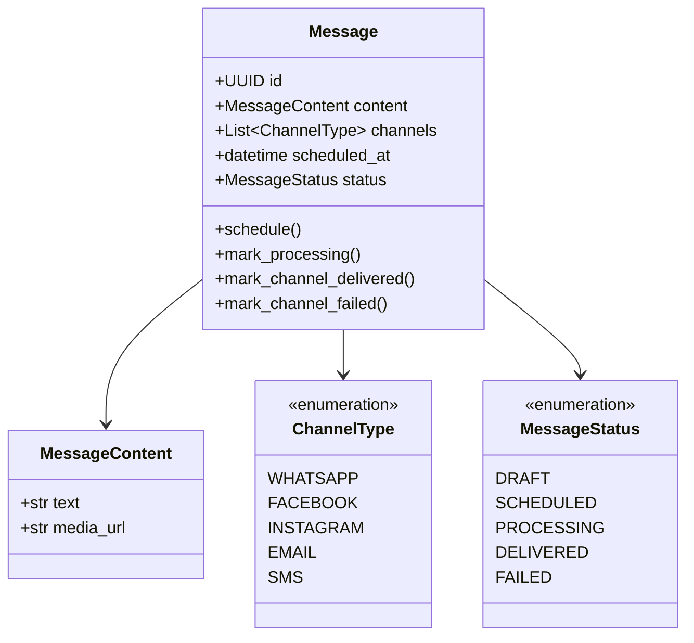
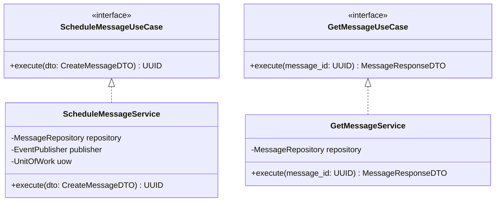
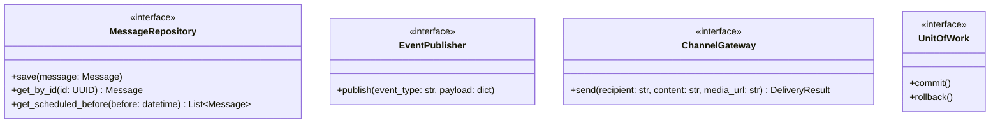
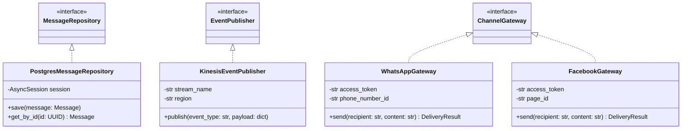
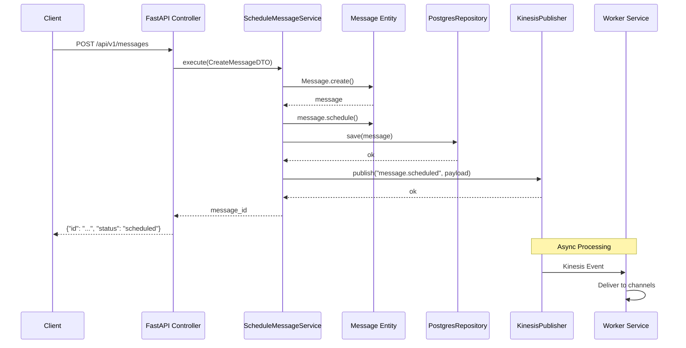
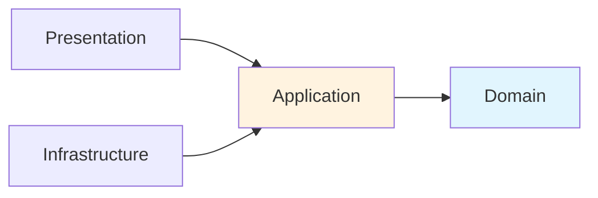
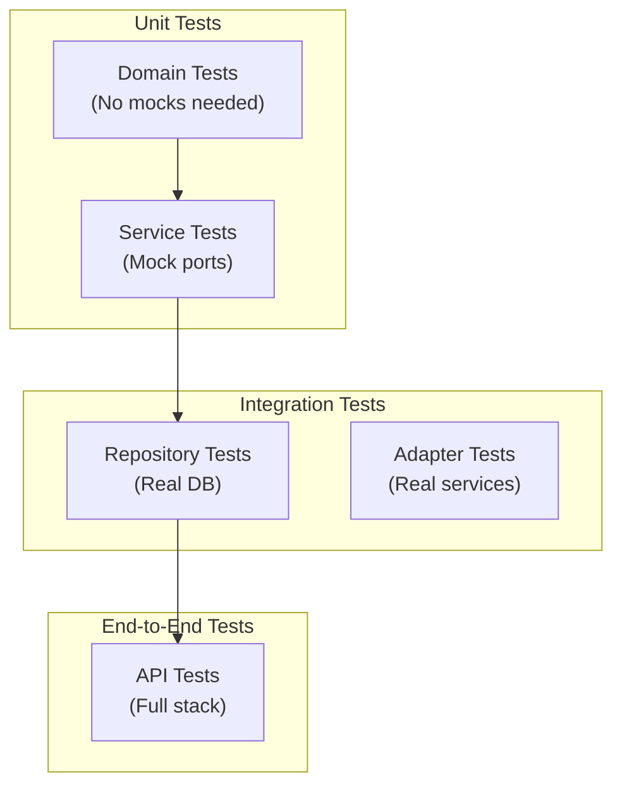

# Architecture: Hexagonal (Ports & Adapters)

## Overview

The Omnichannel Publisher follows Hexagonal Architecture (also known as Ports & Adapters), which isolates the core business logic from external concerns like databases, APIs, and message queues.

## Hexagonal Architecture Diagram



## Layer Responsibilities

### Domain Core (Center)
The heart of the application containing pure business logic with zero external dependencies.



### Inbound Ports (Use Cases)
Abstract interfaces defining what the application can do.



### Outbound Ports
Abstract interfaces for external dependencies.



### Adapters
Concrete implementations of ports.



## Folder Structure

```
api/src/
├── domain/                          # Domain Core
│   ├── entities/
│   │   └── message.py               # Message aggregate root
│   └── value_objects/
│       ├── channel_type.py          # ChannelType enum
│       └── content.py               # MessageContent value object
│
├── application/                     # Application Layer
│   ├── ports/
│   │   ├── inbound/                 # Use case interfaces
│   │   │   ├── schedule_message.py
│   │   │   └── get_message.py
│   │   └── outbound/                # Repository/service interfaces
│   │       ├── message_repository.py
│   │       ├── event_publisher.py
│   │       └── unit_of_work.py
│   ├── services/                    # Use case implementations
│   │   ├── schedule_message_service.py
│   │   └── get_message_service.py
│   └── dtos/                        # Data transfer objects
│       └── message_dto.py
│
├── infrastructure/                  # Infrastructure Layer
│   ├── adapters/
│   │   ├── persistence/             # Database adapters
│   │   │   ├── postgres_message_repository.py
│   │   │   └── sqlalchemy_unit_of_work.py
│   │   └── messaging/               # Message queue adapters
│   │       └── kinesis_event_publisher.py
│   └── persistence/
│       ├── database.py              # Database connection
│       └── models.py                # SQLAlchemy models
│
└── presentation/                    # Presentation Layer
    └── api/
        ├── dependencies.py          # Dependency injection
        └── v1/
            ├── health.py
            └── messages.py          # REST endpoints
```

## Request Flow



## Benefits of Hexagonal Architecture

| Benefit | Description |
|---------|-------------|
| **Testability** | Domain and use cases can be tested without infrastructure |
| **Flexibility** | Swap adapters without changing business logic |
| **Maintainability** | Clear boundaries make code easier to understand |
| **Independence** | Domain doesn't depend on frameworks or databases |
| **Parallel Development** | Teams can work on different adapters independently |

## Dependency Rule



Dependencies always point inward:
- **Presentation** depends on **Application**
- **Application** depends on **Domain**
- **Infrastructure** depends on **Application** (implements ports)
- **Domain** depends on nothing

## Testing Strategy



| Layer | Test Type | Dependencies |
|-------|-----------|--------------|
| Domain | Unit | None |
| Services | Unit | Mocked ports |
| Adapters | Integration | Real DB/services |
| API | E2E | Full application |

## References

- [Hexagonal Architecture by Alistair Cockburn](https://alistair.cockburn.us/hexagonal-architecture/)
- [Ports and Adapters Pattern](https://herbertograca.com/2017/09/14/ports-adapters-architecture/)
- [Clean Architecture by Robert C. Martin](https://blog.cleancoder.com/uncle-bob/2012/08/13/the-clean-architecture.html)
