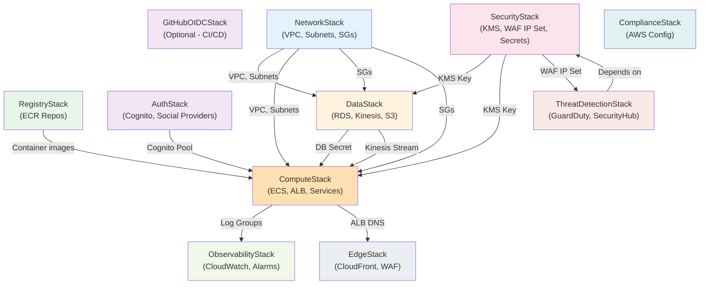

# Deployment and Teardown Guide

This guide documents the infrastructure stack dependencies, deployment order, removal policies, and safe teardown procedures for the Omnichannel Publisher platform (containers mode).

## Stack Dependency Graph



## Deployment Order

### Phase 1: Bootstrap (One-time)

Deploy these stacks first, in order:

1. **GitHubOIDCStack** (optional, only if using GitHub Actions CI/CD)
   - Creates OIDC provider and IAM roles for GitHub Actions
   - Can be deployed separately or skipped if using manual deployments
   - Command: `cdk deploy GitHubOIDCStack -c github_org=YOUR_ORG -c github_repo=YOUR_REPO`

2. **RegistryStack**
   - Creates ECR repositories for API, Worker, Scheduler services
   - Must exist before container builds
   - Command: `cdk deploy RegistryStack`

### Phase 2: Core Infrastructure (Deploy Together)

Deploy these stacks in parallel or in order. They have no circular dependencies:

3. **NetworkStack**
   - VPC, public/private/isolated subnets, NAT gateway
   - VPC Flow Logs, S3 gateway endpoint
   - Security groups for ALB and ECS services
   - **Removal Policy**: VPC is retained by default (safe to delete)
   - **Exports**: VpcId, PrivateSubnetIds, ServiceSecurityGroupId

4. **SecurityStack**
   - KMS key for encryption (RETAIN policy - requires manual deletion)
   - WAF IP set for blocking malicious IPs
   - Secrets Manager secrets for OAuth and social media APIs
   - **Removal Policy**: KMS key is RETAINED (won't auto-delete)
   - **Exports**: KmsKeyArn, WafIpSetArn

5. **AuthStack**
   - Cognito User Pool with social identity providers (Google, GitHub, LinkedIn)
   - User Pool Client for API authentication
   - User Pool Domain for hosted UI
   - Admin and Community Manager groups
   - **Removal Policy**: User Pool is RETAINED (won't auto-delete)
   - **Exports**: UserPoolId, UserPoolClientId, UserPoolDomain

6. **DataStack**
   - PostgreSQL RDS instance (single-AZ, t3.micro for dev)
   - Kinesis Data Stream (on-demand mode)
   - S3 bucket for data storage
   - **Removal Policy**: RDS is DESTROY (auto-deletes on stack deletion)
   - **Removal Policy**: S3 bucket is DESTROY with auto_delete_objects=True
   - **Removal Policy**: Kinesis stream is DESTROY
   - **Important**: RDS has deletion_protection=False (dev mode) - can be deleted

7. **ComputeStack**
   - ECS Cluster with Cloud Map namespace
   - Three Fargate services: API, Worker, Scheduler
   - Application Load Balancer with WAF
   - CloudWatch log groups for each service
   - **Removal Policy**: All resources are DESTROY
   - **Exports**: AlbDnsName (used by EdgeStack)

### Phase 3: Monitoring & Security (Independent)

These stacks can fail without affecting others. Deploy after Phase 2:

8. **ObservabilityStack**
   - CloudWatch metric filters and alarms
   - SNS topics for alerts
   - Security dashboard
   - **Removal Policy**: All resources are DESTROY
   - **Dependencies**: Requires log groups from ComputeStack

9. **ComplianceStack**
   - AWS Config recorder and delivery channel (via custom Lambda)
   - Config rules for compliance checking
   - S3 bucket for Config snapshots
   - **Removal Policy**: S3 bucket is DESTROY with auto_delete_objects=True
   - **Important**: Custom resource handles recorder lifecycle

10. **ThreatDetectionStack**
    - GuardDuty detector
    - Security Hub
    - CloudTrail for audit logging
    - Lambda for incident response (auto-blocks IPs in WAF)
    - **Removal Policy**: All resources are DESTROY
    - **Dependencies**: Requires WAF IP set from SecurityStack

### Phase 4: Edge (Deploy Last)

11. **EdgeStack**
    - CloudFront distribution (15-30 min provisioning time)
    - CloudFront WAF WebACL
    - S3 bucket for access logs
    - **Removal Policy**: S3 bucket is DESTROY with auto_delete_objects=True
    - **Dependencies**: Requires ALB DNS from ComputeStack
    - **Note**: Deployed to us-east-1 region (CloudFront requirement)
    - **Note**: Can take 15-30 minutes to provision

## Deployment Commands

### Deploy All Stacks (Recommended)

```bash
cd infra
uv run cdk deploy --all
```

This deploys all stacks in dependency order. CloudFormation handles the sequencing.

### Deploy Individual Stacks

```bash
# Bootstrap (one-time)
uv run cdk deploy RegistryStack

# Core infrastructure
uv run cdk deploy NetworkStack
uv run cdk deploy SecurityStack
uv run cdk deploy AuthStack
uv run cdk deploy DataStack
uv run cdk deploy ComputeStack

# Monitoring & Security
uv run cdk deploy ObservabilityStack
uv run cdk deploy ComplianceStack
uv run cdk deploy ThreatDetectionStack

# Edge (last, takes 15-30 min)
uv run cdk deploy EdgeStack
```

### Deploy with Context Variables

```bash
# Specify container image tag
uv run cdk deploy --all -c image_tag=v1.2.3

# Deploy EdgeStack with custom ALB DNS
uv run cdk deploy EdgeStack -c alb_dns=my-alb-123456.us-east-1.elb.amazonaws.com

# Deploy GitHub OIDC (one-time)
uv run cdk deploy GitHubOIDCStack -c github_org=myorg -c github_repo=myrepo
```

## Stateful Resources & Removal Policies

### Resources That Auto-Delete on Stack Deletion

| Resource | Stack | Removal Policy | Notes |
|----------|-------|-----------------|-------|
| RDS Instance | DataStack | DESTROY | Single-AZ, t3.micro, deletion_protection=False |
| Kinesis Stream | DataStack | DESTROY | On-demand mode, 1-day retention |
| S3 Bucket (Data) | DataStack | DESTROY | auto_delete_objects=True |
| S3 Bucket (Config) | ComplianceStack | DESTROY | auto_delete_objects=True |
| S3 Bucket (CloudFront Logs) | EdgeStack | DESTROY | auto_delete_objects=True |
| ECS Cluster | ComputeStack | DESTROY | Services and tasks terminate |
| ALB | ComputeStack | DESTROY | Listeners and target groups deleted |
| CloudFront Distribution | EdgeStack | DESTROY | Takes 15-30 min to delete |
| CloudWatch Log Groups | ComputeStack | DESTROY | 1-month retention, auto-deleted |
| VPC | NetworkStack | DESTROY | Subnets, NAT gateway, endpoints deleted |
| Security Groups | NetworkStack | DESTROY | All SGs deleted |
| WAF WebACLs | ComputeStack, EdgeStack | DESTROY | Associated rules deleted |

### Resources That Require Manual Deletion

| Resource | Stack | Reason | Manual Steps |
|----------|-------|--------|--------------|
| KMS Key | SecurityStack | RETAIN policy | Delete via AWS Console or CLI: `aws kms schedule-key-deletion --key-id <key-id> --pending-window-in-days 7` |
| Cognito User Pool | AuthStack | RETAIN policy | Delete via AWS Console or CLI: `aws cognito-idp delete-user-pool --user-pool-id <pool-id>` |
| Secrets Manager Secrets | SecurityStack | Default (RETAIN) | Delete via AWS Console or CLI: `aws secretsmanager delete-secret --secret-id <secret-name>` |
| ECR Repositories | RegistryStack | DESTROY with empty_on_delete=True | Images are deleted, repos are deleted |
| GitHub OIDC Provider | GitHubOIDCStack | Default (RETAIN) | Delete via AWS Console or CLI: `aws iam delete-open-id-connect-provider --open-id-connect-provider-arn <arn>` |

## Safe Teardown Procedure

### Option 1: Delete All Stacks (Recommended for Dev)

```bash
cd infra
uv run cdk destroy --all
```

This will:
1. Delete all stacks in reverse dependency order
2. Auto-delete resources with DESTROY removal policy
3. Leave RETAIN resources (KMS, Cognito, Secrets, OIDC) for manual cleanup

### Option 2: Delete Specific Stacks

```bash
# Delete edge layer first (takes 15-30 min)
uv run cdk destroy EdgeStack

# Delete monitoring & security
uv run cdk destroy ObservabilityStack
uv run cdk destroy ComplianceStack
uv run cdk destroy ThreatDetectionStack

# Delete compute & data
uv run cdk destroy ComputeStack
uv run cdk destroy DataStack

# Delete core infrastructure
uv run cdk destroy AuthStack
uv run cdk destroy SecurityStack
uv run cdk destroy NetworkStack

# Delete registry (optional, keep for future deployments)
uv run cdk destroy RegistryStack
```

### Option 3: Manual Cleanup of RETAIN Resources

After running `cdk destroy --all`, manually delete retained resources:

```bash
# Delete KMS key (7-day pending deletion)
aws kms schedule-key-deletion \
  --key-id arn:aws:kms:us-east-1:ACCOUNT:key/KEY_ID \
  --pending-window-in-days 7

# Delete Cognito User Pool
aws cognito-idp delete-user-pool \
  --user-pool-id us-east-1_XXXXXXXXX

# Delete Secrets Manager secrets
aws secretsmanager delete-secret \
  --secret-id secure-api/db-credentials \
  --force-delete-without-recovery

aws secretsmanager delete-secret \
  --secret-id omnichannel/oauth/google \
  --force-delete-without-recovery

# Delete GitHub OIDC provider (if deployed)
aws iam delete-open-id-connect-provider \
  --open-id-connect-provider-arn arn:aws:iam::ACCOUNT:oidc-provider/token.actions.githubusercontent.com
```

## Cross-Stack References & Exports

The following CloudFormation exports are created and can be imported by other stacks:

| Export Name | Stack | Value | Used By |
|-------------|-------|-------|---------|
| VpcId | NetworkStack | VPC ID | DataStack, ComputeStack |
| PrivateSubnetIds | NetworkStack | Comma-separated subnet IDs | DataStack, ComputeStack |
| ServiceSecurityGroupId | NetworkStack | Security group ID | DataStack, ComputeStack |
| SecureApiKmsKeyArn | SecurityStack | KMS key ARN | DataStack, ComputeStack |
| SecureApiWafIpSetArn | SecurityStack | WAF IP set ARN | ThreatDetectionStack |
| ComputeStack-AlbDnsName | ComputeStack | ALB DNS name | EdgeStack |
| SecureApiDistributionDomain | EdgeStack | CloudFront domain | External (DNS, docs) |

### Deleting Stacks with Exports

If you try to delete a stack that exports values used by other stacks, CloudFormation will fail. Delete in this order:

1. **EdgeStack** (imports ComputeStack-AlbDnsName)
2. **ThreatDetectionStack** (imports SecureApiWafIpSetArn)
3. **ComputeStack** (exports AlbDnsName)
4. **DataStack** (imports from NetworkStack, SecurityStack)
5. **AuthStack** (independent)
6. **SecurityStack** (exports KmsKeyArn, WafIpSetArn)
7. **NetworkStack** (exports VpcId, etc.)

## Deployment Risks & Mitigation

### Risk: RDS Deletion

**Severity**: HIGH - Data loss

**Mitigation**:
- Dev mode has `deletion_protection=False` - can be deleted
- For production, set `deletion_protection=True` in DataStack
- Enable automated backups: `backup_retention=Duration.days(7)`
- Create manual snapshot before deletion: `aws rds create-db-snapshot --db-instance-identifier secure-api-db --db-snapshot-identifier pre-deletion-backup`

### Risk: CloudFront Distribution Deletion

**Severity**: MEDIUM - Service downtime

**Mitigation**:
- CloudFront deletion takes 15-30 minutes
- DNS records pointing to CloudFront will fail during deletion
- Update DNS to ALB before deleting EdgeStack
- Keep CloudFront distribution running during testing

### Risk: KMS Key Deletion

**Severity**: HIGH - Data inaccessible

**Mitigation**:
- KMS key has RETAIN policy - won't auto-delete
- Requires manual deletion with 7-day pending window
- All encrypted data (RDS, S3, Kinesis) becomes inaccessible if key is deleted
- Never delete KMS key unless you're decommissioning the entire environment

### Risk: Cognito User Pool Deletion

**Severity**: MEDIUM - Users can't authenticate

**Mitigation**:
- User Pool has RETAIN policy - won't auto-delete
- Requires manual deletion
- All users and groups are deleted
- Social identity provider configurations are lost
- Backup user data before deletion: `aws cognito-idp list-users --user-pool-id <pool-id>`

### Risk: Circular Dependencies

**Severity**: LOW - Deployment fails

**Mitigation**:
- All stacks are designed to avoid circular dependencies
- NetworkStack is deployed first (provides VPC, SGs)
- SecurityStack is independent (only provides KMS, WAF)
- DataStack depends on NetworkStack, SecurityStack
- ComputeStack depends on NetworkStack, SecurityStack, DataStack, AuthStack
- EdgeStack depends on ComputeStack (via ALB DNS export)

### Risk: Secrets Manager Rotation

**Severity**: MEDIUM - API authentication fails

**Mitigation**:
- OAuth secrets are stored in Secrets Manager with RETAIN policy
- Rotation is manual (requires re-authentication with providers)
- Social media API tokens should be rotated every 30 days
- Update secrets before they expire: `aws secretsmanager update-secret --secret-id omnichannel/oauth/google --secret-string '{"client_id":"...","client_secret":"..."}'`

## Deployment Checklist

### Pre-Deployment

- [ ] AWS credentials configured (`aws sts get-caller-identity`)
- [ ] CDK bootstrapped (`cdk bootstrap`)
- [ ] Container images built and pushed to ECR (if deploying ComputeStack)
- [ ] Database migrations prepared (Alembic)
- [ ] Environment variables set (`.envrc`)
- [ ] GitHub OIDC deployed (if using GitHub Actions)

### Deployment

- [ ] Deploy RegistryStack (ECR repos)
- [ ] Deploy NetworkStack (VPC, subnets, SGs)
- [ ] Deploy SecurityStack (KMS, WAF, Secrets)
- [ ] Deploy AuthStack (Cognito)
- [ ] Deploy DataStack (RDS, Kinesis, S3)
- [ ] Deploy ComputeStack (ECS, ALB, services)
- [ ] Run database migrations (`just migrate`)
- [ ] Deploy ObservabilityStack (CloudWatch)
- [ ] Deploy ComplianceStack (AWS Config)
- [ ] Deploy ThreatDetectionStack (GuardDuty)
- [ ] Deploy EdgeStack (CloudFront, 15-30 min)

### Post-Deployment

- [ ] Verify API health: `curl http://<ALB_DNS>/health`
- [ ] Verify CloudFront: `curl https://<CLOUDFRONT_DOMAIN>/health`
- [ ] Check CloudWatch alarms (should be OK)
- [ ] Verify Cognito user pool is accessible
- [ ] Test social login (Google, GitHub, LinkedIn)
- [ ] Verify RDS connectivity from ECS services
- [ ] Check Kinesis stream is receiving events
- [ ] Verify GuardDuty is enabled and detecting findings
- [ ] Verify Security Hub is collecting findings

### Post-Teardown

- [ ] Verify all stacks deleted (except RETAIN resources)
- [ ] Delete KMS key (7-day pending window)
- [ ] Delete Cognito User Pool
- [ ] Delete Secrets Manager secrets
- [ ] Delete GitHub OIDC provider (if deployed)
- [ ] Verify no resources remain in AWS Console

## Known Deployment Issues & Lessons Learned

These are real issues encountered during the initial deployment of this project.

### 1. ComplianceStack — AWS Config Recorder Hangs (CRITICAL)

**Symptom**: `cdk deploy ComplianceStack` hangs indefinitely (30+ min) on `AWS::Config::ConfigurationRecorder`, then rolls back.

**Root cause**: CloudFormation's `AWS::Config::ConfigurationRecorder` resource internally calls `StartConfigurationRecorder` after creation. Starting the recorder requires a delivery channel to already exist. But the delivery channel (`AWS::Config::DeliveryChannel`) depends on the recorder — creating a circular dependency that CloudFormation cannot resolve. The stack hangs waiting for the recorder to start, which never succeeds.

**Fix**: Replace native CloudFormation resources with a Lambda-backed Custom Resource that creates the recorder, delivery channel, and starts recording in the correct order:

1. `PutConfigurationRecorder` — creates recorder without starting it
2. `PutDeliveryChannel` — now the recorder exists, so the channel can reference it
3. `StartConfigurationRecorder` — now the channel exists, so recording can begin

On delete, the Lambda reverses the order: stop recorder → delete channel → delete recorder.

See `infra/stacks/compliance_stack.py` for the implementation.

**If it happens again**: If the stack gets stuck in `CREATE_IN_PROGRESS` for more than 10 minutes on the ConfigurationRecorder resource, cancel the deployment. The stack will roll back. If it ends up in `ROLLBACK_COMPLETE`, delete it manually:

```bash
aws cloudformation delete-stack --stack-name ComplianceStack
```

Then clean up any orphaned Config resources:

```bash
# Check for orphaned delivery channels
aws configservice describe-delivery-channels

# Delete orphaned delivery channel
aws configservice delete-delivery-channel --delivery-channel-name default

# Check for orphaned recorders
aws configservice describe-configuration-recorders

# Stop and delete orphaned recorder
aws configservice stop-configuration-recorder --configuration-recorder-name default
aws configservice delete-configuration-recorder --configuration-recorder-name default
```

### 2. ComputeStack — Placeholder Container Images

**Symptom**: ECS services fail to start because the container image doesn't exist or points to a placeholder.

**Root cause**: The initial CDK code used `amazon/amazon-ecs-sample` as a placeholder image. ECS tasks would start but the container wouldn't serve the correct application.

**Fix**: Container images must reference the ECR repositories created by RegistryStack:

```python
image=ecs.ContainerImage.from_registry(
    f"{self.account}.dkr.ecr.{self.region}.amazonaws.com/{service}:{image_tag}"
)
```

The `image_tag` is passed as CDK context: `cdk deploy -c image_tag=<git-sha>`.

**Prevention**: Always deploy RegistryStack first, build and push images, then deploy ComputeStack.

### 3. ComputeStack — Container Port and Health Check Mismatch

**Symptom**: ALB health checks fail, ECS tasks are marked unhealthy and keep restarting.

**Root cause**: Container port was set to 80 (default) but the FastAPI app listens on 8080. Health check path was `/` instead of `/health`.

**Fix**: Set `container_port=8080` and health check path to `/health` in the task definition.

### 4. EdgeStack — Unstable Cross-Stack Export Name

**Symptom**: `cdk deploy EdgeStack` fails with "Export not found" error.

**Root cause**: The ALB DNS was exported with an auto-generated CloudFormation export name that changed between deployments. EdgeStack used `Fn.import_value()` with the old name.

**Fix**: Use a stable, explicit export name in ComputeStack:

```python
CfnOutput(self, "AlbDnsName", value=alb.load_balancer_dns_name,
          export_name="ComputeStack-AlbDnsName")
```

And import it in EdgeStack with the same stable name:

```python
alb_dns = Fn.import_value("ComputeStack-AlbDnsName")
```

### 5. GitHubOIDCStack — Bootstrap Failure Leaves Orphaned Stack

**Symptom**: A failed `GitHubOIDCStack` deployment leaves a stack in `ROLLBACK_COMPLETE` state that blocks redeployment.

**Root cause**: If the OIDC provider already exists in the account (from a previous attempt or another project), the stack creation fails and rolls back. CloudFormation doesn't auto-delete `ROLLBACK_COMPLETE` stacks.

**Fix**: Delete the orphaned stack manually, then redeploy:

```bash
aws cloudformation delete-stack --stack-name GitHubOIDCStack
# Wait for deletion
aws cloudformation wait stack-delete-complete --stack-name GitHubOIDCStack
# Redeploy
uv run cdk deploy GitHubOIDCStack -c github_org=YOUR_ORG -c github_repo=YOUR_REPO
```

If the OIDC provider already exists, either import it or skip the stack.

### 6. Deploy Pipeline — image_tag Must Be Passed as CDK Context

**Symptom**: ComputeStack deploys with wrong or missing container image tags.

**Root cause**: Initially `image_tag` was passed as an environment variable, but CDK context (`-c`) is the correct mechanism for parameterizing stacks.

**Fix**: The deploy workflow passes `image_tag` via `-c image_tag=${{ github.sha }}` to all CDK commands.

## Teardown Issues & Gotchas

### GuardDuty Detector — Account-Level Singleton

GuardDuty is an account-level service. If you delete ThreatDetectionStack and redeploy, CloudFormation may fail with "Detector already exists" if the detector wasn't fully cleaned up.

**Check before redeploying**:

```bash
aws guardduty list-detectors
# If a detector exists, delete it
aws guardduty delete-detector --detector-id <detector-id>
```

### Security Hub — Account-Level Singleton

Same issue as GuardDuty. Security Hub can only be enabled once per account/region.

```bash
# Check if enabled
aws securityhub describe-hub
# Disable if needed
aws securityhub disable-security-hub
```

### CloudTrail — S3 Bucket Dependency

CloudTrail creates an S3 bucket for logs. If the bucket has objects, CloudFormation may fail to delete it. The CDK Trail construct handles this, but if deletion fails:

```bash
# Empty the bucket first
aws s3 rm s3://TRAIL_BUCKET_NAME --recursive
# Then retry stack deletion
```

### AWS Config — Orphaned Resources After Failed Deployment

If ComplianceStack fails mid-deployment, it can leave orphaned Config resources (recorder, delivery channel) that block redeployment. The Custom Resource Lambda handles cleanup on delete, but if the Lambda itself fails:

```bash
# Manual cleanup sequence (order matters)
aws configservice stop-configuration-recorder --configuration-recorder-name compliance-recorder
aws configservice delete-delivery-channel --delivery-channel-name compliance-recorder
aws configservice delete-configuration-recorder --configuration-recorder-name compliance-recorder
```

Also check for the service-linked role:

```bash
aws iam get-role --role-name AWSServiceRoleForConfig 2>/dev/null
# This role is auto-created and usually cleaned up by rollback
```

### Secrets Manager — 7-Day Recovery Window

By default, `aws secretsmanager delete-secret` schedules deletion in 30 days. If you need to redeploy with the same secret names, use `--force-delete-without-recovery`:

```bash
aws secretsmanager delete-secret \
  --secret-id secure-api/db-credentials \
  --force-delete-without-recovery

# Repeat for all secrets:
for secret in omnichannel/oauth/google omnichannel/oauth/github \
  omnichannel/oauth/linkedin omnichannel/social/facebook \
  omnichannel/social/linkedin omnichannel/social/whatsapp; do
  aws secretsmanager delete-secret --secret-id "$secret" --force-delete-without-recovery
done
```

Without `--force-delete-without-recovery`, redeploying SecurityStack will fail with "secret already exists" for up to 30 days.

### KMS Key — 7-Day Minimum Pending Deletion

KMS keys cannot be deleted immediately. The minimum pending window is 7 days. During this window, any resources still referencing the key will fail.

**Order of operations**: Delete DataStack (RDS, S3, Kinesis) first, then schedule KMS key deletion.

### Cognito User Pool Domain — Must Be Deleted Before Pool

If the Cognito User Pool has a domain (`omnichannel-auth`), the domain must be deleted before the pool. CDK handles this, but if manual cleanup is needed:

```bash
aws cognito-idp delete-user-pool-domain \
  --domain omnichannel-auth \
  --user-pool-id <pool-id>

aws cognito-idp delete-user-pool --user-pool-id <pool-id>
```

### CloudFront — Disable Before Delete

CloudFront distributions must be disabled before they can be deleted. CDK handles this automatically, but the disable + delete cycle takes 15-30 minutes. If the stack deletion times out:

```bash
# Check distribution status
aws cloudfront get-distribution --id <DISTRIBUTION_ID> \
  --query "Distribution.Status"

# If still "InProgress", just wait
# If "Deployed" and enabled, disable it first
aws cloudfront get-distribution-config --id <DISTRIBUTION_ID> > /tmp/cf-config.json
# Edit the config to set Enabled=false, then update
```

### ENI Cleanup — VPC Deletion Blocked

Deleting NetworkStack can fail if there are lingering ENIs (Elastic Network Interfaces) from Lambda functions, RDS, or ECS tasks that haven't been fully cleaned up.

**Fix**: Wait a few minutes after deleting ComputeStack and DataStack, then retry NetworkStack deletion. If it still fails:

```bash
# Find orphaned ENIs in the VPC
aws ec2 describe-network-interfaces \
  --filters "Name=vpc-id,Values=<VPC_ID>" \
  --query "NetworkInterfaces[*].[NetworkInterfaceId,Description,Status]" \
  --output table

# Delete orphaned ENIs (only if Status is "available")
aws ec2 delete-network-interface --network-interface-id <ENI_ID>
```

### Cross-Stack Export Lock-In

CloudFormation prevents deleting a stack if another stack imports its exports. The error is: "Export ComputeStack-AlbDnsName cannot be deleted as it is in use by EdgeStack".

**Always delete in reverse dependency order**:

1. EdgeStack (imports from ComputeStack)
2. ObservabilityStack (imports from ComputeStack)
3. ThreatDetectionStack (imports from SecurityStack)
4. ComputeStack
5. DataStack
6. AuthStack
7. SecurityStack
8. NetworkStack
9. RegistryStack
10. GitHubOIDCStack

## Complete Teardown Script

```bash
#!/bin/bash
# Full teardown for dev environment
# Run from the infra/ directory

set -e

echo "=== Phase 1: Edge layer (15-30 min) ==="
uv run cdk destroy EdgeStack --force

echo "=== Phase 2: Monitoring & compliance ==="
uv run cdk destroy ObservabilityStack --force
uv run cdk destroy ComplianceStack --force
uv run cdk destroy ThreatDetectionStack --force

echo "=== Phase 3: Compute & data ==="
uv run cdk destroy ComputeStack --force
uv run cdk destroy DataStack --force

echo "=== Phase 4: Core infrastructure ==="
uv run cdk destroy AuthStack --force
uv run cdk destroy SecurityStack --force
uv run cdk destroy NetworkStack --force

echo "=== Phase 5: Registry ==="
uv run cdk destroy RegistryStack --force

echo "=== Phase 6: Manual cleanup of RETAIN resources ==="
echo "Run these commands manually after verifying:"
echo ""
echo "  # KMS key (7-day pending deletion)"
echo "  aws kms list-aliases --query 'Aliases[?AliasName==\`alias/secure-api-key\`].TargetKeyId' --output text"
echo "  aws kms schedule-key-deletion --key-id <KEY_ID> --pending-window-in-days 7"
echo ""
echo "  # Cognito User Pool"
echo "  aws cognito-idp list-user-pools --max-results 10 --query 'UserPools[?Name==\`omnichannel-users\`].Id' --output text"
echo "  aws cognito-idp delete-user-pool-domain --domain omnichannel-auth --user-pool-id <POOL_ID>"
echo "  aws cognito-idp delete-user-pool --user-pool-id <POOL_ID>"
echo ""
echo "  # Secrets Manager (force-delete to avoid 30-day wait)"
echo "  for s in secure-api/db-credentials omnichannel/oauth/google omnichannel/oauth/github omnichannel/oauth/linkedin omnichannel/social/facebook omnichannel/social/linkedin omnichannel/social/whatsapp; do"
echo "    aws secretsmanager delete-secret --secret-id \$s --force-delete-without-recovery"
echo "  done"
echo ""
echo "=== Teardown complete (except RETAIN resources) ==="
```

## Troubleshooting

### Stack Stuck in DELETE_IN_PROGRESS

If a stack hangs during deletion for more than 30 minutes, check which resource is blocking:

```bash
aws cloudformation describe-stack-events --stack-name <STACK_NAME> \
  --query "StackEvents[?ResourceStatus=='DELETE_IN_PROGRESS'].[LogicalResourceId,ResourceType]" \
  --output table
```

### Stack in ROLLBACK_COMPLETE

A stack in `ROLLBACK_COMPLETE` cannot be updated — it must be deleted first:

```bash
aws cloudformation delete-stack --stack-name <STACK_NAME>
aws cloudformation wait stack-delete-complete --stack-name <STACK_NAME>
```

### "Export not found" During Deployment

If a stack fails with "Export X not found", the exporting stack either hasn't been deployed or the export name changed. Check:

```bash
aws cloudformation list-exports --query "Exports[*].[Name,Value]" --output table
```

### RDS Deletion Fails

**Error**: "Cannot delete database instance because deletion protection is enabled"

```bash
aws rds modify-db-instance \
  --db-instance-identifier secure-api-db \
  --no-deletion-protection \
  --apply-immediately
```

## References

- [AWS CDK Removal Policies](https://docs.aws.amazon.com/cdk/v2/guide/removal_policy.html)
- [CloudFormation Stack Deletion](https://docs.aws.amazon.com/AWSCloudFormation/latest/UserGuide/using_cfn_stack_exports.html)
- [RDS Deletion Protection](https://docs.aws.amazon.com/AmazonRDS/latest/UserGuide/USER_DeleteInstance.html)
- [KMS Key Deletion](https://docs.aws.amazon.com/kms/latest/developerguide/deleting-keys.html)
- [Cognito User Pool Deletion](https://docs.aws.amazon.com/cognito/latest/developerguide/user-pool-delete.html)
