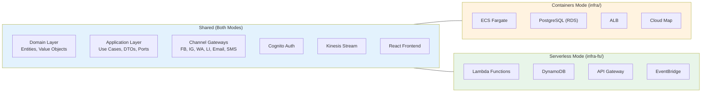
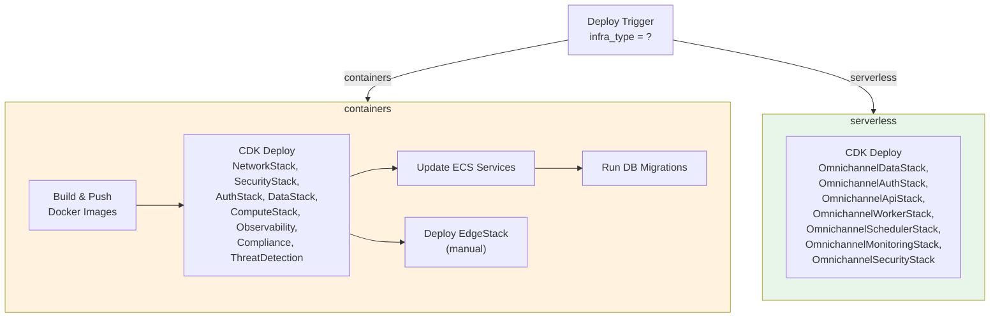
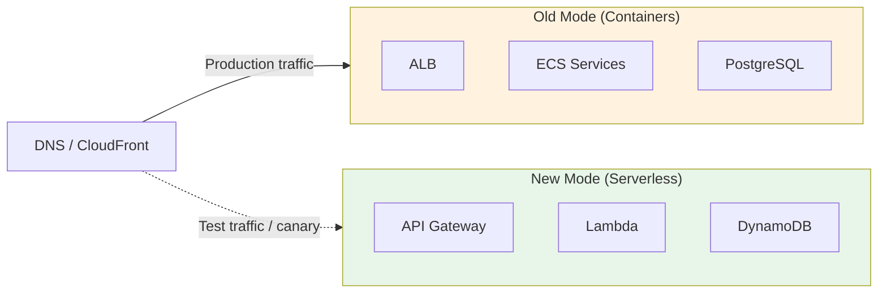

# Dual-Mode Deployment Guide

The Omnichannel Publisher supports two fully independent deployment modes — **Containers** (ECS Fargate + RDS) and **Serverless** (Lambda + DynamoDB) — selectable at deploy time via a single CI/CD parameter. This document explains how the two modes coexist, how to switch between them, and the architectural decisions that make this possible.

## Why Dual-Mode?

Different stages of a project have different needs:

| Stage | Recommended Mode | Reason |
|-------|-----------------|--------|
| Development / Prototyping | Serverless | Near-zero cost, instant deploys |
| Staging / QA | Either | Match production or save costs |
| Production (steady traffic) | Containers | Predictable latency, no cold starts |
| Production (variable traffic) | Serverless | Pay-per-use, auto-scaling |

The dual-mode approach lets you start cheap with serverless and migrate to containers when traffic justifies the fixed cost — or vice versa — without rewriting business logic.

## Architecture Comparison



### Side-by-Side Comparison

| Component | Containers (`infra/`) | Serverless (`infra-fs/`) |
|-----------|----------------------|--------------------------|
| API compute | ECS Fargate (FastAPI) | Lambda + API Gateway (FastAPI/Mangum) |
| Worker compute | ECS Fargate (Kinesis consumer) | Lambda (Kinesis event source) |
| Scheduler | ECS Fargate (APScheduler) | EventBridge rule → Lambda |
| Database | PostgreSQL on RDS | DynamoDB (single-table design) |
| Load balancer | ALB + CloudFront | API Gateway + CloudFront |
| Service discovery | Cloud Map | N/A (API Gateway routes) |
| Networking | VPC, private subnets | No VPC required |
| Monitoring | CloudWatch log metric filters + alarms | CloudWatch Lambda metrics + alarms |
| Security | WAF on ALB + CloudFront | WAF on API Gateway |
| Threat detection | GuardDuty, SecurityHub, CloudTrail | GuardDuty (Lambda + S3), SecurityHub |
| Cold start | None | ~100-500ms |
| Scaling | ECS auto-scaling (minutes) | Instant (Lambda concurrency) |
| Cost (low traffic) | ~$180-200/mo | ~$5-15/mo |
| Cost (high traffic) | ~$250-350/mo | ~$50-80/mo |

## How It Works

### Hexagonal Architecture Enables the Switch

The key enabler is hexagonal architecture (ports & adapters). Business logic lives in the domain and application layers, which have zero infrastructure dependencies:

```
src/
├── domain/           # Pure business logic — NO external deps
│   ├── entities/
│   └── value_objects/
├── application/      # Use cases — depends only on ports (interfaces)
│   ├── ports/
│   │   ├── inbound/  # ScheduleMessageUseCase, GetMessageUseCase
│   │   └── outbound/ # MessageRepository, EventPublisher, UnitOfWork
│   ├── services/     # ScheduleMessageService, GetMessageService
│   └── dtos/
├── infrastructure/   # Adapters — swapped per deployment mode
│   └── adapters/
│       ├── postgres_message_repository.py   ← Containers
│       ├── dynamo_message_repository.py     ← Serverless
│       ├── kinesis_event_publisher.py       ← Both
│       └── ...
└── presentation/
```

The `MessageRepository` port is the same interface in both modes. Only the adapter implementation changes:

```python
# Port (shared)
class MessageRepository(ABC):
    @abstractmethod
    async def get_by_id(self, id: UUID) -> Message | None: ...

    @abstractmethod
    async def save(self, message: Message) -> None: ...

# Container adapter
class PostgresMessageRepository(MessageRepository):
    def __init__(self, session: AsyncSession):
        self._session = session

# Serverless adapter
class DynamoMessageRepository(MessageRepository):
    def __init__(self, table_name: str):
        self._table = boto3.resource("dynamodb").Table(table_name)
```

### CDK Project Structure

Each mode has its own CDK project with independent stack names:

```
infra/                          # Containers mode
├── app.py
└── stacks/
    ├── network_stack.py        → NetworkStack
    ├── security_stack.py       → SecurityStack
    ├── auth_stack.py           → AuthStack
    ├── data_stack.py           → DataStack
    ├── compute_stack.py        → ComputeStack
    ├── observability_stack.py  → ObservabilityStack
    ├── compliance_stack.py     → ComplianceStack
    ├── threat_detection_stack.py → ThreatDetectionStack
    └── edge_stack.py           → EdgeStack

infra-fs/                       # Serverless mode
├── app.py
└── stacks/
    ├── data_stack.py           → OmnichannelDataStack
    ├── auth_stack.py           → OmnichannelAuthStack
    ├── api_stack.py            → OmnichannelApiStack
    ├── worker_stack.py         → OmnichannelWorkerStack
    ├── scheduler_stack.py      → OmnichannelSchedulerStack
    ├── monitoring_stack.py     → OmnichannelMonitoringStack
    ├── security_stack.py       → OmnichannelSecurityStack
    └── frontend_stack.py       → OmnichannelFrontendStack
```

Stack names are completely different between modes, so they never conflict in CloudFormation. Both can coexist in the same AWS account simultaneously.

### CI/CD Integration

The deploy workflow (`deploy.yml`) selects the mode via the `infra_type` input:

```yaml
on:
  workflow_dispatch:
    inputs:
      infra_type:
        description: 'Infrastructure type'
        type: choice
        options:
          - containers    # ECS Fargate (infra/)
          - serverless    # Lambda + DynamoDB (infra-fs/)
```

The `setup` job routes to the correct CDK project and stack names:



Container-specific jobs (build & push, ECS update, migrations, EdgeStack) are automatically skipped when `infra_type` is `serverless`.

## Migration Guide

### Containers → Serverless

1. **Export data** from PostgreSQL to DynamoDB format (use a migration script to transform relational rows into single-table items)
2. **Deploy serverless stacks**: trigger the deploy workflow with `infra_type: serverless`
3. **Verify** the serverless API is working (API Gateway URL in stack outputs)
4. **Update DNS / CloudFront** to point to the new API Gateway endpoint
5. **Tear down container stacks**:
   ```bash
   cd infra
   uv run cdk destroy NetworkStack SecurityStack AuthStack DataStack \
     ComputeStack ObservabilityStack ComplianceStack ThreatDetectionStack EdgeStack
   ```

### Serverless → Containers

1. **Export data** from DynamoDB to PostgreSQL (transform single-table items back to relational schema)
2. **Deploy container stacks**: trigger the deploy workflow with `infra_type: containers`
3. **Push container images** to ECR (the build-and-push job handles this)
4. **Run database migrations**: the migrate job runs Alembic migrations automatically
5. **Update DNS / CloudFront** to point to the ALB
6. **Tear down serverless stacks**:
   ```bash
   cd infra-fs
   uv run cdk destroy OmnichannelDataStack OmnichannelAuthStack OmnichannelApiStack \
     OmnichannelWorkerStack OmnichannelSchedulerStack OmnichannelMonitoringStack \
     OmnichannelSecurityStack OmnichannelFrontendStack
   ```

### Running Both Simultaneously

Since stack names are independent, you can run both modes in parallel during a migration window:



This allows you to:
- Run smoke tests against the new mode before cutting over
- Gradually shift traffic using weighted DNS routing (Route 53)
- Roll back instantly by switching DNS back

## What Stays the Same

Regardless of deployment mode, these components are identical:

- **Domain entities** (Message, ChannelDelivery, etc.)
- **Application services** (ScheduleMessageService, GetMessageService)
- **Port interfaces** (MessageRepository, EventPublisher, ChannelGateway)
- **Channel gateways** (Facebook, Instagram, WhatsApp, LinkedIn, Email, SMS)
- **AI Agent integration** (Bedrock Claude for content adaptation)
- **Authentication** (Cognito User Pool with social providers)
- **Event streaming** (Kinesis Data Streams)
- **Frontend** (React SPA)
- **CI pipeline** (lint, test, security scan, SBOM)

## What Changes

| Concern | Containers | Serverless |
|---------|-----------|------------|
| Entry point | `main.py` (Uvicorn) | `main.py` (Mangum handler) |
| DB adapter | `PostgresMessageRepository` | `DynamoMessageRepository` |
| UoW adapter | `SqlAlchemyUnitOfWork` | `DynamoUnitOfWork` |
| Scheduler | APScheduler (long-running) | EventBridge → Lambda (invoked) |
| Migrations | Alembic (SQL) | N/A (schemaless) |
| Networking | VPC, subnets, security groups | No VPC needed |
| Log groups | `/ecs/secure-api/*` | `/aws/lambda/omnichannel-*` |

## References

- [Architecture (Containers)](architecture-containers.md)
- [Architecture (Serverless)](architecture-serverless.md)
- [Hexagonal Architecture](architecture-containers.md#hexagonal-architecture-ports--adapters)
