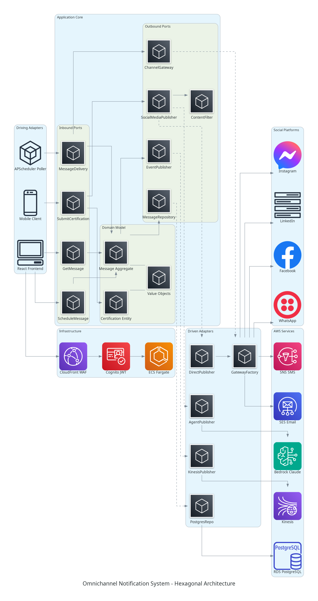

# Hexagonal Architecture Reference

## System Diagram



The diagram above shows the complete hexagonal architecture of the Omnichannel Notification System. Dependencies flow inward: outer layers (adapters) depend on inner layers (ports/domain), never the reverse.

## Architecture at a Glance

The system is split into three concentric zones:

| Zone | Responsibility | Dependencies |
|------|---------------|--------------|
| Driving Adapters | Receive external input (HTTP, Kinesis events, cron) | Depend on Inbound Ports |
| Application Core | Business logic, use cases, domain model | Zero external dependencies |
| Driven Adapters | Implement outbound integrations (DB, queues, APIs) | Implement Outbound Ports |

## Driving Adapters (Inbound)

These are the entry points that trigger application logic:

| Adapter | Service | Mechanism |
|---------|---------|-----------|
| React Frontend | API | REST calls via CloudFront → ALB → FastAPI |
| Mobile Client | API | REST calls (same path) |
| APScheduler Poller | Scheduler | Polls RDS for due messages, publishes to Kinesis |
| Kinesis Consumer | Worker | Consumes stream events for async processing |

All HTTP traffic passes through CloudFront (TLS 1.3) → WAF (OWASP rules) → Cognito JWT validation before reaching the application.

## Application Core

### Inbound Ports (Use Case Interfaces)

| Port | Service | Purpose |
|------|---------|---------|
| `ScheduleMessageUseCase` | API | Schedule a message for future multi-channel delivery |
| `GetMessageUseCase` | API | Retrieve message details by ID |
| `SubmitCertificationUseCase` | API | Submit an AWS certification achievement for announcement |
| `GetCertificationUseCase` | API | Retrieve a certification submission |
| `ListCertificationTypesUseCase` | API | List available AWS certification types |
| `MessageDeliveryService` | Worker | Orchestrate delivery across selected channels |

Each port is an abstract class (`ABC`) in the application layer. Concrete service implementations live alongside them and are wired via constructor injection in `main.py`.

### Domain Model

Pure Python dataclasses with zero external dependencies:

| Entity / Value Object | Description |
|-----------------------|-------------|
| `Message` (Aggregate Root) | Tracks content, channels, schedule, status, and per-channel deliveries |
| `Certification` (Entity) | AWS certification achievement with member info and type |
| `ChannelType` (Value Object) | Enum: `facebook`, `instagram`, `linkedin`, `whatsapp`, `email`, `sms` |
| `MessageContent` (Value Object) | Immutable text + optional media URL |
| `MessageStatus` (Value Object) | Lifecycle: `DRAFT` → `SCHEDULED` → `PROCESSING` → `DELIVERED` / `FAILED` |
| `DeliveryResult` (Value Object) | Per-channel outcome with external ID or error |

### Outbound Ports (Driven Interfaces)

| Port | Implemented By | External Service |
|------|---------------|-----------------|
| `MessageRepository` | `PostgresMessageRepository` | Amazon RDS (PostgreSQL) |
| `EventPublisher` | `KinesisEventPublisher` | Amazon Kinesis Data Streams |
| `ChannelGateway` | `FacebookGateway`, `InstagramGateway`, `LinkedInGateway`, `WhatsAppGateway`, `EmailGateway`, `SmsGateway` | Meta APIs, LinkedIn API, SES, SNS |
| `SocialMediaPublisher` | `DirectPublisher`, `AgentPublisher` | Direct API calls or Amazon Bedrock (Claude) |
| `ContentFilter` | `ContentFilterImpl` | Local regex + policy rules |
| `UnitOfWork` | `SqlAlchemyUnitOfWork` | SQLAlchemy async session |
| `IdempotencyPort` | `InMemoryIdempotencyService` | In-memory (per-instance) |

## Driven Adapters (Outbound)

### Strategy Pattern: DirectPublisher vs AgentPublisher

The `SocialMediaPublisher` port has two implementations, selectable via configuration:

```
SocialMediaPublisher (port)
├── DirectPublisher  — Posts identical content to all channels. Fast, simple.
└── AgentPublisher   — Uses Strands SDK + Bedrock Claude to adapt content
                       per platform (tone, length, hashtags). Slower, smarter.
```

Both implementations delegate actual posting to `ChannelGateway` instances created by `ChannelGatewayFactory`.

### ChannelGatewayFactory

The factory lazily creates and caches gateway instances per channel type, injecting platform credentials from settings:

```
ChannelGatewayFactory.get_gateway(ChannelType.FACEBOOK)
  → FacebookGateway(access_token=..., page_id=...)

ChannelGatewayFactory.get_gateway(ChannelType.EMAIL)
  → EmailGateway(sender_email=..., region=...)
```

## Composition Root

Each service has a `main.py` that wires all dependencies (the only place where concrete implementations are imported):

```
api/src/main.py          — Wires FastAPI routes, repositories, publishers, middleware
worker/src/main.py       — Wires Kinesis consumer, processor, publishers, gateways
scheduler/src/main.py    — Wires APScheduler, DB poller, Kinesis publisher
```

No other module imports from `infrastructure/` directly. This is enforced by convention and validated during code review.

## Cross-Cutting Concerns

| Concern | Implementation | Scope |
|---------|---------------|-------|
| Authentication | Cognito JWT validation middleware | API service |
| Correlation IDs | `X-Request-ID` header → structlog context → Kinesis payload | All services |
| Structured Logging | `structlog` with JSON output → CloudWatch Logs | All services |
| Security Headers | CSP, HSTS, X-Frame-Options middleware | API service |
| Rate Limiting | Per-user sliding window (60 req/min) | API service |
| CSRF Protection | Double Submit Cookie with HMAC-signed tokens | API service |
| Content Filtering | Prompt injection detection + PII scanning | Worker (AgentPublisher) |
| Idempotency | Hash-based dedup on message_id + channels | Worker service |

## Testing Strategy

Hexagonal architecture enables testing at each layer independently:

| Layer | Test Type | What's Real | What's Mocked |
|-------|-----------|-------------|---------------|
| Domain | Unit | Everything | Nothing |
| Services | Unit | Business logic | Ports (repositories, publishers) |
| Adapters | Integration | DB, Kinesis | Nothing |
| API | E2E | Full stack | External services |

Current test counts: API 46, Worker 31, Frontend 21 (98 total, all passing).

## Related Documentation

- [Architecture (Containers)](architecture-containers.md) — Full AWS infrastructure diagrams, CDK stacks, middleware details
- [Architecture (Serverless)](architecture-serverless.md) — Lambda + DynamoDB variant
- [Security](security.md) — Zero Trust, WAF, encryption, threat detection
- [AI Agents](ai-agents.md) — Strands SDK integration with Bedrock Claude
- [Dual-Mode Deployment](dual-mode-deployment.md) — Switching between containers and serverless
