# Security Testing Agent

## Overview

The Security Testing Agent is an AI-powered interactive penetration testing assistant built with [Strands Agents SDK](https://strandsagents.com) and Amazon Bedrock. It wraps the project's pytest-based security test suite with an intelligent agent that can run tests, diagnose failures, query AWS resources for debugging, and auto-fix test code — all through natural language conversation.

```mermaid
flowchart LR
    subgraph User
        CLI["Terminal / Interactive Prompt"]
    end

    subgraph Agent["Strands Agent (Claude Haiku 4.5)"]
        LOOP["Agent Loop<br/>• Reasoning<br/>• Tool Selection<br/>• Execution"]
    end

    subgraph Tools["@tool Functions"]
        direction TB
        TEST["Test Runners<br/>run_pytest_test<br/>run_all_tests_parallel<br/>run_fast_tests"]
        AWS["AWS Read-Only<br/>get_cloudformation_outputs<br/>list_log_groups<br/>query_logs<br/>list_waf_webacls<br/>get_waf_logging_config"]
        CODE["Code Tools<br/>read_test_file<br/>fix_test_code"]
        REC["Recommendations<br/>get_test_recommendations"]
    end

    subgraph Infra["AWS Resources (Read-Only)"]
        CF["CloudFormation"]
        CW["CloudWatch Logs"]
        WAF["WAF v2"]
    end

    CLI --> LOOP
    LOOP --> TEST
    LOOP --> AWS
    LOOP --> CODE
    LOOP --> REC
    AWS --> CF
    AWS --> CW
    AWS --> WAF

    style Agent fill:#e3f2fd
    style Tools fill:#fff3e0
    style Infra fill:#e8f5e9
```



## Quick Start

```bash
cd testing/

# 1. Ensure the Kali container is running
just start

# 2. Launch the agent
just agent
```

The agent starts an interactive prompt where you can ask it to run tests, investigate failures, or get recommendations:

```
🔒 Penetration Testing Agent Ready!
I can help you run security tests, debug failures, and fix issues.

You: Run all fast tests
Agent: I'll run the fast test suite in parallel, skipping slow scans...
       ✅ All tests passed in 8 seconds!

You: The TLS test is failing, can you debug it?
Agent: Let me run the TLS test and check the logs...
       [runs test, queries CloudFormation for endpoints, checks CloudWatch]
       The certificate for api.ugcbba.click expired. Here's what I found...
```

## Agent Capabilities

### 1. Test Execution

The agent can run any test from the security suite through three tools:

| Tool | Purpose | Use Case |
|------|---------|----------|
| `run_pytest_test` | Run a single named test | Targeted debugging |
| `run_all_tests_parallel` | Run multiple tests concurrently via pytest-xdist | Fast feedback |
| `run_fast_tests` | Run all tests except slow scans | Quick validation |

All test execution is restricted to an allowlist of known test names — the agent cannot run arbitrary commands.

### 2. AWS Resource Inspection (Read-Only)

When a test fails, the agent can query AWS to understand why:

| Tool | Purpose |
|------|---------|
| `get_cloudformation_outputs` | Fetch stack outputs (ALB URL, domain names, etc.) |
| `list_log_groups` | Discover CloudWatch log groups |
| `query_logs` | Run CloudWatch Logs Insights queries |
| `list_waf_webacls` | List WAF Web ACLs |
| `get_waf_logging_config` | Check WAF logging destinations |

All AWS access is read-only. The agent cannot create, modify, or delete any AWS resources.

### 3. Auto-Debugging and Code Fixes

The agent can read and patch test files to fix issues:

| Tool | Purpose |
|------|---------|
| `read_test_file` | Read files from the `testing/` directory |
| `fix_test_code` | Replace code in test files with a fix and explanation |

File access is sandboxed to the `testing/` directory — path traversal is blocked.

### 4. Smart Test Recommendations

The agent tracks test history across the session:

- Recently failed tests are prioritized
- Slow tests (nmap, nikto, sqlmap) are skipped unless explicitly requested
- Successful results are cached for 5 minutes to avoid redundant runs

## Available Security Tests

### Fast Tests (< 10s each)

| Test | What It Validates |
|------|-------------------|
| `test-health` | Health endpoint connectivity |
| `test-headers` | Security headers (CSP, HSTS, X-Frame-Options, etc.) |
| `test-tls` | TLS certificate, HTTPS redirect, protocol version, HSTS |
| `test-cors` | CORS policy — origin reflection, preflight, wildcard blocking |
| `test-cookies` | Cookie attributes — HttpOnly, Secure, SameSite |
| `test-error-disclosure` | Information leakage — stack traces, paths, versions |
| `test-http-methods` | HTTP method restriction — TRACE, DELETE, PUT |
| `test-origin-access` | CloudFront origin access — direct ALB bypass, cache headers |
| `test-sql-injection` | SQL injection protection via WAF |
| `test-xss` | XSS sanitization |

### Medium Tests (15-30s)

| Test | What It Validates |
|------|-------------------|
| `test-rate-limit` | Rate limiting enforcement (sends 70 requests) |
| `test-csrf` | End-to-end CSRF protection — missing/mismatched/tampered tokens |
| `test-idor` | IDOR protection (creates Cognito test users, needs auth) |

### Slow Tests (30s-10min)

| Test | What It Validates |
|------|-------------------|
| `test-nmap` | Port scanning with nmap |
| `test-nikto` | Web vulnerability scan with Nikto |
| `test-sqlmap` | Automated SQL injection scan with sqlmap |

### Composite

| Test | What It Includes |
|------|------------------|
| `test-infra` | All infrastructure tests (TLS, CORS, cookies, error disclosure, HTTP methods, origin access) |

## Security Guardrails

The agent enforces strict boundaries through its system prompt and code-level controls:

1. Can only run tests from a hardcoded allowlist (`ALLOWED_TESTS`)
2. Can only read/modify files inside the `testing/` directory (path traversal blocked)
3. AWS access is read-only — no create, modify, or delete operations
4. Cannot execute arbitrary shell commands
5. Refuses tasks unrelated to penetration testing

## Configuration

### Environment Variables

| Variable | Default | Description |
|----------|---------|-------------|
| `TARGET_URL` | `https://api.ugcbba.click` | Target URL for tests |
| `PENTEST_VERBOSE` | `1` | Stream tool output to terminal |
| `PENTEST_MODEL_ID` | `us.anthropic.claude-haiku-4-5-20251001-v1:0` | Bedrock model ID |
| `SKIP_CLOUDWATCH` | `0` | Skip CloudWatch log verification for speed |

### Model Selection

The agent defaults to Claude Haiku 4.5 for fast, cost-effective tool-heavy workflows:

| Model | Speed | Cost | Best For |
|-------|-------|------|----------|
| Claude Haiku 4.5 | ⚡⚡⚡ | $ | Default — fast iteration (recommended) |
| Claude Sonnet 4.5 | ⚡⚡ | $$ | Complex failure analysis |
| Claude Opus 4.5 | ⚡ | $$$ | Deep reasoning about security issues |

Override with:
```bash
PENTEST_MODEL_ID=us.anthropic.claude-sonnet-4-5-20250929-v1:0 just agent
```

## Performance Optimizations

| Optimization | Impact |
|-------------|--------|
| Parallel test execution (pytest-xdist) | 4x faster for full suite |
| Test result caching (5 min TTL) | Instant for repeated runs |
| AWS resource caching (LRU + TTL) | 30x faster for resource lookups |
| Optional CloudWatch skip | 2x faster per test |
| Persistent Kali container | No container restart overhead |
| Streaming output | Real-time feedback |

See [testing/OPTIMIZATIONS.md](../testing/OPTIMIZATIONS.md) for detailed benchmarks.

## Architecture

The agent follows the same Strands Agents pattern as the [social media posting agent](ai-agents.md), but scoped to security testing:

```
testing/
├── pentest_agent.py    # Agent definition, tools, guardrails
├── conftest.py         # Pytest fixtures (Cognito auth, Kali container, CloudWatch helpers)
├── test_pentest.py     # Security test cases
├── justfile            # Task runner recipes
├── Dockerfile.kali     # Kali Linux container with security tools
└── OPTIMIZATIONS.md    # Performance tuning guide
```

The agent uses constructor injection for AWS clients and exposes all capabilities as `@tool`-decorated methods on the `PentestAgent` class.

## Prerequisites

- Docker (for the Kali Linux container)
- AWS credentials with read access to CloudFormation, CloudWatch Logs, and WAF v2
- Amazon Bedrock access for Claude models
- Python dependencies: `cd testing && uv sync`

## References

- [Automated Penetration Testing](automated-penetration-testing.md) — Docker/Kali container setup
- [Penetration Testing](penetration-testing.md) — Manual testing checklist
- [AI Agents](ai-agents.md) — Social media posting agent (same Strands SDK)
- [Testing](testing.md) — General testing strategy
- [Strands Agents SDK](https://strandsagents.com)
