# Security: Zero Trust & Secure Supply Chain

## Overview

This document outlines the Zero Trust architecture and Secure Supply Chain practices implemented in the Omnichannel Publisher platform.

## Zero Trust Principles

**"Never trust, always verify"** - Every request is authenticated and authorized regardless of network location.


## Network Security Architecture


## Identity & Access Flow


## Authentication Providers


### OAuth Credentials Storage

OAuth client credentials are stored securely in AWS Secrets Manager:

| Provider | Secret Name | Fields |
|----------|-------------|--------|
| Google | `omnichannel/oauth/google` | `client_id`, `client_secret` |
| GitHub | `omnichannel/oauth/github` | `client_id`, `client_secret` |
| LinkedIn | `omnichannel/oauth/linkedin` | `client_id`, `client_secret` |

## Data Protection


## Micro-segmentation


## Secure Supply Chain

### Build Pipeline Security


### Container Security Layers


### CI/CD Security Gates


## Threat Detection & Response

```mermaid
flowchart TB
    subgraph Detection["Threat Detection"]
        GD2["GuardDuty<br/>• Malicious IPs<br/>• Unusual API calls<br/>• Container threats"]
        SH2["Security Hub<br/>• Aggregated findings<br/>• Compliance checks"]
        CT2["CloudTrail<br/>• API audit log<br/>• Tamper-proof"]
    end

    subgraph Response["Automated Response"]
        EB["EventBridge<br/>Rule"]
        LAMBDA["Lambda<br/>Function"]
        WAFIP["WAF IP Set<br/>Update"]
    end

    subgraph Alert["Alerting"]
        SLACK["Slack"]
        PD["PagerDuty"]
    end

    GD2 -->|"Finding"| EB
    EB -->|"Severity >= 4"| LAMBDA
    LAMBDA -->|"Block IP"| WAFIP
    LAMBDA -->|"Notify"| Alert

    SH2 -.-> GD2
    CT2 -.-> SH2
```



## Security Checklist

```mermaid
flowchart TB
    subgraph Dev["Development"]
        D1["✓ Signed commits"]
        D2["✓ Branch protection"]
        D3["✓ Pre-commit hooks"]
    end

    subgraph Deps["Dependencies"]
        P1["✓ Lock file with hashes"]
        P2["✓ Vulnerability scanning"]
        P3["✓ SBOM generated"]
    end

    subgraph Container["Container"]
        C1["✓ Distroless base"]
        C2["✓ Non-root user"]
        C3["✓ Image signed"]
    end

    subgraph Infra["Infrastructure"]
        I1["✓ TLS 1.3 everywhere"]
        I2["✓ KMS encryption"]
        I3["✓ VPC endpoints"]
    end

    subgraph Runtime2["Runtime"]
        R1["✓ JWT validation"]
        R2["✓ Rate limiting"]
        R3["✓ GuardDuty enabled"]
    end

    Dev --> Deps --> Container --> Infra --> Runtime2
```



## Dockerfile Security Example

```dockerfile
# Use specific digest, not :latest
FROM python:3.12-slim@sha256:abc123... AS builder

WORKDIR /app

# Install dependencies first (layer caching)
COPY requirements.txt .
RUN pip install --no-cache-dir -r requirements.txt

# Production image - distroless
FROM gcr.io/distroless/python3-debian12

WORKDIR /app

# Copy only what's needed
COPY --from=builder /usr/local/lib/python3.12/site-packages /usr/local/lib/python3.12/site-packages
COPY --from=builder /app .

# Non-root user (distroless default)
USER nonroot

# Read-only filesystem compatible
ENV PYTHONDONTWRITEBYTECODE=1

ENTRYPOINT ["python", "-m", "uvicorn", "main:app"]
```

## References

- [NIST Zero Trust Architecture (SP 800-207)](https://csrc.nist.gov/publications/detail/sp/800-207/final)
- [SLSA Supply Chain Framework](https://slsa.dev/)
- [OWASP Container Security](https://cheatsheetseries.owasp.org/cheatsheets/Docker_Security_Cheat_Sheet.html)
- [AWS Well-Architected Security Pillar](https://docs.aws.amazon.com/wellarchitected/latest/security-pillar/welcome.html)

---

## Threat Analysis

This section documents identified attack vectors, their risk assessment, and remediation status.

### Attack Surface Overview


### Identified Attack Vectors

#### 1. Supply Chain Attacks (Critical)


| Vulnerability | Current State | Risk |
|--------------|---------------|------|
| Dependencies not pinned with hashes | ⚠️ Vulnerable | Critical |
| No SBOM generation | ⚠️ Missing | High |
| GitHub token has broad repo access | ⚠️ Over-permissioned | High |
| No dependency vulnerability scanning in CI | ⚠️ Missing | High |

#### 2. Authentication Bypass (Critical)


| Vulnerability | Current State | Risk |
|--------------|---------------|------|
| No JWT audience (`aud`) validation | ⚠️ Vulnerable | Critical |
| No JWT issuer (`iss`) strict validation | ⚠️ Vulnerable | High |
| JWKS cached indefinitely | ⚠️ Vulnerable | Medium |
| No algorithm restriction | ⚠️ Vulnerable | Critical |

#### 3. API Abuse (High)


| Vulnerability | Current State | Risk |
|--------------|---------------|------|
| No input sanitization | ⚠️ Vulnerable | High |
| No user-scoped access control | ⚠️ Vulnerable | High |
| No request size limits | ⚠️ Missing | Medium |
| WAF rate limit per IP only | ⚠️ Bypassable | Medium |

#### 4. Secrets Exfiltration (High)

| Vulnerability | Current State | Risk |
|--------------|---------------|------|
| Secrets ARN in Lambda env vars | ⚠️ Exposed | High |
| No secrets rotation | ⚠️ Missing | Medium |
| Broad Secrets Manager permissions | ⚠️ Over-permissioned | Medium |
| Potential logging of sensitive data | ⚠️ Risk | Medium |

#### 5. Message Queue Poisoning (Medium)

| Vulnerability | Current State | Risk |
|--------------|---------------|------|
| No message schema validation | ⚠️ Vulnerable | Medium |
| No idempotency keys | ⚠️ Missing | Medium |
| Unlimited retries on errors | ⚠️ DoS risk | Medium |
| No message replay protection | ⚠️ Missing | Low |

#### 6. AI/LLM Attacks (Medium)


| Vulnerability | Current State | Risk |
|--------------|---------------|------|
| No prompt injection protection | ⚠️ Vulnerable | Medium |
| No output content filtering | ⚠️ Missing | Medium |
| No rate limiting per user | ⚠️ Missing | Medium |

#### 7. Frontend Attacks (Low-Medium)

| Vulnerability | Current State | Risk |
|--------------|---------------|------|
| Potential XSS in previews | ⚠️ Risk | Medium |
| Tokens in localStorage | ⚠️ Exposed to XSS | Medium |
| No CSRF protection | ⚠️ Missing | Low |
| Env vars in client bundle | ⚠️ Exposed | Low |

---

## Remediation Plan

### Priority Matrix


### Phase 1: Critical (Week 1)

| Task | Description | Status |
|------|-------------|--------|
| **JWT Hardening** | Add `aud`, `iss` validation, algorithm restriction | 🔴 TODO |
| **Dependency Pinning** | Pin all deps with hashes, enable Dependabot | 🔴 TODO |
| **User-scoped Access** | Validate user owns resource before access | 🔴 TODO |
| **Input Sanitization** | Sanitize all user inputs, escape HTML | 🔴 TODO |

### Phase 2: High Priority (Week 2)

| Task | Description | Status |
|------|-------------|--------|
| **AI Guardrails** | Add content filtering, output validation | 🔴 TODO |
| **Secrets Runtime Fetch** | Remove secrets from env vars, fetch at runtime | 🔴 TODO |
| **JWKS Refresh** | Implement JWKS cache with TTL and refresh | 🔴 TODO |
| **Request Validation** | Add request size limits, schema validation | 🔴 TODO |

### Phase 3: Medium Priority (Week 3-4)

| Task | Description | Status |
|------|-------------|--------|
| **SBOM Generation** | Generate and publish SBOM in CI | 🔴 TODO |
| **Secrets Rotation** | Configure automatic rotation for all secrets | 🔴 TODO |
| **Message Idempotency** | Add idempotency keys to Kinesis messages | 🔴 TODO |
| **Rate Limiting** | Per-user rate limiting, not just per-IP | 🔴 TODO |

### Phase 4: Hardening (Ongoing)

| Task | Description | Status |
|------|-------------|--------|
| **CSRF Protection** | Add CSRF tokens to forms | 🔴 TODO |
| **Secure Token Storage** | Move tokens to httpOnly cookies | 🔴 TODO |
| **Content Security Policy** | Implement strict CSP headers | 🔴 TODO |
| **Penetration Testing** | External security audit | 🔴 TODO |

### Remediation Architecture

```mermaid
flowchart TB
    subgraph Phase1["Phase 1: Critical"]
        JWT["JWT Hardening<br/>• Algorithm restriction<br/>• Audience validation<br/>• Issuer validation"]
        DEPS["Dependency Security<br/>• Pin with hashes<br/>• Dependabot alerts<br/>• pip-audit in CI"]
        ACCESS["Access Control<br/>• User-scoped queries<br/>• Resource ownership<br/>• RBAC enforcement"]
    end

    subgraph Phase2["Phase 2: High"]
        AI_FIX["AI Guardrails<br/>• Input filtering<br/>• Output validation<br/>• Content moderation"]
        SECRETS_FIX["Secrets Management<br/>• Runtime fetch<br/>• Least privilege<br/>• Rotation"]
    end

    subgraph Phase3["Phase 3: Medium"]
        SBOM_FIX["Supply Chain<br/>• SBOM generation<br/>• Image signing<br/>• Provenance"]
        MSG_FIX["Message Security<br/>• Schema validation<br/>• Idempotency<br/>• DLQ handling"]
    end

    Phase1 --> Phase2 --> Phase3

    style Phase1 fill:#ff5252
    style Phase2 fill:#ff9800
    style Phase3 fill:#ffeb3b
```



### Security Metrics to Track

| Metric | Target | Current |
|--------|--------|---------|
| Critical vulnerabilities | 0 | TBD |
| High vulnerabilities | 0 | TBD |
| Dependency freshness | < 30 days | TBD |
| Secrets rotation age | < 90 days | TBD |
| Failed auth attempts (hourly) | < 100 | TBD |
| WAF blocked requests (daily) | Monitored | TBD |
