# Security: Zero Trust & Secure Supply Chain

## Overview

This document outlines the Zero Trust architecture and Secure Supply Chain practices implemented in the Omnichannel Publisher platform.

## Zero Trust Principles

**"Never trust, always verify"** - Every request is authenticated and authorized regardless of network location.


## Network Security Architecture


## Identity & Access Flow


## Authentication Providers


### OAuth Credentials Storage

OAuth client credentials are stored securely in AWS Secrets Manager:

| Provider | Secret Name | Fields |
|----------|-------------|--------|
| Google | `omnichannel/oauth/google` | `client_id`, `client_secret` |
| GitHub | `omnichannel/oauth/github` | `client_id`, `client_secret` |
| LinkedIn | `omnichannel/oauth/linkedin` | `client_id`, `client_secret` |

## Data Protection


## Micro-segmentation


## Secure Supply Chain

### Build Pipeline Security


### Container Security Layers


### CI/CD Security Gates


## Threat Detection & Response

```mermaid
flowchart TB
    subgraph Detection["Threat Detection"]
        GD2["GuardDuty<br/>• Malicious IPs<br/>• Unusual API calls<br/>• Container threats"]
        SH2["Security Hub<br/>• Aggregated findings<br/>• Compliance checks"]
        CT2["CloudTrail<br/>• API audit log<br/>• Tamper-proof"]
    end

    subgraph Response["Automated Response"]
        EB["EventBridge<br/>Rule"]
        LAMBDA["Lambda<br/>Function"]
        WAFIP["WAF IP Set<br/>Update"]
    end

    subgraph Alert["Alerting"]
        SLACK["Slack"]
        PD["PagerDuty"]
    end

    GD2 -->|"Finding"| EB
    EB -->|"Severity >= 4"| LAMBDA
    LAMBDA -->|"Block IP"| WAFIP
    LAMBDA -->|"Notify"| Alert

    SH2 -.-> GD2
    CT2 -.-> SH2
```



## Security Checklist

```mermaid
flowchart TB
    subgraph Dev["Development"]
        D1["✓ Signed commits"]
        D2["✓ Branch protection"]
        D3["✓ Pre-commit hooks"]
    end

    subgraph Deps["Dependencies"]
        P1["✓ Lock file with hashes"]
        P2["✓ Vulnerability scanning"]
        P3["✓ SBOM generated"]
    end

    subgraph Container["Container"]
        C1["✓ Distroless base"]
        C2["✓ Non-root user"]
        C3["✓ Image signed"]
    end

    subgraph Infra["Infrastructure"]
        I1["✓ TLS 1.3 everywhere"]
        I2["✓ KMS encryption"]
        I3["✓ VPC endpoints"]
    end

    subgraph Runtime2["Runtime"]
        R1["✓ JWT validation"]
        R2["✓ Rate limiting"]
        R3["✓ GuardDuty enabled"]
    end

    Dev --> Deps --> Container --> Infra --> Runtime2
```



## Dockerfile Security Example

```dockerfile
# Use specific digest, not :latest
FROM python:3.12-slim@sha256:abc123... AS builder

WORKDIR /app

# Install dependencies first (layer caching)
COPY requirements.txt .
RUN pip install --no-cache-dir -r requirements.txt

# Production image - distroless
FROM gcr.io/distroless/python3-debian12

WORKDIR /app

# Copy only what's needed
COPY --from=builder /usr/local/lib/python3.12/site-packages /usr/local/lib/python3.12/site-packages
COPY --from=builder /app .

# Non-root user (distroless default)
USER nonroot

# Read-only filesystem compatible
ENV PYTHONDONTWRITEBYTECODE=1

ENTRYPOINT ["python", "-m", "uvicorn", "main:app"]
```

## References

- [NIST Zero Trust Architecture (SP 800-207)](https://csrc.nist.gov/publications/detail/sp/800-207/final)
- [SLSA Supply Chain Framework](https://slsa.dev/)
- [OWASP Container Security](https://cheatsheetseries.owasp.org/cheatsheets/Docker_Security_Cheat_Sheet.html)
- [AWS Well-Architected Security Pillar](https://docs.aws.amazon.com/wellarchitected/latest/security-pillar/welcome.html)
