# Service Discovery & Registry Pattern

## Overview

The Omnichannel Publisher uses AWS Cloud Map as a service registry, enabling services to discover and communicate with each other without hardcoded endpoints.

## Architecture

## Service Registration Flow

## Service Communication Patterns

### Synchronous (Request/Response)

### Asynchronous (Event-driven)

### Scheduled Jobs

## Services Overview

```mermaid
flowchart TB
    subgraph External["External"]
        USER[("👤 User")]
        ALB["Application<br/>Load Balancer"]
    end

    subgraph Internal["Internal Services"]
        API["API Service<br/>api.secure-api.local<br/>• REST endpoints<br/>• Message scheduling"]
        WORKER["Worker Service<br/>worker.secure-api.local<br/>• Kinesis consumer<br/>• Channel delivery"]
        SCHEDULER["Scheduler Service<br/>scheduler.secure-api.local<br/>• Cron polling<br/>• Due message dispatch"]
    end

    subgraph Data["Data Layer"]
        KINESIS3["Kinesis"]
        RDS[("RDS")]
    end

    USER --> ALB --> API
    API --> KINESIS3
    API --> RDS
    SCHEDULER --> RDS
    SCHEDULER --> KINESIS3
    KINESIS3 --> WORKER
    WORKER --> RDS

    style External fill:#e8f5e9
    style Internal fill:#e3f2fd
    style Data fill:#fff3e0
```

## DNS-based Load Balancing

## Health Checks

## Service Client Implementation

## Environment Configuration

## Benefits

## Comparison with Alternatives

| Approach | Pros | Cons |
|----------|------|------|
| **Cloud Map** | AWS-native, auto-registration, DNS-based | AWS-specific |
| Consul | Feature-rich, multi-cloud | Extra infrastructure |
| Eureka | Java ecosystem standard | JVM-centric |
| Kubernetes DNS | K8s-native | Requires K8s |

## References

- [AWS Cloud Map Documentation](https://docs.aws.amazon.com/cloud-map/)
- [ECS Service Discovery](https://docs.aws.amazon.com/AmazonECS/latest/developerguide/service-discovery.html)
- [Microservices Patterns - Service Discovery](https://microservices.io/patterns/service-registry.html)
