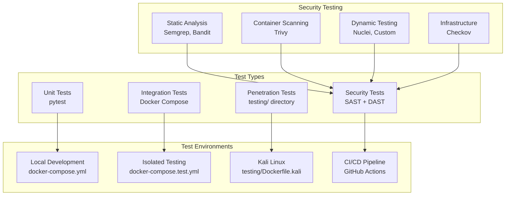

# Testing Guide

## Overview

The platform uses Docker-based testing for consistency across development, CI/CD, and production environments. Tests are organized into unit tests, integration tests, and security tests.

## Test Architecture



## Testing Directory Structure

```
testing/                    # Dedicated penetration testing
├── Dockerfile.kali         # Kali Linux container with tools
├── Vagrantfile            # VM-based testing environment  
├── justfile               # Penetration test commands
└── README.md              # Penetration testing setup guide
```

## Quick Start

```bash
just up && just test        # Start services and run tests
just test-isolated          # Isolated test environment  
just security-scan          # Security analysis
cd testing && just all      # Penetration testing
```

**Command reference:** Run `just --list` to see all available commands.

## Unit Testing

### Running Unit Tests

All test commands are defined in the main [justfile](../justfile). Key commands:

```bash
just test           # All services  
just test-api       # API only
just test-cov       # With coverage
just test-isolated  # Fresh containers
```

Run `just --list` to see all available test commands.

### Test Structure

Each service follows the same test structure:
```
service/
├── src/
│   ├── domain/
│   ├── application/
│   ├── infrastructure/
│   └── presentation/
└── tests/
    ├── unit/
    │   ├── domain/
    │   ├── application/
    │   └── infrastructure/
    ├── integration/
    └── conftest.py
```

### Writing Tests

Follow hexagonal architecture principles:

```python
# Domain tests (no external dependencies)
def test_message_validation():
    message = Message(content="test", user_id="123")
    assert message.is_valid()

# Application tests (mock infrastructure)
@pytest.fixture
def mock_repository():
    return Mock(spec=MessageRepository)

def test_create_message_use_case(mock_repository):
    service = CreateMessageService(mock_repository)
    result = await service.execute(CreateMessageDTO(content="test"))
    assert result.success

# Infrastructure tests (real dependencies)
@pytest.mark.integration
async def test_postgres_repository(db_session):
    repo = PostgresMessageRepository(db_session)
    message = await repo.save(Message(content="test"))
    assert message.id is not None
```

## Integration Testing

### Isolated Test Environment

The `docker-compose.test.yml` creates isolated containers:

```yaml
services:
  test-runner:
    build:
      context: ./api
      dockerfile: Dockerfile.dev
    environment:
      DB_NAME: omnichannel_test  # Separate test database
    command: pytest tests/ -v --tb=short
    profiles: [test]
```

### Running Integration Tests

```bash
# Full isolated environment
just test-isolated

# Build and test single service
just test-build api

# Manual Docker commands
docker compose -f docker-compose.yml -f docker-compose.test.yml --profile test up --build test-runner
```

### Test Database

Integration tests use a separate database:
- **Development:** `omnichannel`
- **Testing:** `omnichannel_test`

This prevents test data from polluting development data.

## Security Testing

### Static Analysis (SAST)

Security scanning commands are in the main [justfile](../justfile):

```bash
just security-scan  # All tools: Semgrep, Bandit, pip-audit, Gitleaks
just trivy-scan     # Container vulnerabilities  
just sbom-scan      # Software Bill of Materials
just iac-scan       # Infrastructure security
```

See `just --list` for complete security command reference.

### Container Security

```bash
just trivy-scan     # Scan all service images
```

### Software Bill of Materials (SBOM)

```bash
just sbom-scan      # Generate SBOMs and scan for vulnerabilities
# Results saved to sbom-reports/
```

### Infrastructure Security

```bash
just iac-scan       # Scan CDK/CloudFormation with Checkov
```

### Dynamic Security Testing (DAST)

```bash
just up                                    # Start application
just nuclei-scan http://localhost:8080     # Advanced vulnerability scanning
cd testing && just all                     # Basic security tests
```

### Penetration Testing

The `testing/` directory contains a complete penetration testing environment with Kali Linux tools.

**Quick start:**
```bash
# Docker-based (recommended)
docker build -f testing/Dockerfile.kali -t pentest:latest testing/
docker run --rm -e TARGET_URL=http://localhost:8080 pentest all

# Local justfile
cd testing && just all TARGET_URL=http://localhost:8080
```

See [testing/README.md](../testing/README.md) and [testing/justfile](../testing/justfile) for complete command reference and setup instructions.

### TLS Security Testing

TLS configuration is validated against the custom domains (`api.ugcbba.click`, `auth.ugcbba.click`):

```bash
cd testing

# Run TLS-specific tests
just test-tls

# Run all fast security tests (includes TLS)
just test-fast
```

Tests verify certificate validity, TLS 1.0/1.1 rejection, TLS 1.2 acceptance, HTTPS redirect, and HSTS headers. See `testing/test_pentest.py::TestTLSSecurity` for details.

### Test Target URL

By default, tests target `https://api.ugcbba.click` (CloudFront + WAF). Override with:

```bash
TARGET_URL=https://your-endpoint.example.com just test
```

## CI/CD Integration

### GitHub Actions

```yaml
name: Test Suite
on: [push, pull_request]

jobs:
  unit-tests:
    runs-on: ubuntu-latest
    steps:
      - uses: actions/checkout@v4
      - name: Run unit tests
        run: just test-isolated

  security-tests:
    runs-on: ubuntu-latest
    steps:
      - uses: actions/checkout@v4
      - name: Security scan
        run: just security-scan
      - name: Container scan
        run: just trivy-scan
```

### Pre-commit Hooks

```bash
# Install git hooks
just install-hooks

# Manual pre-push check
just check
```

The pre-push hook runs:
- Linting (ruff, mypy)
- Unit tests
- Security scan
- Container scan

## Test Configuration

### Environment Variables

```bash
# Test environment
DB_NAME=omnichannel_test
AWS_ENDPOINT_URL=http://localstack:4566
DEBUG=true

# Security testing
TARGET_URL=http://localhost:8080
JWT_TOKEN=eyJ0eXAiOiJKV1QiLCJhbGciOiJIUzI1NiJ9...
```

### Test Dependencies

Each service includes test dependencies:

```toml
# pyproject.toml
[project.optional-dependencies]
dev = [
    "pytest>=7.0.0",
    "pytest-asyncio>=0.21.0",
    "pytest-cov>=4.0.0",
    "httpx>=0.24.0",
    "factory-boy>=3.2.0",
]
```

## Performance Testing

### Load Testing

```bash
# Install k6
brew install k6

# Run load test
k6 run scripts/load-test.js
```

### Benchmarking

```bash
# API benchmarks
pytest tests/benchmarks/ --benchmark-only
```

## Test Data Management

### Factories

```python
# tests/factories.py
import factory
from src.domain.entities import Message

class MessageFactory(factory.Factory):
    class Meta:
        model = Message
    
    content = factory.Faker("text", max_nb_chars=200)
    user_id = factory.Faker("uuid4")
    scheduled_at = None
```

### Fixtures

```python
# tests/conftest.py
@pytest.fixture
async def db_session():
    async with AsyncSession(test_engine) as session:
        yield session
        await session.rollback()

@pytest.fixture
def sample_message():
    return MessageFactory()
```

## Debugging Tests

### Local Debugging

```bash
# Run tests with verbose output
just test-file tests/test_messages.py -v -s

# Debug specific test
pytest tests/test_messages.py::test_create_message -v -s --pdb
```

### Container Debugging

```bash
# Shell into test container
docker compose exec api bash

# Run tests inside container
pytest tests/ -v --pdb
```

## Best Practices

### Test Organization

1. **Unit tests** - Fast, no external dependencies
2. **Integration tests** - Real database, marked with `@pytest.mark.integration`
3. **Security tests** - Automated in CI/CD
4. **Manual tests** - Penetration testing checklist

### Test Naming

```python
# Good test names
def test_create_message_with_valid_data_returns_success():
def test_create_message_with_invalid_user_raises_forbidden():
def test_rate_limiter_blocks_after_threshold_exceeded():
```

### Mocking

```python
# Mock external services
@patch('src.infrastructure.adapters.facebook_gateway.FacebookGateway.post')
def test_facebook_delivery(mock_post):
    mock_post.return_value = {"id": "123"}
    # Test logic
```

### Security Test Coverage

Ensure tests cover:
- ✅ Authentication bypass
- ✅ Authorization (IDOR)
- ✅ Input validation
- ✅ SQL injection
- ✅ XSS protection
- ✅ Rate limiting
- ✅ Security headers
- ✅ TLS certificate validity
- ✅ TLS protocol enforcement (1.2+ only)
- ✅ HTTPS redirect
- ✅ HSTS header
- ✅ CORS policy (origin reflection, preflight, wildcard)
- ✅ Cookie security (HttpOnly, Secure, SameSite)
- ✅ CSRF protection (missing/mismatched/tampered tokens)
- ✅ Error information disclosure
- ✅ HTTP method restriction
- ✅ CloudFront origin access
- ✅ Dependency vulnerabilities

## Troubleshooting

### Common Issues

**Tests fail in Docker but pass locally:**
```bash
# Check environment differences
docker compose exec api env | grep -E "(DB_|AWS_)"

# Verify test database
docker compose exec postgres psql -U dbadmin -l
```

**Security scan false positives:**
```bash
# Exclude specific findings
semgrep --config p/owasp-top-ten --exclude "tests/" api/src/
```

**Container build failures:**
```bash
# Clean Docker cache
docker system prune -f
just build
```

### Getting Help

- Check logs: `just logs`
- Database shell: `just db-shell`
- Service shell: `just api-shell`
- Test reports: `htmlcov/index.html`

## References

- [testing/README.md](../testing/README.md) - Dedicated penetration testing setup
- [Hexagonal Architecture](hexagonal-architecture.md) - Testing strategy for ports & adapters
- [Security](security.md) - Security testing requirements
- [Penetration Testing](penetration-testing.md) - Manual security testing
- [Automated Penetration Testing](automated-penetration-testing.md) - Automated security testing
- [pytest Documentation](https://docs.pytest.org/)
- [Docker Compose Testing](https://docs.docker.com/compose/profiles/)
