# Use Case: AWS Certification Announcer

## Overview

Community members who achieve AWS certifications can submit their achievement through a web portal. The system automatically publishes congratulatory announcements across community social media channels.

## User Flow

```mermaid
flowchart LR
    USER[("👤 Certified<br/>Member")] --> WEB["Web Portal"]
    WEB --> API["API Service"]
    API --> KINESIS["Kinesis"]
    KINESIS --> WORKER["Worker"]
    
    WORKER --> FB["Facebook<br/>Page Post"]
    WORKER --> IG["Instagram<br/>Story/Post"]
    WORKER --> WA["WhatsApp<br/>Community"]
    WORKER --> LI["LinkedIn<br/>Company Page"]

    style WEB fill:#e3f2fd
    style WORKER fill:#e8f5e9
```



## Frontend Requirements

### Certification Submission Form


### AWS Certification Types

- Cloud Practitioner
- Solutions Architect Associate/Professional
- Developer Associate
- SysOps Administrator Associate
- DevOps Engineer Professional
- Database Specialty
- Security Specialty
- Machine Learning Specialty
- Data Analytics Specialty
- Advanced Networking Specialty
- SAP on AWS Specialty

### Generated Post Template

```
🎉 Congratulations to [Name]! 🎉

[Name] has just earned the AWS [Certification Name] certification!

[Optional personal message]

Welcome to the club of AWS certified professionals! 🚀

#AWSCertified #[CertificationHashtag] #CloudCommunity #AWSCommunity
```

### UI Components

1. **Submission Page**
   - Form with validation
   - Real-time preview of generated posts
   - Channel selection (which platforms to post to)
   - Submit button

2. **Success Page**
   - Confirmation message
   - Links to published posts (when available)
   - Share buttons for personal social media

3. **Admin Dashboard** (future)
   - Pending submissions queue
   - Approval workflow (if moderation needed)
   - Analytics (posts per certification type, engagement)

## API Endpoints Needed

```
POST /api/v1/certifications
  - Submit new certification achievement
  - Body: { name, certification_type, date, photo_url?, linkedin_url?, message? }
  - Returns: { id, status: "scheduled" }

GET /api/v1/certifications/{id}
  - Get submission status and delivery results

GET /api/v1/certifications/types
  - List available certification types
```

## Data Model


## Channel-Specific Formatting

### Facebook
- Full post with image
- Tag community page
- Include hashtags

### Instagram
- Image required (badge or template graphic)
- Caption with emojis
- Hashtags in first comment

### WhatsApp
- Text message to community group
- Optional image attachment
- Keep concise

### LinkedIn
- Professional tone
- Tag member if LinkedIn URL provided
- Company page post

## Future Enhancements

- [ ] Email notification to the certified member
- [ ] Leaderboard of community certifications
- [ ] Monthly/yearly certification stats
- [ ] Integration with Credly for badge verification
- [ ] Auto-generate celebration graphics with member photo
