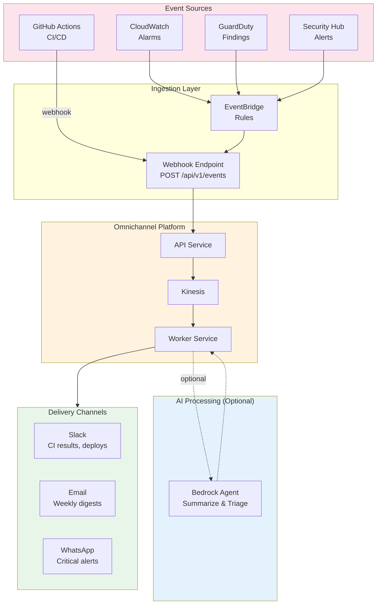

# Use Case: Operational Notifications (Dog-fooding)

## Overview

The omnichannel platform routes its own operational alerts (CI/CD results, security scan findings, deployment status, production monitoring) through its own delivery pipeline. This "dog-fooding" approach validates the platform's reliability while providing intelligent, multi-channel operational awareness.

## Motivation

CI/CD notifications are currently handled by direct Slack webhook calls in GitHub Actions. This works but has limitations:

- Output must be manually sanitized (Unicode escaping, JSON encoding, character limits)
- No channel flexibility — hardcoded to Slack
- No intelligent summarization — raw scan output is noisy
- No severity-based routing — everything goes to the same channel

By routing operational events through the omnichannel platform, we get all of these for free.

## Architecture



## Event Types & Routing

| Event | Severity | Channel(s) | AI Processing |
|-------|----------|------------|---------------|
| CI pipeline passed | Info | Slack | No |
| CI pipeline failed | Warning | Slack | No |
| Security scan findings | High | Slack + Email | Yes — summarize CVEs |
| Deployment completed | Info | Slack | No |
| Deployment failed | Critical | Slack + WhatsApp | No |
| CloudWatch alarm | High | Slack + WhatsApp | Yes — correlate with recent deploys |
| GuardDuty finding | Critical | Slack + WhatsApp + Email | Yes — triage and recommend action |
| Weekly security digest | Info | Email | Yes — aggregate and summarize |

## How It Fits the Existing Architecture

The platform already has every building block needed:

| Component | Existing | Reused For |
|-----------|----------|------------|
| `ChannelGateway` (strategy pattern) | Facebook, Instagram, LinkedIn, WhatsApp, Email, SMS | Add `SlackGateway` |
| `EventPublisher` | Publishes to Kinesis | Receives CI/monitoring events |
| Worker `Processor` | Delivers to channels | Same pipeline, different message type |
| Bedrock Agent (Strands) | Content optimization for social posts | Summarize/triage operational alerts |
| `MessageRepository` | Stores social media messages | Stores operational events for audit |

No new services are needed. The only additions are:

1. A `SlackGateway` channel adapter (implements `ChannelGateway`)
2. A webhook endpoint for external event ingestion
3. Routing rules that map event severity to channels
4. An optional Bedrock summarizer step for noisy outputs (Trivy tables, GuardDuty findings)

## API Endpoint

```
POST /api/v1/events
  - Ingest operational event
  - Body: {
      source: "github-actions" | "cloudwatch" | "guardduty" | "security-hub",
      severity: "info" | "warning" | "high" | "critical",
      title: "CI Pipeline Failed",
      body: "SBOM scan found 1 HIGH vulnerability...",
      metadata: { run_id, pr_number, repository, ... },
      channels: ["slack"]  // optional override
    }
  - Auth: API key (internal service-to-service)
  - Returns: { id, status: "queued" }
```

## AI Agent Role

For events that benefit from summarization, the Bedrock agent:

1. Receives raw operational data (Trivy tables, CloudWatch metrics, GuardDuty JSON)
2. Extracts the key information (which CVE, what severity, what's affected)
3. Formats a human-readable summary appropriate for each channel
4. Adds actionable context (links to fix, related documentation)

```python
@tool
async def summarize_security_finding(raw_output: str, source: str) -> str:
    """
    Summarize a security scan finding into a concise, actionable message.

    Args:
        raw_output: Raw scanner output (Trivy table, GuardDuty JSON, etc.)
        source: The scanner that produced this output

    Returns:
        A concise summary with affected packages, severity, and fix versions
    """
    ...
```

Example transformation:

**Raw Trivy output (noisy):**
```
┌──────────────┬────────────────┬──────────┬────────┬───────────────────┬───────────────┐
│   Library    │ Vulnerability  │ Severity │ Status │ Installed Version │ Fixed Version │
├──────────────┼────────────────┼──────────┼────────┼───────────────────┼───────────────┤
│ cryptography │ CVE-2026-26007 │ HIGH     │ fixed  │ 46.0.4            │ 46.0.5        │
└──────────────┴────────────────┴──────────┴────────┴───────────────────┴───────────────┘
```

**AI-summarized Slack message:**
```
🔒 SBOM Scan: 1 HIGH vulnerability in worker

• cryptography 46.0.4 → 46.0.5 (CVE-2026-26007)
  Fix: uv lock --upgrade-package cryptography
```

## Implementation Phases

### Phase 1: SlackGateway (Short-term)
- Add `SlackGateway` implementing `ChannelGateway`
- Route CI webhook events through the platform
- Replace direct Slack webhook calls in GitHub Actions with a single `POST /api/v1/events`

### Phase 2: Multi-channel Routing (Medium-term)
- EventBridge integration for CloudWatch/GuardDuty/Security Hub
- Severity-based routing rules (critical → WhatsApp + Slack)
- Weekly email digest aggregation

### Phase 3: AI Summarization (Longer-term)
- Bedrock agent for security finding summarization
- Correlation engine (link alarms to recent deployments)
- Intelligent triage (suppress known/accepted risks)

## Benefits

- **Validates the platform** — operational use proves reliability before external users depend on it
- **Single notification system** — no more maintaining separate Slack webhook logic in CI
- **Channel flexibility** — switch from Slack to Teams, or add WhatsApp for critical alerts, without touching CI
- **Audit trail** — all operational events stored in the same database as business messages
- **AI-powered clarity** — noisy scanner output becomes actionable summaries
