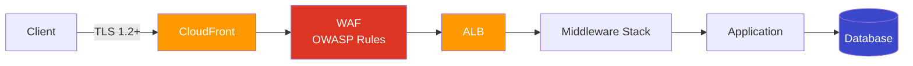
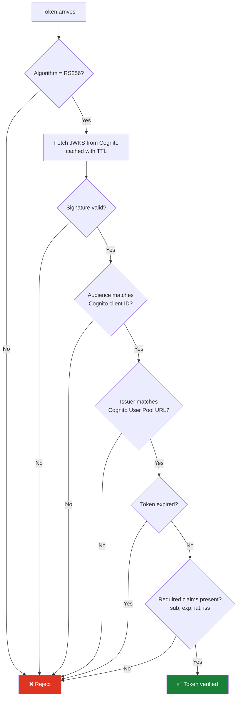
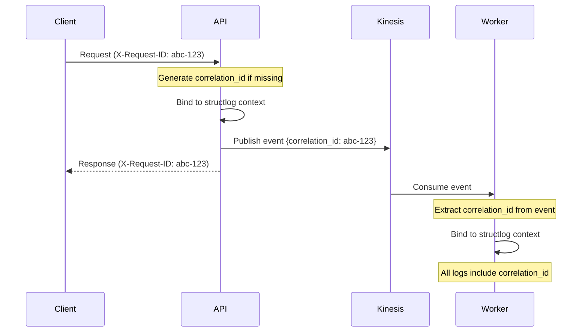
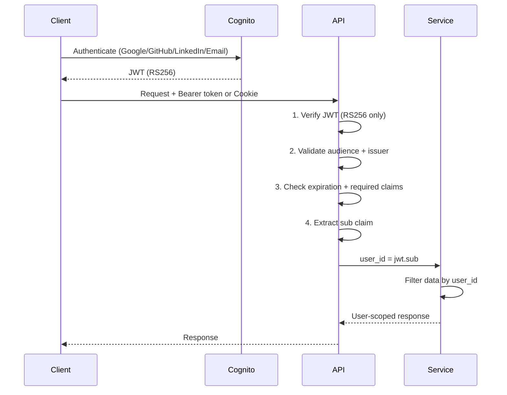
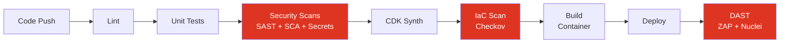

# Security Architecture

This document describes the three security pillars implemented in this project: Layered Defense, Zero Trust Runtime Architecture, and Secure Supply Chain.

---

## 1. Layered Defense

Every request passes through multiple independent security layers before reaching business logic. If one layer is bypassed or misconfigured, the next layer catches the threat. No single point of failure.

### Request Flow



### Layer Breakdown

#### Layer 1: Edge — CloudFront + WAF

The outermost perimeter. Requests hit CloudFront first, which enforces TLS 1.2+ (`SecurityPolicyProtocol.TLS_V1_2_2021`) and redirects HTTP to HTTPS. A WAF WebACL is attached with:

| Rule | Priority | Purpose |
|------|----------|---------|
| BlockBadIps | 0 | Dynamic IP blocklist (populated by GuardDuty incident response Lambda) |
| AWSManagedRulesCommonRuleSet | 1 | OWASP Core Rule Set — XSS, path traversal, protocol violations |
| AWSManagedRulesKnownBadInputsRuleSet | 2 | Log4Shell, Java deserialization, known exploit patterns |
| AWSManagedRulesSQLiRuleSet | 3 | SQL injection detection across query strings, body, headers |
| RateLimitRule | 4 | IP-based rate limiting (2000 req/5min) |

WAF logs go to CloudWatch (`aws-waf-logs-cloudfront`) for audit and correlation.

**Source**: `infra/stacks/edge_stack.py`

#### Layer 2: Network — VPC Isolation

Services run in private subnets with no direct internet access. The network is segmented into three tiers:

- **Public subnets**: ALB only
- **Private subnets** (with NAT egress): ECS Fargate services
- **Isolated subnets** (no internet): RDS PostgreSQL

Security groups enforce least-privilege communication:
- ALB → ECS services on port 8080 only
- ECS services → RDS on port 5432 only
- ECS services → each other on port 8080 (Cloud Map service discovery)

VPC Flow Logs capture all traffic for forensic analysis.

**Source**: `infra/stacks/network_stack.py`

#### Layer 3: ALB — Second WAF

The ALB has its own regional WAF WebACL with the same OWASP managed rule groups, providing defense-in-depth in case CloudFront is bypassed (e.g., direct ALB access). WAF logs go to `aws-waf-logs-alb`.

**Source**: `infra/stacks/compute_stack.py` (`_create_waf_web_acl`)

#### Layer 4: Application Middleware

Six middleware layers execute in order on every request:

```python
# main.py — middleware registration (first added = last executed)
app.add_middleware(CSRFMiddleware, ...)          # 6. CSRF validation
app.add_middleware(RateLimitMiddleware)           # 5. Per-user rate limiting
app.add_middleware(RequestSizeLimitMiddleware)    # 4. 1MB body limit
app.add_middleware(SecurityHeadersMiddleware)     # 3. Security response headers
app.add_middleware(CorrelationIdMiddleware)       # 2. Request tracing (runs first)
# FastAPI built-in                               # 1. Routing + auth dependencies
```

| Middleware | What it does |
|-----------|-------------|
| CorrelationIdMiddleware | Extracts/generates `X-Request-ID`, binds to structlog context for distributed tracing |
| SecurityHeadersMiddleware | Sets HSTS, CSP, X-Frame-Options, X-Content-Type-Options, Permissions-Policy, strips Server header |
| RequestSizeLimitMiddleware | Rejects requests with `Content-Length > 1MB` (413) |
| RateLimitMiddleware | Per-user rate limits: 60/min, 1000/hour, 10/sec burst. Falls back to IP for unauthenticated requests |
| CSRFMiddleware | Double Submit Cookie pattern with HMAC-signed, time-limited tokens |

**Source**: `api/src/presentation/middleware/`, `api/src/main.py`

#### Layer 5: Application Logic

- Pydantic models validate and sanitize all input
- User-scoped queries prevent IDOR (see Zero Trust section)
- Domain entities are pure Python — no ORM annotations, no external dependencies

#### Layer 6: Database

- RDS PostgreSQL in isolated subnets (no internet access)
- KMS encryption at rest with automatic key rotation
- Credentials in Secrets Manager (never in environment variables)
- `pgaudit` extension logs all DML statements
- Slow query logging (>500ms)

**Source**: `infra/stacks/data_stack.py`

### Why This Matters

An attacker who bypasses WAF still faces network isolation. If they reach the application, middleware blocks oversized payloads, enforces rate limits, and validates CSRF tokens. If they get past middleware, Pydantic rejects malformed input. If they craft valid input, user-scoped queries prevent accessing other users' data. If they compromise the application, the database is in an isolated subnet with encrypted storage and audit logging.

---

## 2. Zero Trust Runtime Architecture

No request is trusted by default — not even from authenticated users. Every operation is verified independently.

### Principles Applied

#### Never Trust the Token Alone

JWT validation is strict and multi-layered:



Algorithm confusion attacks are blocked at the header parsing stage, before any signature verification occurs.

**Source**: `api/src/presentation/middleware/auth.py` — `JWTAuthMiddleware`

#### Never Trust the User ID

Client-provided user IDs are never used. The `sub` claim from the verified JWT is the only source of identity. Services enforce user-scoped access:

```python
# Application service — user_id comes from verified JWT, not from request body
async def get_message(self, message_id: UUID, user_id: str) -> Message:
    message = await self._repository.get_by_id(message_id)
    if message and message.user_id != user_id:
        raise ForbiddenError("Access denied")
    return message
```

This prevents IDOR (Insecure Direct Object Reference) attacks where an authenticated user tries to access another user's resources.

#### Never Trust the Browser

Cookie security prevents session hijacking and cross-site attacks:

| Cookie | HttpOnly | Secure | SameSite | Purpose |
|--------|----------|--------|----------|---------|
| `access_token` | Yes | Yes | Lax | JWT access token (XSS-safe) |
| `refresh_token` | Yes | Yes | Lax | JWT refresh token |
| `csrf_token` | No | Yes | Lax | CSRF double-submit (must be JS-readable) |

CSRF protection uses the Double Submit Cookie pattern:
1. Server generates an HMAC-signed token with timestamp
2. Token is set in a cookie and must be echoed in `X-CSRF-Token` header
3. Tokens expire after 1 hour
4. Signature prevents tampering, timestamp prevents replay

**Source**: `api/src/presentation/middleware/csrf.py`

#### Never Trust the Network

- All external traffic is TLS 1.2+ (CloudFront enforced)
- HSTS with `max-age=31536000; includeSubDomains; preload`
- Internal service communication uses Cloud Map DNS within the VPC
- Secrets are fetched at runtime from Secrets Manager with caching (5-minute TTL), never stored in environment variables

**Source**: `api/src/infrastructure/secrets.py`

#### Verify Everything, Log Everything

Every request gets a correlation ID that flows through all services:



Structured JSON logs with `structlog` include: correlation ID, user ID, service name, operation timing, and error context. No PII is logged.

**Source**: `api/src/infrastructure/logging.py`, `api/src/presentation/middleware/correlation.py`

### Authentication Flow



---

## 3. Secure Supply Chain

Security scanning is automated at every stage of the development lifecycle — from code commit to production deployment.

### Pipeline Security Gates



### Static Analysis (SAST)

| Tool | Scope | Trigger | Configuration |
|------|-------|---------|---------------|
| Semgrep | OWASP Top 10, security-audit, secrets | PR to main | `p/python`, `p/security-audit`, `p/secrets`, `p/owasp-top-ten` |
| Bandit | Python-specific security issues | PR to main | `-ll -ii` (medium+ severity) |
| CodeQL | Python + JavaScript deep analysis | PR to main, weekly schedule | `security-extended`, `security-and-quality` queries |
| Ruff | Linting with security rules (S prefix) | Every push | `select = ["S", ...]` in pyproject.toml |

**Source**: `.github/workflows/ci.yml` (security job), `.github/workflows/codeql.yml`

### Software Composition Analysis (SCA)

| Tool | What it checks | How |
|------|---------------|-----|
| pip-audit | Python dependency CVEs | Exports `uv.lock` → checks against PyPI advisory DB |
| npm audit | JavaScript dependency CVEs | Built into `npm ci` |
| Trivy | Container image vulnerabilities | Scans built Docker images for CRITICAL/HIGH |
| CycloneDX | SBOM generation | Generates JSON SBOMs for all services |

**Source**: `justfile` (security-scan, trivy-scan, sbom-scan recipes)

### Secret Detection

| Tool | Scope | Trigger |
|------|-------|---------|
| Gitleaks | Git history + staged changes | Every PR (any code change) |
| GitHub Secret Scanning | Repository-wide | Always on |

Gitleaks runs even when no service code changes — any file matching `*.py, *.ts, *.json, *.yml, *.yaml, *.toml, *.sh` triggers it.

**Source**: `.github/workflows/ci.yml` (secret-scan job), `.gitleaks.toml`

### Infrastructure as Code (IaC) Security

| Tool | What it checks | Trigger |
|------|---------------|---------|
| Checkov | CloudFormation templates from CDK synth | PR when `infra/` changes |
| CDK Synth | Template validation | Every infra change |

The pipeline synthesizes CDK to CloudFormation, then Checkov scans the output for misconfigurations (open security groups, unencrypted storage, missing logging, etc.).

**Source**: `.github/workflows/ci.yml` (iac-security job)

### Dynamic Analysis (DAST)

| Tool | Type | Trigger |
|------|------|---------|
| OWASP ZAP | Baseline/Full/API scan | Post-deploy to staging, manual |
| Nuclei | CVE + misconfiguration templates | Post-deploy, manual |
| Custom pentest suite | 41 targeted security tests | Manual via `just` recipes |

ZAP is configured with a rules file (`.zap/rules.tsv`) that maps each finding to IGNORE/WARN/FAIL, ensuring the pipeline fails on real vulnerabilities while ignoring known false positives.

**Source**: `.github/workflows/security-scan.yml`, `testing/test_pentest.py`

### Container Security

Docker images use multi-stage builds with a minimal production image:

```dockerfile
# Build stage — install dependencies
FROM python:3.12-slim AS builder
RUN pip install uv
COPY pyproject.toml .
RUN uv pip install --system --no-cache .

# Production stage — minimal attack surface
FROM python:3.12-slim
COPY --from=builder /usr/local/lib/python3.12/site-packages ...
RUN groupadd -r appuser && useradd -r -g appuser appuser
USER appuser  # Non-root execution
```

Key hardening:
- Non-root user (`appuser`)
- No build tools in production image
- No cache files (`--no-cache`)
- Trivy scans for CRITICAL/HIGH vulnerabilities before deploy

**Source**: `api/Dockerfile`

### Runtime Threat Detection

Post-deployment, AWS-native services provide continuous monitoring:

| Service | Purpose |
|---------|---------|
| GuardDuty | Threat detection (network anomalies, credential compromise, crypto mining) |
| Security Hub | Centralized security findings aggregation |
| CloudTrail | API audit trail for all AWS actions |
| AWS Config | Resource compliance monitoring |

GuardDuty findings trigger an incident response Lambda that automatically blocks attacker IPs by updating the WAF IP set — closing the loop from detection to prevention.

**Source**: `infra/stacks/threat_detection_stack.py`, `infra/stacks/compliance_stack.py`

### Dependency Management

All Python services use `uv` with lockfiles (`uv.lock`) for deterministic builds. Dependencies are pinned with minimum versions in `pyproject.toml` and fully resolved in the lockfile.

---

## Summary

| Pillar | Key Principle | Implementation |
|--------|--------------|----------------|
| Layered Defense | No single point of failure | 6 layers from CloudFront to database, each independently enforcing security |
| Zero Trust | Verify everything, trust nothing | JWT validation, user-scoped access, CSRF, cookie hardening, runtime secrets |
| Secure Supply Chain | Shift left, automate everything | SAST + SCA + secrets + IaC + DAST scanning in CI/CD, container hardening, runtime threat detection |
