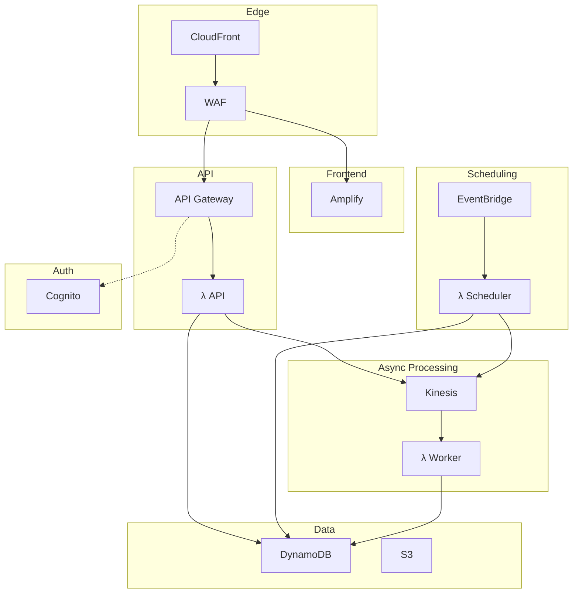

# Serverless Infrastructure (infra-fs)

Fully serverless architecture for Omnichannel Publisher using Lambda, DynamoDB, and API Gateway.

> 📖 For detailed architecture documentation, see [docs/architecture-serverless.md](../docs/architecture-serverless.md)

## Architecture Overview



## Cost Comparison vs Containers

| Traffic Level | Containers (ECS) | Serverless | Savings |
|---------------|------------------|------------|---------|
| Dev/Low | ~$180-200/mo | ~$5-15/mo | 90%+ |
| Medium | ~$200-250/mo | ~$20-40/mo | 80%+ |
| High | ~$250-350/mo | ~$50-80/mo | 70%+ |

## Stacks

| Stack | Resources | Description |
|-------|-----------|-------------|
| DataStack | DynamoDB, Kinesis, S3 | Single-table design, event streaming, media storage |
| AuthStack | Cognito User Pool | Social login (Google, GitHub, LinkedIn) |
| ApiStack | Lambda + API Gateway | REST API with Cognito authorizer |
| WorkerStack | Lambda + Kinesis trigger | Message delivery to social platforms |
| SchedulerStack | EventBridge + Lambda | Polls for due messages every minute |
| MonitoringStack | CloudWatch | Dashboards, alarms, metrics |
| SecurityStack | WAF, GuardDuty, Security Hub | OWASP rules, threat detection |
| FrontendStack | Amplify Hosting | React SPA deployment |

## DynamoDB Single-Table Design

```
PK                    SK                      GSI1PK          GSI1SK              GSI2PK              GSI2SK
───────────────────────────────────────────────────────────────────────────────────────────────────────────────
MSG#<id>              METADATA                USER#<user-id>  MSG#<id>            STATUS#scheduled    <scheduled_at>
MSG#<id>              CHANNEL#facebook        -               -                   -                   -
MSG#<id>              CHANNEL#linkedin        -               -                   -                   -
CERT#<id>             METADATA                USER#<user-id>  CERT#<id>           -                   -
USER#<id>             PROFILE                 -               -                   -                   -
```

### Access Patterns

| Pattern | Key Condition | Index |
|---------|---------------|-------|
| Get message | `PK = MSG#<id>` | Table |
| List user messages | `GSI1PK = USER#<id>` | GSI1 |
| Get scheduled messages | `GSI2PK = STATUS#scheduled AND GSI2SK <= now` | GSI2 |

## Lambda Functions

| Function | Memory | Timeout | Trigger |
|----------|--------|---------|---------|
| API | 512 MB | 30s | API Gateway |
| Worker | 1024 MB | 5 min | Kinesis (batch 10) |
| Scheduler | 256 MB | 1 min | EventBridge (1 min) |

## Deployment

```bash
# Install dependencies
uv sync

# Deploy all stacks
uv run cdk deploy --all

# Deploy specific stack
uv run cdk deploy OmnichannelApiStack

# Destroy all stacks
uv run cdk destroy --all
```

## Environment Variables

### API Lambda
- `TABLE_NAME` - DynamoDB table name
- `KINESIS_STREAM_NAME` - Kinesis stream for events
- `MEDIA_BUCKET` - S3 bucket for media
- `COGNITO_USER_POOL_ID` - Cognito user pool
- `COGNITO_CLIENT_ID` - Cognito app client

### Worker Lambda
- `TABLE_NAME` - DynamoDB table name
- `SECRETS_ARN` - Secrets Manager ARN for API credentials
- `USE_AI_AGENT` - Enable AI content adaptation
- `BEDROCK_MODEL_ID` - Claude model for AI agent

### Scheduler Lambda
- `TABLE_NAME` - DynamoDB table name
- `KINESIS_STREAM_NAME` - Kinesis stream for events

## CI/CD Selection

Set `INFRA_TYPE` environment variable in GitHub Actions:

```yaml
env:
  INFRA_TYPE: serverless  # Uses infra-fs/
  # INFRA_TYPE: containers  # Uses infra/ (default)
```

## Related Documentation

- [Serverless Architecture](../docs/architecture-serverless.md) - Detailed architecture
- [Container Architecture](../docs/architecture-containers.md) - ECS Fargate alternative
- [Security](../docs/security.md) - Security practices
